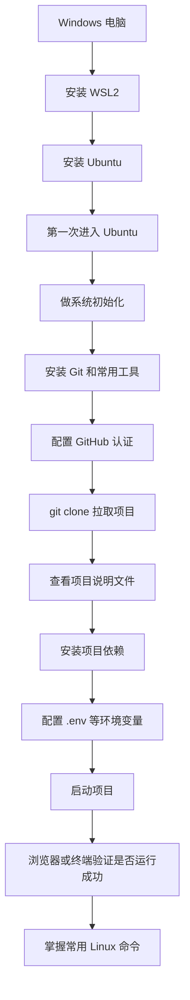

本手册包含 1 份源文件：E:\GithubProject\docs\general\linux.md

# WSL2 + Ubuntu + GitHub 项目拉取与运行实战手册（纯小白一步一步版）

> 这篇文档是写给“Windows 用户、几乎不会 Linux、第一次用 WSL2、第一次在 Ubuntu 里拉 GitHub 项目”的人看的。
> 目标不是让你背命令，而是让你真正做成下面这件事：
> **在 Windows 上装好 WSL2 + Ubuntu，然后在 Ubuntu 里把 GitHub 项目拉下来、装依赖、跑起来，并且慢慢学会常用 Linux 操作。**

---

## 先说结论：你这次到底要学会什么

读完并照着做完这篇文档，你会学会：

1. 什么是 WSL2，为什么 Windows 用户要用它。
2. 怎么在 Windows 上安装 WSL2 和 Ubuntu。
3. 第一次进入 Ubuntu 后，应该先做什么初始化。
4. 怎么在 Ubuntu 里安装 Git、配置 GitHub 认证。
5. 怎么把 GitHub 项目拉下来。
6. 怎么判断一个项目是 Python、Node.js 还是别的技术栈。
7. 怎么一步一步把项目运行起来。
8. 最后怎么学会 Linux 常用操作，不再看到命令就害怕。

---

## 第一部分：先把大图看懂，不要急着敲命令

- 根本不知道这条命令应该在 Windows 终端里执行，还是在 Ubuntu 终端里执行
- 看见路径就分不清到底是 Windows 路径还是 Linux 路径
- 项目没跑起来，也不知道是 WSL、Ubuntu、Git、还是项目本身的问题

很多新手一上来就开始复制命令，结果经常会出现下面这种情况：

所以正确顺序应该是：

1. 先看懂整体流程。
2. 分清楚“Windows 端”和“Ubuntu 端”。
3. 再开始一步一步执行。

---

## 1. 整体流程图



### 这张图你应该怎么理解

- “装个 Ubuntu 然后随便跑”

这整个流程不是：

而是：

1. 先让 Windows 具备跑 Linux 子系统的能力。
2. 再让 Ubuntu 正常工作。
3. 再把开发工具装进去。
4. 最后才是拉项目、装依赖、运行项目。

---

## 2. 你这次会同时接触两个“世界”

这是最重要的概念之一。

### 世界 1：Windows 世界

- 路径像 `C:\Users\你的名字\Desktop`
- 常见终端是 PowerShell、CMD、Windows Terminal
- 常见文件资源管理器是 Windows 文件夹界面

你平时熟悉的是这个。

特点：

### 世界 2：Ubuntu / Linux 世界

- 路径像 `/home/你的用户名/projects`
- 常见终端是 bash
- 文件操作命令和 Windows 不一样

你这次要学习的是这个。

特点：

### 一句话理解

WSL2 就像是在你的 Windows 电脑里，开了一个 Linux 小世界。

你以后会经常在这个 Linux 小世界里做开发。

---

## 第二部分：先讲清楚 WSL2 是什么

很多新手一看到这个词就头大，其实不用怕。

---

## 3. WSL2 是什么

- `Windows Subsystem for Linux`

- **让 Windows 能跑 Linux**

`WSL` 的全称是：

你先不要硬记英文，只要记住它的大意：

### 那 `WSL2` 又是什么

- 比较新
- 比较完整
- 更适合开发

它是 WSL 的第二代版本。

你先把它理解成：

### 为什么很多项目推荐 WSL2

- 在 Linux 下最好跑
- 或者只在 Linux 下稳定

- Python 项目
- Node.js 项目
- Docker 场景
- 编译型项目

因为有些项目：

比如很多：

在 Windows 原生环境里可能会遇到各种兼容性问题。

所以对 Windows 用户来说，WSL2 是一个很实用的解决方案。

---

## 4. Ubuntu 是什么

为什么这次用 Ubuntu？

- Linux 的一种常见版本

- 文档多
- 教程多
- 新手最容易搜到答案
- 很多 WSL2 教程默认就是 Ubuntu

Ubuntu 是一个 Linux 发行版。

你可以简单理解成：

因为：

---

## 第三部分：正式安装前，先检查 Windows 条件

---

## 5. 第一步：检查你的 Windows 版本够不够新

```powershell
winver
```

在 **Windows 终端 / PowerShell** 里执行：

### 这条命令是什么意思

- 打开 Windows 版本信息窗口

#### `winver`

意思是：

### 你想看到什么

- Windows 11

- Windows 10 较新的版本

大方向上你需要：

或者：

如果你的系统太老，WSL2 可能装不顺利。

---

## 6. 第二步：检查 CPU 虚拟化有没有开

### 为什么要检查这个

因为 WSL2 底层会用到虚拟化能力。
如果虚拟化没开，安装时可能报错。

### 怎么看

```text
虚拟化：已启用
```

1. 按 `Ctrl + Shift + Esc` 打开任务管理器
2. 点击 `性能`
3. 选中 `CPU`
4. 看右下或右侧有没有一项叫：

### 如果看到“未启用”怎么办

- Intel 的 VT-x
- AMD 的 SVM

这通常不是系统命令能直接解决的，可能要进 BIOS 开启：

这一步因电脑品牌不同而不同。
如果你遇到了，再单独处理，不要一开始就被它吓住。

---

## 第四部分：正式安装 WSL2 和 Ubuntu

这部分最重要。

---

## 7. 第三步：以管理员身份打开 PowerShell

### 为什么一定要“管理员身份”

- 启用系统功能
- 安装 Linux 子系统组件

因为安装 WSL2 会涉及：

这些通常需要管理员权限。

### 怎么打开

```text
以管理员身份运行
```

1. 点击开始菜单
2. 搜索 `PowerShell`
3. 右键
4. 选择：

---

## 8. 第四步：一键安装 WSL2

```powershell
wsl --install
```

在 **管理员 PowerShell** 里执行：

### 这条命令每一部分是什么意思

- 调用 WSL 工具

- 安装 WSL 所需的组件

#### `wsl`

表示：

#### `--install`

意思是：

### 这一条命令整体在干什么

- “帮我自动安装 WSL 和默认的 Linux 发行版”

你可以把它理解成：

### 执行后可能发生什么

常见情况是：

1. 系统开始启用功能
2. 安装 Ubuntu
3. 提示你重启电脑

### 如果提示你重启

就重启。
这不是失败，是正常流程。

---

## 9. 第五步：如果你想明确安装 Ubuntu，可以这样写

```powershell
wsl --install -d Ubuntu
```

### 这条命令和上一条有什么区别

- 用默认发行版

- 明确指定安装 Ubuntu

上一条是：

这一条是：

### `-d` 是什么意思

- 指定发行版

- `Ubuntu` 就是这次我们要装的 Linux 系统

意思是：

你现在只要记住：

---

## 10. 第六步：查看可以安装哪些 Linux 发行版

```powershell
wsl --list --online
```

### 这条命令是什么意思

- 列出

- 列出网上可安装的发行版

#### `--list`

意思是：

#### `--online`

意思是：

### 为什么你可能会用到它

- Debian
- Kali
- openSUSE

如果以后你不想用 Ubuntu，而想装：

那就可以先用这条命令看清单。

但对于新手，这次先老老实实用 Ubuntu 就好。

---

## 11. 第七步：安装完成后检查 WSL 状态

```powershell
wsl --status
wsl --version
wsl -l -v
```

在 **Windows PowerShell** 里执行：

### 第一条：`wsl --status`

- 查看 WSL 当前整体状态

意思是：

### 第二条：`wsl --version`

- 看 WSL 组件版本

意思是：

### 第三条：`wsl -l -v`

- 列出你已经安装的 Linux 发行版

- 同时显示版本信息

这是很常用的一条。

你可以把它拆开看：

#### `-l`

意思是：

#### `-v`

意思是：

### 你想看到什么

```text
Ubuntu    Running    2
```

- `2`

- 你现在跑的是 WSL2

你希望看到类似：

最关键的是最后那个：

它表示：

---

## 12. 第八步：如果 Ubuntu 不是 WSL2，手动改成 2

```powershell
wsl --set-default-version 2
wsl --set-version Ubuntu 2
```

如果你发现版本不是 2，可以执行：

### 第一条命令在做什么

```powershell
wsl --set-default-version 2
```

- 以后默认用 WSL2

意思是：

### 第二条命令在做什么

```powershell
wsl --set-version Ubuntu 2
```

- 把已经安装的 Ubuntu 切换成 WSL2

意思是：

---

## 第五部分：第一次进入 Ubuntu

---

## 13. 第九步：启动 Ubuntu

```powershell
wsl -d Ubuntu
```

在 Windows PowerShell 里执行：

### 这条命令是什么意思

- 指定要进入哪个发行版

- 进入 Ubuntu 这个 Linux 系统

#### `-d`

表示：

#### `Ubuntu`

表示：

### 第一次进入时会发生什么

系统通常会提示你：

1. 创建一个 Linux 用户名
2. 创建一个 Linux 密码

### 这一步特别重要

- 你在 Ubuntu 里的本地账号

- `sudo`

你创建的这个用户名和密码，不是 GitHub 密码。它是：

以后很多命令会用到这个密码，尤其是：

---

## 14. 什么是 `sudo，Super User DO`

你后面会经常看到这个命令。

### 最简单理解

- “请临时用管理员权限执行这条 Linux 命令”

```bash
sudo apt update
```

- 用管理员权限更新软件包列表

`sudo` 的意思可以理解成：

例如：Advanced Package Tool

意思就是：

### 为什么它会让你输入密码

- 你刚才创建的 Ubuntu 用户密码

- 输入密码时屏幕上通常不会显示星号
- 这不是没输入进去，是 Linux 的正常行为

注意：

因为 Linux 默认不会随便给高权限。你输入的是：

---

## 第六部分：Ubuntu 第一次进入后，先做初始化

这部分就像“搬进新房子先通水通电”。

---

## 15. 第十步：先更新软件包列表

```bash
sudo apt update
```

进入 Ubuntu 后执行：

### 这条命令每一部分是什么意思

- “Ubuntu 的应用商店命令行工具”

- 更新软件包列表

- 它不是立刻升级所有软件
- 它只是先把“仓库里有哪些最新版本”同步下来

注意：

#### `apt`

这是 Ubuntu 常用的软件包管理工具。

你可以把它理解成：

#### `update`

意思是：

### 为什么必须先做这一步

- 最新的软件包清单是什么

因为你后面装 Git、curl、build-essential 等工具前，应该先让系统知道：

---

## 16. 第十一步：升级已安装的软件包

```bash
sudo apt -y upgrade
```

### 这条命令每一部分是什么意思

- 把当前已安装的软件升级到可升级的版本

- 自动回答 yes

- 后面如果系统问“你要不要继续”，它自动帮你同意

#### `upgrade`

意思是：

#### `-y`

意思是：

也就是：

### 为什么这一步推荐做

因为新装好的 Ubuntu 可能有一些包不是最新的。
先升级，后面装工具时更稳。

---

## 17. 第十二步：安装最常用的基础工具

```bash
sudo apt -y install build-essential curl wget unzip zip ca-certificates software-properties-common
```

执行：

### 这条命令整体在做什么

- 一次安装一批开发常用基础工具

意思是：

### 这里每个工具大概是干什么的

#### `build-essential`

这是一组编译基础工具。

很多项目在安装依赖时，可能需要编译某些模块。
它很常用。

#### `curl`

用于通过命令行访问网址、下载内容。

#### `wget`

也是下载工具。

#### `unzip`

解压 `.zip`

#### `zip`

打包 `.zip`

#### `ca-certificates`

HTTPS 证书支持。
没有它，有些下载会报 SSL 相关错误。

#### `software-properties-common`

一些系统管理功能会用到。

---

## 18. 第十三步：再安装几样你以后很常用的工具

```bash
sudo apt -y install git vim nano htop tree jq
```

### 为什么这些工具推荐装

#### `git`

用来拉 GitHub 项目。

#### `vim`

一个编辑器。
但新手先不用强迫自己学会。

#### `nano`

也是编辑器。
对新手通常比 `vim` 友好。

#### `htop`

查看系统资源和进程状态。

#### `tree`

用树状方式查看目录结构。

#### `jq`

处理 JSON 时很方便。

---

## 第七部分：先学会路径，不然后面会一直迷路

---

## 19. Windows 路径和 Linux 路径有什么区别

### Windows 路径长这样

```text
C:\Users\你的名字\Desktop
```

### Linux 路径长这样

```text
/home/你的用户名/projects
```

### 最关键的区别

```text
\
```

```text
/
```

#### Windows 常用反斜杠

#### Linux 常用正斜杠

新手最容易在这里看花。

---

## 20. Linux 里的“家目录”是什么

```text
~
```

- 当前用户的家目录

```bash
cd ~
```

- 回到你自己的家目录

```text
/home/你的用户名
```

你会经常看到这个符号：

它表示：

例如：

意思就是：

通常它实际对应的路径像这样：

---

## 21. 为什么项目最好放在 Linux 文件系统里

```text
/mnt/c/...
```

很多新手会把代码放在：**mnt** =  **mount** （挂载、映射）

也就是 Windows 磁盘映射进来的目录里。

这不是绝对不行，但通常不推荐作为主要开发目录。

### 更推荐的做法

```text
~/projects
```

- Ubuntu 自己的 Linux 文件系统

把项目放在：

也就是：

### 为什么更推荐

- 安装依赖更快
- 文件监听更稳定
- 权限问题更少

因为很多开发工具在 Linux 文件系统里跑更顺：

---

## 22. 第十四步：创建项目目录

```bash
mkdir -p ~/projects
cd ~/projects
pwd
```

在 Ubuntu 里执行：

### 第一条：`mkdir -p ~/projects`

- 创建一个目录叫 `projects`

- make directory
- 创建文件夹

- 如果上层不存在就一并创建
- 如果目录已经存在，也不要报错

意思是：

#### `mkdir`

意思是：

#### `-p`

意思是：

### 第二条：`cd ~/projects`

- 进入这个目录

意思是：

### 第三条：`pwd`

- 显示你当前所在的完整路径

- “我现在到底在哪”

意思是：

你可以把 `pwd` 理解成：

---

## 第八部分：安装 VS Code Remote WSL（推荐，但不是必须）

如果你习惯在 Windows 上用 VS Code 写代码，这一节很实用。

---

## 23. 什么叫 Remote WSL

- VS Code 界面还在 Windows 上
- 但你打开的项目实际上在 Ubuntu 里

它的效果是：

这是很多 Windows 开发者最舒服的工作方式。

---

## 24. 第十五步：在 Ubuntu 里用 VS Code 打开项目目录

```bash
code .
```

进入 Ubuntu 终端后执行：

### 这条命令是什么意思

- 打开 VS Code

- 当前目录

```bash
code .
```

- 用 VS Code 打开当前目录

#### `code`

表示：

#### `.`

这个点表示：

所以：

意思就是：

### 如果提示 `code: command not found`

- 你还没装 VS Code
- 或者没启用 VS Code 的命令行入口

说明：

这不是 WSL 坏了，只是编辑器还没接好。

---

## 第九部分：先装 Git，再配置 GitHub

拉 GitHub 项目前，先把 Git 和认证搞清楚。

---

## 25. 第十六步：配置 Git 用户信息

```bash
git config --global user.name "你的名字"
git config --global user.email "你的GitHub邮箱"
git config --global init.defaultBranch main
```

在 Ubuntu 里执行：

### 第一条是什么意思

```bash
git config --global user.name "你的名字"
```

- 给 Git 设置默认用户名

意思是：

### 第二条是什么意思

```bash
git config --global user.email "你的GitHub邮箱"
```

- 给 Git 设置默认邮箱

意思是：

### 第三条是什么意思

```bash
git config --global init.defaultBranch main
```

- 以后新仓库默认主分支名叫 `main`

意思是：

### `--global` 是什么意思

- 这套配置对你这个 Ubuntu 用户的所有 Git 仓库都生效

表示：

---

## 26. 第十七步：检查 Git 配置有没有写进去

```bash
git config --global --list
```

### 这条命令是什么意思

- 把全局 Git 配置列出来

- `user.name`
- `user.email`

意思是：

你应该至少能看到：

---

## 27. 为什么推荐用 SSH 连接 GitHub

你后面拉 GitHub 项目有两种常见方式：

### 方式 1：HTTPS

```text
https://github.com/用户名/仓库名.git
```

例如：

### 方式 2：SSH

```text
git@github.com:用户名/仓库名.git
```

例如：

### 为什么推荐 SSH

- 更适合长期开发
- 不用每次输账号密码
- 配好以后比较顺手

因为：

所以这篇文档默认你优先学 SSH。

---

## 28. 第十八步：生成 SSH 密钥

```bash
ssh-keygen -t ed25519 -C "你的GitHub邮箱"
```

在 Ubuntu 里执行：

### 这条命令每一部分是什么意思

- 生成 SSH 密钥

- 指定密钥类型

- 这是现在比较常见、比较推荐的一种类型

- 给这个密钥加一段注释

#### `ssh-keygen`

意思是：

#### `-t ed25519`

意思是：

对新手你先记住：

#### `-C "你的GitHub邮箱"`

意思是：

通常就写你的 GitHub 邮箱。

### 执行以后会发生什么

它会问你：

1. 密钥保存在哪里
2. 要不要设置密码短语

### 新手怎么选

- `~/.ssh/id_ed25519`

- `~/.ssh/id_ed25519.pub`

通常你一路回车就可以。这样它会默认生成在：

公钥则会是：

---

## 29. 第十九步：启动 ssh-agent 并加载私钥

```bash
eval "$(ssh-agent -s)"
ssh-add ~/.ssh/id_ed25519
```

### 第一条是什么意思

```bash
eval "$(ssh-agent -s)"
```

- 启动 SSH 代理程序

你先不用深究太深。最简单理解就是：

### 第二条是什么意思

```bash
ssh-add ~/.ssh/id_ed25519
```

- 把刚才生成的私钥加载进去

意思是：

这样后面 Git 连接 GitHub 时，就可以用这把密钥。

---

## 30. 第二十步：查看公钥内容

```bash
cat ~/.ssh/id_ed25519.pub
```

### 这条命令是什么意思

- 把文件内容打印出来

- 显示你的公钥内容

#### `cat`

意思是：

所以这条命令整体意思就是：

### 你要做什么

把终端里显示出来的整段公钥复制下来。

---

## 31. 第二十一步：把公钥加到 GitHub

```text
My WSL Ubuntu
```

在 GitHub 网页上操作：

1. 登录 GitHub
2. 点击右上角头像
3. 点击 `Settings`
4. 点击左侧 `SSH and GPG keys`
5. 点击 `New SSH key`
6. Title 可以写：

7. Key 里面粘贴你刚才复制的公钥
8. 点击保存

---

## 32. 第二十二步：测试 SSH 是否连通 GitHub

```bash
ssh -T git@github.com
```

在 Ubuntu 里执行：

### 这条命令是什么意思

- 用 SSH 的方式测试是否能连到 GitHub

它表示：

### 第一次可能会看到什么

```text
Are you sure you want to continue connecting
```

```text
yes
```

可能会提示：

你输入：

就行。

### 成功时通常会发生什么

GitHub 会返回一段欢迎信息。

只要不是权限拒绝，基本就说明配置成功了。

---

## 第十部分：开始拉 GitHub 项目

终于到你最关心的部分了。

---

## 33. 第二十三步：找到仓库地址

```text
git@github.com:用户名/仓库名.git
```

在 GitHub 仓库页面里：

1. 点击绿色按钮 `Code`
2. 选择 `SSH`
3. 复制地址

看起来会像这样：

---

## 34. 第二十四步：把项目克隆到 Ubuntu

```bash
cd ~/projects
git clone git@github.com:用户名/仓库名.git
```

在 Ubuntu 里执行：

### 第一条：`cd ~/projects`

- 进入你刚才创建的项目目录

意思是：

### 第二条：`git clone ...`

- 从 GitHub 下载这个项目到本地

- 复制一份远程仓库到你电脑

意思是：

#### `clone`

你可以把它理解成：

### 执行完以后会发生什么

你当前目录里会多出一个新文件夹，名字通常就是仓库名。

---

## 35. 第二十五步：进入项目目录

```bash
cd 仓库名
ls
```

### 第一条是什么意思

进入项目目录。

### 第二条 `ls` 是什么意思

- 列出当前目录下的文件和文件夹

- Linux 版“看看这里都有什么”

`ls` 的意思是：

你可以把它理解成：

---

## 36. 第二十六步：确认远程地址对不对

```bash
git remote -v
```

### 这条命令是什么意思

- 查看这个仓库连接的是哪个远程地址

意思是：

### 为什么要看

- clone 错仓库
- 或者地址不是你想要的

因为有时候你可能：

这时候先看清楚会更稳。

---

## 第十一部分：拿到项目后，先别急着运行

- 刚 clone 完就直接 `python main.py`
- 或者 `npm run dev`

很多新手最容易犯的错误是：

这样很容易乱。

正确做法是：

1. 先看项目说明
2. 先识别技术栈
3. 再按项目类型装依赖和运行

---

## 37. 第二十七步：先看这些文件

- `README.md`
- `.env.example`
- `requirements.txt`
- `pyproject.toml`
- `package.json`
- `docker-compose.yml`
- `Makefile`

你拿到仓库后，优先看看有没有这些文件：

### 为什么先看这些

- 这个项目是什么技术栈
- 依赖怎么装
- 命令怎么跑

因为这些文件经常就已经告诉你：

---

## 38. 怎么通过文件判断项目类型

### 如果你看到这些文件

- `requirements.txt`
- `pyproject.toml`
- `main.py`
- `manage.py`

#### Python 项目常见文件

### 如果你看到这些文件

- `package.json`
- `package-lock.json`
- `pnpm-lock.yaml`

#### Node.js 项目常见文件

### 如果你看到这些文件

- `pom.xml`
- `build.gradle`

#### Java 项目常见文件

### 一句话

- 看文件判断类型

你不用一开始就什么技术栈都懂。先学会：

这已经很重要了。

---

## 第十二部分：最常见的项目运行流程

这一节我按项目类型给你拆开讲。

---

## 39. 如果是 Python 项目，最常见怎么跑

### 情况 1：项目里有 `requirements.txt`

```bash
python3 --version
python3 -m venv .venv
source .venv/bin/activate
pip install -r requirements.txt
```

通常流程是：

### 每条命令是什么意思

- 给当前项目创建一个虚拟环境，名字叫 `.venv`

- 激活这个虚拟环境

- 按 `requirements.txt` 里的清单安装依赖

#### `python3 --version`

看 Python 版本。

#### `python3 -m venv .venv`

意思是：

#### `source .venv/bin/activate`

意思是：

激活后你安装的包就主要进这个项目环境，而不是乱装到全局。

#### `pip install -r requirements.txt`

意思是：

### 然后怎么启动

```bash
python3 main.py
```

```bash
uvicorn main:app --reload
```

这要看项目文档。
常见可能是：

或者：

---

## 40. 如果是 Python 项目，而且有 `pyproject.toml`

- `uv`
- `poetry`
- `pdm`

这说明项目可能在用更现代的管理方式，比如：

### 你应该怎么判断

- `uv.lock`
- `poetry.lock`
- `pdm.lock`

看文档。或者看里面有没有这些痕迹：

### 如果项目是 `uv`

```bash
uv sync
uv run python main.py
```

常见流程可能是：

所以不要一看到 `pyproject.toml` 就直接乱跑，
先看配套锁文件和说明文档。

---

## 41. 如果是 Node.js 项目，最常见怎么跑

```bash
node --version
npm --version
npm install
npm run dev
```

常见流程：

### 每条命令是什么意思

启动开发模式。

安装前端或 Node 项目的依赖。

#### `node --version`

看 Node.js 版本。

#### `npm --version`

看 npm 版本。

#### `npm install`

#### `npm run dev`

### 如果报 `npm: command not found`

- 你还没装 Node.js

说明：

这不是项目坏了，是运行环境没装。

---

## 42. 如果项目要求环境变量

- 数据库地址
- API Key
- 端口
- 密码

- `.env.example`

很多项目都需要：

这时候通常会看到：

### 正确做法

```bash
cp .env.example .env
```

通常是：

### 这条命令是什么意思

- copy
- 复制文件

- 把 `.env.example` 复制成 `.env`

#### `cp`

意思是：

所以这条命令整体意思是：

然后你再编辑 `.env` 填自己的配置。

---

## 第十三部分：项目跑起来后，怎么在 Windows 浏览器里访问

这是 WSL 新手非常容易迷糊的一点。

---

## 43. 如果项目监听的是 3000、5173、8000 这种端口

```text
http://127.0.0.1:8000
```

- `http://localhost:8000`

比如你在 Ubuntu 里启动项目后，看到：

很多时候你可以直接在 Windows 浏览器里打开：

### 为什么

因为 WSL2 和 Windows 之间对本地端口通常做了转发。

### 什么时候你应该先试

- FastAPI：`8000`
- React/Vite：`5173`
- Next.js：`3000`

比如：

先在 Windows 浏览器打开试试。

---

## 第十四部分：最后最重要的一节，Linux 常用操作详解

- 最后 Linux 操作部分也要详细

你前面说得很明确：

所以这一节我不只列命令，而是按“什么时候用、为什么用、执行后会发生什么”来讲。

---

## A. 先学 5 个最基础的路径概念

### 1. 当前目录 `.` 是什么

```text
.
```

- 当前目录

点号：

意思是：

### 2. 上一级目录 `..` 是什么

```text
..
```

- 当前目录的上一级

两个点：

意思是：

### 3. 家目录 `~` 是什么

```text
~
```

- 你的家目录

波浪线：

意思是：

### 4. 绝对路径是什么

```text
/home/你的用户名/projects
```

例如：

这种从根目录开始写的完整路径，就是绝对路径。

### 5. 相对路径是什么

```text
/home/你的用户名
```

```text
projects
```

例如你当前已经在：

这时你写：

这就是相对路径。

---

## B. 进入和查看目录

### `pwd`

```bash
pwd
```

- 显示当前路径

- 你搞不清自己在哪的时候

作用：

什么时候用：

### `ls`

```bash
ls
```

- 查看当前目录内容

作用：

### `ls -a`

为什么有用：

```bash
ls -a
```

- 查看所有文件，包括隐藏文件

- `.gitignore`
- `.env`
- `.venv`

作用：

因为像这些文件平时是隐藏的：

### `ls -l`

```bash
ls -l
```

- 用更详细的方式列出文件

- 权限
- 所有者
- 文件大小

作用：

你会看到：

### `cd`

```bash
cd 文件夹名
```

- 进入某个目录

作用：

### `cd ..`

```bash
cd ..
```

- 回到上一级目录

作用：

### `cd ~`

```bash
cd ~
```

- 回到家目录

作用：

---

## C. 创建文件夹和文件

### `mkdir`

```bash
mkdir demo
```

- 创建一个叫 `demo` 的文件夹

作用：

### `mkdir -p`

```bash
mkdir -p a/b/c
```

- 一次创建多层目录

作用：

### `touch`

```bash
touch test.txt
```

- 创建一个空文件

作用：

如果文件已经存在，它不会把内容清空，只会更新文件时间戳。

---

## D. 复制、移动、重命名

### `cp`

```bash
cp old.txt new.txt
```

- 复制文件

作用：

### `cp -r`

```bash
cp -r old_dir new_dir
```

- 复制文件夹

- 递归复制

作用：

#### `-r`

意思是：

### `mv`

```bash
mv old.txt new.txt
```

- 移动文件
- 或者重命名文件

- “移动”
- “重命名”

作用：

Linux 里：

很多时候都是 `mv`

---

## E. 删除文件和文件夹

### `rm`

```bash
rm test.txt
```

- 删除文件

作用：

### `rm -r`

```bash
rm -r demo
```

- 删除文件夹及其内容

作用：

### 新手提醒

`rm` 很危险，因为 Linux 删除后没有回收站那种感觉。
所以你不确定时，先 `ls` 看清楚再删。

---

## F. 查看文件内容

### `cat`

```bash
cat README.md
```

- 一次性把整个文件内容打印出来

- 文件比较短

作用：

适合：

### `less`

```bash
less README.md
```

- 分页查看文件

- 文件比较长

- 按 `q`

作用：

适合：

退出方法：

### `head`

```bash
head README.md
```

- 只看文件前几行

作用：

### `tail`

```bash
tail README.md
```

- 只看文件最后几行

作用：

### `tail -f`

```bash
tail -f app.log
```

- 持续盯着日志文件

- 看项目运行日志

- 按 `Ctrl + C`

作用：

适合：

退出方法：

---

## G. 编辑文件

### `nano`

为什么推荐新手先学它：

```bash
nano .env
```

- 用 `nano` 打开文件编辑

- 比 `vim` 简单
- 底部会直接显示快捷键提示

作用：

### `nano` 里怎么保存退出

1. 按 `Ctrl + O` 保存
2. 按回车确认文件名
3. 按 `Ctrl + X` 退出

---

## H. 查找文件和文字

### `find`

```bash
find . -name "README.md"
```

- 从当前目录开始查找某个文件

作用：

### `grep`

```bash
grep "mysql" .env
```

- 在文件里查找某段文字

作用：

### `grep -R`

```bash
grep -R "localhost" .
```

- 在当前目录所有文件里递归查找某段文字

- 你想找某个配置写在哪个文件里

作用：

适合：

---

## I. 权限相关

### `sudo`

- 临时管理员权限

前面讲过了：

### `chmod`

```bash
chmod +x script.sh
```

- 给文件增加可执行权限

作用：

### 什么时候会用到

- 没有执行权限

当一个脚本不能执行时，常见原因之一就是：

---

## J. 进程和端口

### `ps：Process Status，all user x`

```bash
ps aux
```

- 查看当前系统里的进程

作用：

### `htop，Hisham's top`

```bash
htop
```

- 用更直观的界面查看系统资源和进程

- 按 `q`

作用：

退出：

### ss -ltnp，Socket Statistics

* **-l = --listening**

= 套接字统计工具
= 查看网络端口、连接、谁在占用端口

  **只看正在监听的端口** （等着别人来连的服务）
* **-t = --tcp**

  **只看 TCP 连接** （网页、SSH、API 都是 TCP）
* **-n = --numeric**

  **用数字显示 IP 和端口** （不翻译名字，超快）
* **-p = --process**

  **显示哪个进程在占用这个端口** （显示 PID + 程序名）

## **ss -ltnp = 查看所有正在监听的 TCP 端口 + 显示占用进程**

```bash
ss -ltnp
```

- 查看哪些端口正在监听

作用：

### 什么时候很有用

- 端口被占用

比如你项目起不来，提示：

这时候它就很有帮助。

### `kill`

```bash
kill 进程ID
```

- 结束某个进程

作用：

---

## K. 系统更新和装软件

### `apt update`

更新软件包列表。

### `apt upgrade`

升级已安装的软件包。

### `apt install`

安装软件。

```bash
sudo apt install git
```

- 安装 Git

例如：

意思是：

---

## L. 清屏和历史记录

### `clear`

```bash
clear
```

- 清空终端显示内容

作用：

### `history`

为什么有用：

```bash
history
```

- 查看你以前执行过的命令

- 忘了之前敲过什么，可以回来查

作用：

---

## 第十五部分：最常见的 10 个问题

---

## 1. `wsl --install` 报错

先检查：

1. 你是不是管理员 PowerShell
2. Windows 版本是不是太老
3. 虚拟化是不是没开

---

## 2. 进入 Ubuntu 时密码输不进去

其实通常是输进去了。
Linux 输入密码时通常不显示星号。

---

## 3. `sudo` 提示权限不够

- 你输入的是 Ubuntu 用户密码

- GitHub 密码

先确认：

不是：

---

## 4. `git clone` 权限失败

- SSH key 没加到 GitHub
- 你 clone 的是私有仓库
- 仓库地址写错了

常见原因：

---

## 5. `ssh -T git@github.com` 失败

优先检查：

1. 公钥有没有加到 GitHub
2. 私钥有没有 `ssh-add`
3. 终端网络是否正常

---

## 6. `python` 或 `npm` 找不到

- 运行环境没装

- Python
- Node.js

这通常不是项目坏了，而是：

要先根据项目类型安装：

---

## 7. `.env` 没有怎么办

- `.env.example`

```bash
cp .env.example .env
```

先看看项目里有没有：

如果有，就先复制一份：

再去填写。

---

## 8. 项目启动后浏览器打不开

- `http://localhost:端口号`

先检查：

1. 项目是否真的启动成功
2. 监听的是不是 `127.0.0.1`
3. 端口是多少

然后在 Windows 浏览器里试：

---

## 9. 端口被占用

项目启动时报端口冲突时，先查：

```bash
ss -ltnp
```

或者直接改项目配置里的端口。

---

## 10. 不知道自己到底在哪个目录

```bash
pwd
ls
```

- 你在错误目录里执行了命令

先执行：

很多新手的问题，本质上只是：

---

## 第十六部分：你现在最应该照着做的最短清单

如果你觉得整篇太长，就先照这个最短清单做。

### A. 在 Windows 管理员 PowerShell 里

```powershell
wsl --install
```

```powershell
wsl --status
wsl -l -v
wsl -d Ubuntu
```

重启电脑后，再执行：

### B. 在 Ubuntu 里初始化

```bash
sudo apt update
sudo apt -y upgrade
sudo apt -y install build-essential curl wget unzip zip ca-certificates software-properties-common
sudo apt -y install git vim nano htop tree jq
mkdir -p ~/projects
cd ~/projects
```

### C. 配 Git 和 GitHub

```bash
git config --global user.name "你的名字"
git config --global user.email "你的GitHub邮箱"
ssh-keygen -t ed25519 -C "你的GitHub邮箱"
eval "$(ssh-agent -s)"
ssh-add ~/.ssh/id_ed25519
cat ~/.ssh/id_ed25519.pub
ssh -T git@github.com
```

### D. 拉项目

```bash
cd ~/projects
git clone git@github.com:用户名/仓库名.git
cd 仓库名
ls
```

### E. 看项目类型并运行

1. 先看 `README.md`
2. 再看有没有 `requirements.txt`、`pyproject.toml`、`package.json`
3. 再按项目类型装依赖
4. 再启动

---

## 最后一段：你真正学会这篇文档的标志是什么

不是“我好像看懂了”。

而是下面这些事你都能自己做：

1. 自己装好 WSL2 和 Ubuntu
2. 自己进入 Ubuntu 并完成初始化
3. 自己配置 Git 和 GitHub SSH
4. 自己从 GitHub clone 一个项目
5. 自己判断项目类型并运行
6. 自己用 `pwd`、`ls`、`cd`、`cp`、`grep`、`nano` 这些命令解决日常问题

做到这些，你就不是”完全不会 WSL 和 Linux”的状态了。

---

## 第十七部分：项目 clone 下来后，以后更新了怎么办？

> “我已经把项目 clone 下来了，但是后来这个项目又更新了，我是不是要重新 clone 一次？”

这是很多新手都会问的问题：

**答案是：不需要重新 clone。**

Git 专门提供了命令来处理这种情况。

---

## 1. 先理解 Git 的”远程仓库”和”本地仓库”概念

### 什么是远程仓库

远程仓库就是 GitHub 上那个仓库。

它是”源头”，是”最新版本”。

### 什么是本地仓库

本地仓库就是你 clone 到 Ubuntu 里的那个项目文件夹。

它是”副本”，是你电脑上的版本。

### 它们之间是什么关系

```
┌─────────────────────────────────────────────────────────────┐
│                      GitHub 服务器                           │
│  ┌─────────────────────────────────────────────────────┐   │
│  │              远程仓库（源头）                         │   │
│  │                                                     │   │
│  │  这是最新的、最权威的版本                            │   │
│  └─────────────────────────────────────────────────────┘   │
└─────────────────────────────────────────────────────────────┘
                           ↕
                    （网络连接）
                           ↕
┌─────────────────────────────────────────────────────────────┐
│                      你的电脑（Ubuntu）                      │
│  ┌─────────────────────────────────────────────────────┐   │
│  │              本地仓库（副本）                         │   │
│  │                                                     │   │
│  │  这是你 clone 下来的版本                            │   │
│  │  可能已经过时了                                     │   │
│  └─────────────────────────────────────────────────────┘   │
└─────────────────────────────────────────────────────────────┘
```

### clone 做了什么

- 完整的提交历史
- 所有分支
- 远程地址信息

当你执行 `git clone` 时，Git 做了这些事：

1. 在 GitHub 上找到那个仓库
2. 把仓库的所有文件下载到你电脑
3. 把仓库的所有历史记录下载到你电脑
4. 记住这个仓库的远程地址（origin）

**关键理解：**

clone 不只是”下载文件”，它还下载了：

所以你本地仓库和远程仓库之间是有”联系”的。

---

## 2. 怎么把远程的更新拉到本地？

### 最常用的命令：git pull

```bash
cd ~/projects/仓库名
git pull
```

当你知道远程仓库有更新，想把这些更新同步到本地时：

### 这条命令在做什么

- 从远程仓库拉取最新的代码
- 合并到你当前的本地分支

```
执行 git pull 前：

`git pull` 的意思是：

远程仓库：v1.0 → v1.1 → v1.2 → v1.3（最新）
本地仓库：v1.0 → v1.1 → v1.2（旧）

执行 git pull 后：

远程仓库：v1.0 → v1.1 → v1.2 → v1.3（最新）
本地仓库：v1.0 → v1.1 → v1.2 → v1.3（同步了！）
```

### git pull 的完整过程

```
git pull = git fetch + git merge
```

`git pull` 实际上是两个命令的组合：

1. `git fetch`：从远程仓库下载最新的提交记录
2. `git merge`：把这些提交合并到你当前的分支

---

## 3. 如果你想更精细地控制，可以分开执行

### 第一步：先看看远程有什么更新

```bash
git fetch
```

- 连接远程仓库
- 下载最新的提交记录
- **但不修改你的本地文件**

```
执行 git fetch 后：

**这条命令在做什么：**

远程仓库的信息已经下载到本地了
但你的本地代码还没有变

你可以先看看有什么变化
再决定要不要合并
```

### 第二步：看看远程有哪些更新

```bash
git log HEAD..origin/main
```

- 显示远程 main 分支有你本地没有的提交
- 让你看看具体更新了什么

**这条命令在做什么：**

### 第三步：如果确认要更新，再合并

```bash
git merge origin/main
```

- 把远程 main 分支的更新合并到你当前分支

**这条命令在做什么：**

---

## 4. 实际工作中最常用的流程

```bash
cd ~/projects/仓库名
git pull
```

对于大多数情况，你只需要记住这个：

就这么简单。

### 什么时候应该执行 git pull

- 每天开始工作前
- 知道项目有更新后
- 准备开始写代码前

### 养成好习惯

每次开始工作前，先 `git pull`，确保你的本地代码是最新的。

---

## 5. 如果 git pull 报错怎么办？

### 常见情况：你本地有修改，和远程冲突了

- 远程仓库改了这个文件
- 你本地也改了这个文件
- Git 不知道该用哪个版本

假设你本地改了一些文件，还没提交，这时候执行 `git pull` 可能会报错。

**为什么？**

因为 Git 不知道该怎么处理：

### 解决方法 1：先提交你的修改

```bash
git add .
git commit -m “我的修改”
git pull
```

### 解决方法 2：暂时保存你的修改

```bash
git stash
git pull
git stash pop
```

- 把你当前的修改暂时”藏起来”
- 让工作区变干净

- 拉取远程更新

- 把刚才”藏起来”的修改恢复回来

**这几条命令是什么意思：**

#### `git stash`

意思是：

#### `git pull`

意思是：

#### `git stash pop`

意思是：

---

## 6. 总结：你应该记住的命令

| 场景         | 命令                          | 作用                    |
| ------------ | ----------------------------- | ----------------------- |
| 同步远程更新 | `git pull`                  | 最常用，拉取并合并      |
| 只下载不合并 | `git fetch`                 | 先看看有什么更新        |
| 查看远程更新 | `git log HEAD..origin/main` | 看看远程有什么新提交    |
| 合并远程更新 | `git merge origin/main`     | 把 fetch 的更新合并进来 |
| 暂存本地修改 | `git stash`                 | 把修改藏起来            |
| 恢复暂存修改 | `git stash pop`             | 把藏起来的修改恢复      |

---

## 第十八部分：SSH 到底是什么？为什么要配密钥？（底层原理详解）

这一部分，我要用最白话的方式，把 SSH 和密钥的原理讲透。

---

## 1. 先从最基本的问题开始：为什么需要”认证”？

### 想象一个场景

假设 GitHub 是一个”保险柜”，里面存着你的代码。

你想从这个保险柜里拿东西（clone 代码），或者往里面放东西（push 代码）。

**问题来了：**

保险柜怎么知道你是谁？怎么知道你有权限操作？

### 两种常见的”证明你是谁”的方式

- 输入用户名
- 输入密码
- 系统验证你是对的，就让你操作

- 你把这把钥匙的信息告诉 GitHub
- 以后你用这把钥匙操作，GitHub 就知道是你

**方式 1：账号密码**

就像你登录网站一样：

**方式 2：SSH 密钥**

就像你有一把”专属钥匙”：

### 为什么 Git 推荐用 SSH 密钥

- 更安全
- 更方便（不用每次输入密码）
- 更适合自动化操作

因为：

---

## 2. SSH 是什么？

### SSH 的全称

`SSH` = `Secure Shell`

### 最简单的理解

- 安全地连接到远程服务器
- 安全地传输数据
- 安全地验证身份

SSH 是一种**安全的远程连接协议**。

它让你可以：

### 为什么说它”安全”

什么是加密？我后面会详细讲。

因为 SSH 使用了**加密技术**。

---

## 3. SSH 密钥是什么？为什么要用它？

### 密钥的本质

```
ssh-ed25519 AAAAC3NzaC1lZDI1NTE5AAAAIBxM...你的邮箱
```

- 证明你的身份
- 加密和解密数据

密钥就是一个**很长很长的字符串**。

比如：

这个字符串有什么用？

它可以用来：

### 为什么用密钥而不是密码

**密码的问题：**

1. 每次操作都要输入，很麻烦
2. 密码可能被猜测
3. 密码可能被偷看（键盘记录器等）
4. 如果密码泄露，别人就能冒充你

**密钥的优势：**

1. 配置一次，以后自动验证
2. 密钥足够长，几乎不可能被猜测
3. 密钥不需要在网络上传输（后面会解释为什么）
4. 即使别人截获了你的通信，也拿不到你的密钥

---

## 4. 公钥和私钥：SSH 的核心原理

这是 SSH 最重要、最精妙的设计。

### 密钥是成对的

SSH 密钥不是一把，而是**两把**：

1. **公钥（Public Key）**
2. **私钥（Private Key）**

### 它们是什么关系

- 可以公开给任何人
- 放在 GitHub 上
- 放在服务器上

- 只有你自己知道
- 保存在你自己的电脑上
- **绝对不能给别人**

**公钥：**

**私钥：**

### 它们是怎么工作的？

这是最关键的部分，我用一个比喻来解释：

---

## 5. 用”锁和钥匙”的比喻来理解

### 想象一下

- 你可以把这把锁给任何人
- 别人可以用这把锁锁住东西
- 但锁住的东西，只有你能打开

- 这把钥匙只有你有
- 它能打开所有用你的公钥锁住的东西
- 如果钥匙丢了，别人就能冒充你

**公钥就像一把”锁”：**

**私钥就像一把”钥匙”：**

### 具体流程

```
┌─────────────────────────────────────────────────────────────┐
│                      你的电脑                                │
│  ┌─────────────────────────────────────────────────────┐   │
│  │              私钥（id_ed25519）                       │   │
│  │                                                     │   │
│  │  这是你的钥匙，只有你知道                            │   │
│  │  绝对不能给别人！                                    │   │
│  └─────────────────────────────────────────────────────┘   │
└─────────────────────────────────────────────────────────────┘

**当你配置 SSH 时：**

1. 你在本地生成一对密钥（公钥 + 私钥）
2. 你把公钥放到 GitHub 上
3. 私钥保存在你自己的电脑上

┌─────────────────────────────────────────────────────────────┐
│                      GitHub 服务器                           │
│  ┌─────────────────────────────────────────────────────┐   │
│  │              公钥（id_ed25519.pub）                   │   │
│  │                                                     │   │
│  │  这是你的锁，GitHub 用来验证你的身份                 │   │
│  │  可以公开                                           │   │
│  └─────────────────────────────────────────────────────┘   │
└─────────────────────────────────────────────────────────────┘
```

---

## 6. SSH 认证的具体过程（底层原理）

当你执行 `git clone` 或 `git push` 时，SSH 会进行一个”握手”过程。

### 第一步：客户端发起连接

> “你好，我是用户 A，我想连接你。”

你的电脑（客户端）对 GitHub 说：

### 第二步：服务器发送挑战

> “好的，我这里有一个用你公钥加密的'挑战消息'，你能解密吗？”

GitHub 说：

**关键理解：**

GitHub 用你的公钥加密了一段随机数据。

因为是用你的公钥加密的，只有拥有对应私钥的人才能解密。

### 第三步：客户端解密并返回

你的电脑用私钥解密这段数据，然后返回给 GitHub。

### 第四步：服务器验证

- 如果正确，说明你确实拥有对应的私钥
- 认证通过！

GitHub 检查你返回的结果：

### 为什么这个过程是安全的？

- GitHub 发送的是用公钥加密的数据
- 你用私钥解密，然后把结果返回
- 私钥始终留在你自己的电脑上

```
┌─────────────────────────────────────────────────────────────┐
│                                                             │
│    你的电脑                          GitHub 服务器           │
│                                                             │
│    ┌─────────┐                      ┌─────────┐            │
│    │  私钥   │                      │  公钥   │            │
│    └─────────┘                      └─────────┘            │
│         │                                │                 │
│         │         1. 请求连接             │                 │
│         │ ──────────────────────────────>│                 │
│         │                                │                 │
│         │     2. 用公钥加密的挑战消息      │                 │
│         │ <──────────────────────────────│                 │
│         │                                │                 │
│         │  3. 用私钥解密，返回结果         │                 │
│         │ ──────────────────────────────>│                 │
│         │                                │                 │
│         │        4. 验证通过！            │                 │
│         │                                │                 │
│    私钥从未传输！                          │                 │
│                                                             │
└─────────────────────────────────────────────────────────────┘
```

**关键点：私钥从未在网络上传输！**

整个过程：

**这意味着：**

即使有人截获了所有通信，他也无法冒充你，因为他没有你的私钥。

---

## 7. 为什么公钥可以公开，私钥不能？

### 数学原理（简单解释）

- 用公钥加密的数据，只能用私钥解密
- 用私钥签名的数据，可以用公钥验证

公钥和私钥是通过一种特殊的数学算法生成的。

这种算法有一个特点：

**关键：**

从公钥推算出私钥，在数学上是”几乎不可能”的。

这就是为什么公钥可以公开——即使别人知道了你的公钥，也无法推算出你的私钥。

### 实际例子

```
ssh-ed25519 AAAAC3NzaC1lZDI1NTE5AAAAI...你的邮箱
```

假设你的公钥是：

即使全世界都知道这个公钥，他们也无法生成对应的私钥。

只有当初生成这对密钥时产生的那个私钥，才能配合这个公钥工作。

---

## 8. ed25519 是什么？为什么推荐用它？

### ed25519 是一种密钥算法

```bash
ssh-keygen -t ed25519 -C “你的邮箱”
```

当你执行：

`-t ed25519` 就是指定使用 ed25519 算法。

### 为什么推荐 ed25519

**优点：**

1. **更安全**：基于椭圆曲线密码学，数学上更难破解
2. **更快**：生成密钥、签名、验证都更快
3. **更短**：密钥长度更短，但安全性更高
4. **更现代**：是近年来广泛认可的算法

### 和 RSA 的对比

```bash
ssh-keygen -t rsa -b 4096
```

- 密钥更长
- 速度更慢
- 算法更老

以前常用的是 RSA：

RSA 也可以用，但：

现在推荐优先使用 ed25519。

---

## 9. 实际操作：生成和配置 SSH 密钥的完整流程

### 第一步：生成密钥对

```bash
ssh-keygen -t ed25519 -C “你的GitHub邮箱”
```

- `~/.ssh/id_ed25519`：私钥
- `~/.ssh/id_ed25519.pub`：公钥

**执行后会发生什么：**

1. 系统生成一对密钥
2. 问你要保存在哪里（默认 `~/.ssh/id_ed25519`）
3. 问你要不要设置密码短语（可以不设，直接回车）

**生成的文件：**

### 第二步：查看公钥

```bash
cat ~/.ssh/id_ed25519.pub
```

```
ssh-ed25519 AAAAC3NzaC1lZDI1NTE5AAAAIBxM...你的邮箱
```

你会看到类似：

### 第三步：把公钥加到 GitHub

1. 复制整个公钥内容
2. 登录 GitHub
3. Settings → SSH and GPG keys → New SSH key
4. 粘贴公钥，保存

### 第四步：测试连接

```bash
ssh -T git@github.com
```

```
Hi 用户名! You've successfully authenticated...
```

**成功的话会看到：**

---

## 10. ssh-agent 是什么？为什么需要它？

### 问题场景

如果你给私钥设置了密码短语，每次使用私钥都要输入密码，很麻烦。

### ssh-agent 的作用

- 在内存中保存你的私钥
- 以后需要用私钥时，自动帮你使用
- 不用每次都输入密码

`ssh-agent` 是一个”密钥管理器”。

它的作用是：

### 怎么使用

```bash
# 启动 ssh-agent
eval “$(ssh-agent -s)”

# 把私钥添加到 ssh-agent
ssh-add ~/.ssh/id_ed25519
```

**执行后：**

你的私钥就加载到内存中了，以后 Git 操作会自动使用它。

---

## 11. SSH 和 HTTPS 的区别

### HTTPS 方式

```bash
git clone https://github.com/用户名/仓库.git
```

- 简单，不需要配置
- 但每次操作可能要输入用户名密码
- 或者需要配置 credential helper

**特点：**

### SSH 方式

```bash
git clone git@github.com:用户名/仓库.git
```

- 需要先配置密钥
- 配置后不用每次输入密码
- 更安全

**特点：**

### 推荐做法

- 临时下载一个项目看看：用 HTTPS
- 长期开发的项目：用 SSH

---

## 12. 常见问题解答

### Q1：私钥丢了怎么办？

**答：** 重新生成一对密钥，然后把新的公钥加到 GitHub。

旧的公钥就失效了，需要删除。

### Q2：可以在多台电脑上用同一对密钥吗？

- 每台电脑生成自己的密钥对
- 把每台电脑的公钥都加到 GitHub

**答：** 技术上可以，但不推荐。

更好的做法是：

这样如果某台电脑的私钥泄露，只需要删除对应的公钥，不影响其他电脑。

### Q3：公钥泄露了怎么办？

**答：** 公钥本来就是可以公开的，泄露了也没关系。

只要私钥没泄露，就是安全的。

### Q4：私钥泄露了怎么办？

**答：** 立刻：

1. 从 GitHub 删除对应的公钥
2. 重新生成一对密钥
3. 把新的公钥加到 GitHub

### Q5：为什么有时候 ssh -T 成功，但 git clone 失败？

**答：** 可能的原因：

1. 你用的是 HTTPS 地址而不是 SSH 地址
2. 私钥没有正确加载到 ssh-agent
3. 权限问题（检查 `~/.ssh` 目录权限）

---

## 13. 总结：你应该记住的核心概念

| 概念     | 解释                                   |
| -------- | -------------------------------------- |
| SSH      | 一种安全的远程连接协议                 |
| 公钥     | 可以公开，放在服务器上，用来验证身份   |
| 私钥     | 只有自己知道，保存在本地，用来证明身份 |
| 密钥对   | 公钥和私钥是成对的，一起生成           |
| 认证过程 | 服务器用公钥加密挑战，客户端用私钥解密 |
| 安全原理 | 私钥从未在网络上传输                   |

### 你应该记住的操作

```bash
# 生成密钥
ssh-keygen -t ed25519 -C “你的邮箱”

# 查看公钥
cat ~/.ssh/id_ed25519.pub

# 启动 ssh-agent
eval “$(ssh-agent -s)”

# 添加私钥
ssh-add ~/.ssh/id_ed25519

# 测试连接
ssh -T git@github.com
```

---

## 最后的最后：你现在应该完全理解了

读完这一部分，你应该能够回答：

1. **为什么需要 SSH？** —— 为了安全地验证身份
2. **什么是公钥和私钥？** —— 一对密钥，公钥公开，私钥保密
3. **为什么公钥可以公开？** —— 因为从公钥推不出私钥
4. **认证过程是怎样的？** —— 服务器用公钥加密挑战，客户端用私钥解密
5. **为什么这个过程安全？** —— 私钥从未在网络上传输

如果你能用自己的话解释清楚这些问题，说明你真的理解了 SSH 的原理。
