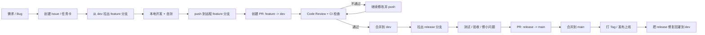
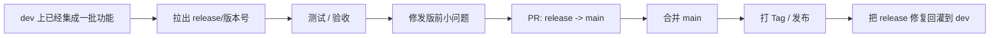
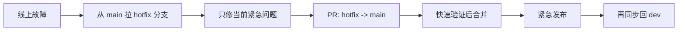
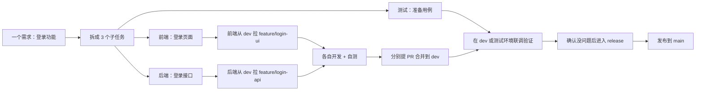
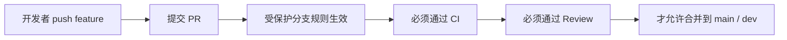
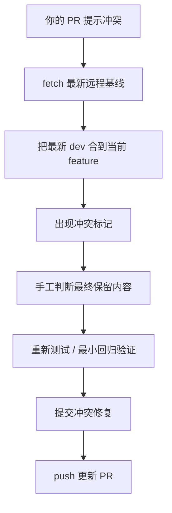

本手册包含 1 份源文件：E:\GithubProject\docs\general\git.md

# Git:

创建分支：
git branch feature
// 相当于：
echo "当前commit哈希" > .git/refs/heads/feature

```
执行 git add file.txt 时：

```
执行 git commit -m "message" 时：

```
分支只是一个指向commit的指针文件：

```
### 场景1：默认 merge（快进合并，你这个拓扑的默认行为）
因为 main 的最新提交 C，是 feature 最新提交 E 的直接祖先，Git 默认会走**快进合并（Fast-forward）**：
- 不生成新的合并提交
- 直接把 main 指针从 C 移动到 E
- feature 指针原地不动，还是指向 E

```

**git add 的底层操作(就是保存当前文件的状态)**

1. Git读取文件内容
2. 计算SHA-1哈希
3. 压缩内容（zlib）,后面可以解压缩
4. 存入 .git/objects/xx/xxxx...
5. 更新暂存区（index文件）

暂存区（index）的内容：
┌──────────────────────────────────────────────┐
│ 文件名        │ 创建时间 │ SHA-1            │
├──────────────────────────────────────────────┤
│ file.txt     │ 1234567  │ abc123def456...  │
│ other.txt    │ 1234568  │ xyz789...        │
└──────────────────────────────────────────────┘

暂存区是一个二进制文件，记录了：
- 每个文件的路径
- 文件的SHA-1哈希
- 文件的元数据
```

**git commit 的底层操作(把暂存区当前的项目状态做成一个 commit 对象，然后让当前分支指向这个新 commit。)**

1. Git读取暂存区
2. 创建tree对象：
   - 遍历暂存区的所有文件
   - 为每个目录创建tree对象
   - tree包含文件名→blob的映射

3. 创建commit对象：
   struct commit {
       tree: def456...        // 指向根tree
       parent: abc123...      // 指向父commit
       author: "张三 <email>"
       committer: "张三 <email>"
       message: "message"
   }

4. 更新分支引用：
   echo "新的commit哈希" > .git/refs/heads/main

5. 清空暂存区（实际上暂存区保留，但与HEAD一致）
```

**分支的本质(指向某个所有文件状态的指针文件,hash就是commit对象的地址)**

.git/refs/heads/main：
abc123def456789...  // 一个40字符的SHA-1哈希

切换分支：
git checkout feature
// 相当于：
1. 读取 .git/refs/heads/feature 获取commit哈希
2. 读取该commit的tree对象
3. 更新工作区文件
4. 更新 HEAD 文件

HEAD文件：
.git/HEAD：
ref: refs/heads/main  // 指向当前分支

或者（分离HEAD状态）：
abc123def456...  // 直接指向某个commit
```

**git merge 的底层操作（开一个分支就是，指向C，每一次commit就是一个字母）**

main:    A ── B ── C
                      
feature:               D ── E

合并后结构：
```

A ── B ── C ── D ── E  (main、feature 都指向 E)

### 场景2：加 `--no-ff` 强制生成合并提交（对应你描述的双父commit）
如果执行 `git merge --no-ff feature`，Git 会强制新建一个合并提交 M：
- M 有两个父提交：`parent1=C`（main原顶端），`parent2=E`（feature顶端）
- main 指针移动到新的合并提交 M
- **feature 指针依然停在 E，完全不动**

```
推送到远程仓库：

```
1. Fork 仓库（复制一份到你的账号）
2. 创建分支，修改代码
3. 推送到你的 Fork
4. 创建 PR（请求原仓库拉取你的改动）
5. 维护者 Review（审核代码）
6. 合并或关闭
```

```
你请求维护者"Pull"（拉取）你的代码到他们的仓库。
不是你Push（推送），而是请求他们Pull。
```

合并后结构：
```

main:    A ── B ── C ─────── M (main 现在指向 M)
                      \       /
feature:               D ── E (feature 仍指向 E)

**git push 的底层操作**

1. Git获取远程仓库地址：
   url = .git/config中的remote.url

2. Git比较本地和远程的commit：
   - 找出本地有但远程没有的commit
   - 计算需要的对象

3. 通过HTTP/SSH发送数据：
   POST /git-receive-pack
   
   请求体：
   - commit对象
   - tree对象
   - blob对象
   - 更新refs的请求

4. 远程服务器处理：
   - 验证权限
   - 存储对象
   - 更新refs

5. 返回结果给客户端
```

#### PR是什么？

**问题**：发起 PR 是什么意思？为什么叫 Pull Request？

**是什么**：
PR（Pull Request）是请求仓库维护者"拉取"你的代码变更。

**流程**：

**为什么叫Pull Request**：

## 二、企业协作全景与分支模型

### 2.1 协作全景图



| 分支          | 作用                           | 是否允许直接 push          | 谁主要操作            |
| ------------- | ------------------------------ | -------------------------- | --------------------- |
| `main`      | 生产分支，代表线上稳定代码     | 通常禁止                   | 发布负责人            |
| `dev`       | 日常集成分支，功能先汇总到这里 | 通常禁止                   | 开发团队              |
| `feature/*` | 单个功能开发分支               | 允许开发者 push 自己的分支 | 开发者                |
| `release/*` | 发版准备分支                   | 通常限制很严               | 发布负责人 / 测试配合 |
| `hotfix/*`  | 线上紧急修复分支               | 仅修紧急问题               | 负责故障修复的人      |

这张图是面试里最值得你记住的主流程。它展示了从需求到上线的完整链路：

2.3 每个分支的角色与规则

### 2.5 分支基本操作

核心逻辑：**先切到目标分支，再 merge 来源分支。**

```bash
git branch          # 查看本地分支
git branch -r       # 查看远程分支
git branch -a       # 查看所有分支（本地 + 远程）
```

```bash
git branch | wc -l                          # 本地分支数量
git branch -r | grep -v 'HEAD' | wc -l     # 远程分支数量（排除 HEAD）
git branch -a | grep -v 'HEAD' | wc -l     # 所有分支数量（排除 HEAD）
```

```bash
git branch -d feature/login
```

```bash
git branch -D feature/login
```

```bash
git push origin --delete feature/login
```

```bash
git switch main
git pull origin main          # 先拉最新
git merge feature/login       # 再合并
git push origin main          # 最后推送
```

```text
<<<<<<< HEAD
main 分支的代码
=======
feature/login 分支的代码
>>>>>>> feature/login
```

```bash
git add .
git commit
git push origin main
```

#### 查看分支

查看分支数量：

#### 删除分支

安全删除（分支已合并才允许删除）：

强制删除（即使没合并也删）：

删除远程分支：

#### 合并分支

假设要把 `feature/login` 合并到 `main`：

如果出现冲突，文件里会显示冲突标记：

手动处理冲突后：

## 三、常见工作流

### 3.2 Git Flow

**特点：** 包含 `main`、`develop`、`feature/*`、`release/*`、`hotfix/*` 五类分支，结构完整。

**优点：** 结构清楚、发布流程完整，非常适合讲给面试官听。

**缺点：** 流程较重，对小团队可能有点复杂。

**适合场景：** 版本发版、测试验收、热修复比较重的团队。

### 3.4 Release 流程详解



Release 分支的核心价值是把"日常集成线"和"正式上线线"隔开。`dev` 可能还在继续变化，而 `release` 是为了冻结一版准备上线的代码，只允许发版相关修复，不再继续加新功能。这样能降低上线风险。

### 3.5 Hotfix 流程详解



Hotfix 必须从 `main` 拉，因为线上运行的是 `main` 对应版本。如果从 `dev` 拉，容易把尚未准备上线的功能一起带进修复包，风险很高。修完后不仅要回到 `main`，还要同步回 `dev`，防止下个版本把这次修复覆盖掉。

---

## 四、团队协作实战

### 4.1 多人协作角色图

```mermaid
flowchart LR
    A["产品 / 需求方"] --> B["创建 Issue / 需求卡"]
    B --> C["开发者领取任务"]
    C --> D["从 dev 拉 feature 分支开发"]
    D --> E["提交 PR"]
    E --> F["Reviewer 做 Code Review"]
    F --> G["CI 跑检查"]
    G --> H["测试 / QA 验证"]
    H --> I["合并到 dev"]
    I --> J["发布负责人拉 release"]
    J --> K["最终合并到 main 并发布"]
```



### 4.2 每个角色怎么讲

**产品 / 需求方：** 负责提需求、明确验收标准。通常不会直接让开发者"去改一下代码"，而是先把需求落成 Issue 或工单，明确范围、背景和验收标准，这样后续 PR、测试和发布都能挂到同一条需求链路上。

**开发者：** 负责从 `dev` 拉 `feature`，开发、自测、提 PR，根据 review 意见修改。一个分支尽量只承载一个需求或子任务，减少改动混杂带来的审查和回滚风险。

**Reviewer：** 负责审业务逻辑、边界情况、回归风险、可维护性，决定是否 approve。Code Review 不只是看语法对不对，更关注需求实现是否准确、边界条件是否完整、是否可能引入回归问题，以及代码是否符合团队规范。

**测试 / QA：** 在 `dev` 或 `release` 上验证功能，提缺陷。

**发布负责人：** 决定何时发版，合并 `release -> main`，打 Tag，处理回滚或 hotfix。

### 4.3 多人一起写同一个项目时怎么配合



注意：不是两个人改同一个文件就一定冲突。

**真实协作示意图：**

1. **冲突处理机制：** 如果出现冲突，先同步最新基线，再手工解决冲突并补最小回归验证，而不是直接粗暴覆盖。

**冲突（conflict）就是：两个人改了同一个文件的同一块位置，Git 不知道该保留谁的内容。**

---

比如原来的 `user.js` 是这样：

<pre class="overflow-visible! px-0!" data-start="102" data-end="156"><div class="relative w-full mt-4 mb-1"><div class=""><div class="contents"><div class="relative"><div class="h-full min-h-0 min-w-0"><div class="h-full min-h-0 min-w-0"><div class="border border-token-border-light border-radius-3xl corner-superellipse/1.1 rounded-3xl"><div class="h-full w-full border-radius-3xl bg-token-bg-elevated-secondary corner-superellipse/1.1 overflow-clip rounded-3xl lxnfua_clipPathFallback"><div class="pointer-events-none absolute inset-x-4 top-12 bottom-4"><div class="pointer-events-none sticky z-40 shrink-0 z-1!"><div class="sticky bg-token-border-light"></div></div></div><div class="relative"><div class=""><div class="relative z-0 flex max-w-full"><div id="code-block-viewer" dir="ltr" class="q9tKkq_viewer cm-editor z-10 light:cm-light dark:cm-light flex h-full w-full flex-col items-stretch ͼd ͼr"><div class="cm-scroller"><pre class="cm-content q9tKkq_readonly m-0"><code><span class="ͼg">function</span><span></span><span class="ͼm">getUserName</span><span>() {</span><br/><span></span><span class="ͼg">return</span><span></span><span class="ͼk">"Tom"</span><span>;</span><br/><span>}</span></code></pre></div></div></div></div></div></div></div></div></div><div class=""><div class=""></div></div></div></div></div></div></pre>

现在有两个人同时从 `dev` 分支拉出自己的分支。

---

## 情况一：不会冲突

A 改第一行附近：

<pre class="overflow-visible! px-0!" data-start="215" data-end="311"><div class="relative w-full mt-4 mb-1"><div class=""><div class="contents"><div class="relative"><div class="h-full min-h-0 min-w-0"><div class="h-full min-h-0 min-w-0"><div class="border border-token-border-light border-radius-3xl corner-superellipse/1.1 rounded-3xl"><div class="h-full w-full border-radius-3xl bg-token-bg-elevated-secondary corner-superellipse/1.1 overflow-clip rounded-3xl lxnfua_clipPathFallback"><div class="pointer-events-none absolute inset-x-4 top-12 bottom-4"><div class="pointer-events-none sticky z-40 shrink-0 z-1!"><div class="sticky bg-token-border-light"></div></div></div><div class="relative"><div class=""><div class="relative z-0 flex max-w-full"><div id="code-block-viewer" dir="ltr" class="q9tKkq_viewer cm-editor z-10 light:cm-light dark:cm-light flex h-full w-full flex-col items-stretch ͼd ͼr"><div class="cm-scroller"><pre class="cm-content q9tKkq_readonly m-0"><code><span class="ͼg">function</span><span></span><span class="ͼm">getUserName</span><span>() {</span><br/><span></span><span class="ͼg">return</span><span></span><span class="ͼk">"Tom"</span><span>;</span><br/><span>}</span><br/><br/><span class="ͼg">function</span><span></span><span class="ͼm">getUserAge</span><span>() {</span><br/><span></span><span class="ͼg">return</span><span></span><span class="ͼj">18</span><span>;</span><br/><span>}</span></code></pre></div></div></div></div></div></div></div></div></div><div class=""><div class=""></div></div></div></div></div></div></pre>

B 改另一个地方：

<pre class="overflow-visible! px-0!" data-start="324" data-end="434"><div class="relative w-full mt-4 mb-1"><div class=""><div class="contents"><div class="relative"><div class="h-full min-h-0 min-w-0"><div class="h-full min-h-0 min-w-0"><div class="border border-token-border-light border-radius-3xl corner-superellipse/1.1 rounded-3xl"><div class="h-full w-full border-radius-3xl bg-token-bg-elevated-secondary corner-superellipse/1.1 overflow-clip rounded-3xl lxnfua_clipPathFallback"><div class="pointer-events-none absolute inset-x-4 top-12 bottom-4"><div class="pointer-events-none sticky z-40 shrink-0 z-1!"><div class="sticky bg-token-border-light"></div></div></div><div class="relative"><div class=""><div class="relative z-0 flex max-w-full"><div id="code-block-viewer" dir="ltr" class="q9tKkq_viewer cm-editor z-10 light:cm-light dark:cm-light flex h-full w-full flex-col items-stretch ͼd ͼr"><div class="cm-scroller"><pre class="cm-content q9tKkq_readonly m-0"><code><span class="ͼg">function</span><span></span><span class="ͼm">getUserName</span><span>() {</span><br/><span></span><span class="ͼg">return</span><span></span><span class="ͼk">"Tom"</span><span>;</span><br/><span>}</span><br/><br/><span class="ͼg">function</span><span></span><span class="ͼm">getUserEmail</span><span>() {</span><br/><span></span><span class="ͼg">return</span><span></span><span class="ͼk">"tom@test.com"</span><span>;</span><br/><span>}</span></code></pre></div></div></div></div></div></div></div></div></div><div class=""><div class=""></div></div></div></div></div></div></pre>

这时候 Git 大概率可以自动合并，因为改的位置不同。

---

## 情况二：会冲突

A 把代码改成：

<pre class="overflow-visible! px-0!" data-start="492" data-end="548"><div class="relative w-full mt-4 mb-1"><div class=""><div class="contents"><div class="relative"><div class="h-full min-h-0 min-w-0"><div class="h-full min-h-0 min-w-0"><div class="border border-token-border-light border-radius-3xl corner-superellipse/1.1 rounded-3xl"><div class="h-full w-full border-radius-3xl bg-token-bg-elevated-secondary corner-superellipse/1.1 overflow-clip rounded-3xl lxnfua_clipPathFallback"><div class="pointer-events-none absolute inset-x-4 top-12 bottom-4"><div class="pointer-events-none sticky z-40 shrink-0 z-1!"><div class="sticky bg-token-border-light"></div></div></div><div class="relative"><div class=""><div class="relative z-0 flex max-w-full"><div id="code-block-viewer" dir="ltr" class="q9tKkq_viewer cm-editor z-10 light:cm-light dark:cm-light flex h-full w-full flex-col items-stretch ͼd ͼr"><div class="cm-scroller"><pre class="cm-content q9tKkq_readonly m-0"><code><span class="ͼg">function</span><span></span><span class="ͼm">getUserName</span><span>() {</span><br/><span></span><span class="ͼg">return</span><span></span><span class="ͼk">"Alice"</span><span>;</span><br/><span>}</span></code></pre></div></div></div></div></div></div></div></div></div><div class=""><div class=""></div></div></div></div></div></div></pre>

B 把同一行改成：

<pre class="overflow-visible! px-0!" data-start="561" data-end="615"><div class="relative w-full mt-4 mb-1"><div class=""><div class="contents"><div class="relative"><div class="h-full min-h-0 min-w-0"><div class="h-full min-h-0 min-w-0"><div class="border border-token-border-light border-radius-3xl corner-superellipse/1.1 rounded-3xl"><div class="h-full w-full border-radius-3xl bg-token-bg-elevated-secondary corner-superellipse/1.1 overflow-clip rounded-3xl lxnfua_clipPathFallback"><div class="pointer-events-none absolute inset-x-4 top-12 bottom-4"><div class="pointer-events-none sticky z-40 shrink-0 z-1!"><div class="sticky bg-token-border-light"></div></div></div><div class="relative"><div class=""><div class="relative z-0 flex max-w-full"><div id="code-block-viewer" dir="ltr" class="q9tKkq_viewer cm-editor z-10 light:cm-light dark:cm-light flex h-full w-full flex-col items-stretch ͼd ͼr"><div class="cm-scroller"><pre class="cm-content q9tKkq_readonly m-0"><code><span class="ͼg">function</span><span></span><span class="ͼm">getUserName</span><span>() {</span><br/><span></span><span class="ͼg">return</span><span></span><span class="ͼk">"Bob"</span><span>;</span><br/><span>}</span></code></pre></div></div></div></div></div></div></div></div></div><div class=""><div class=""></div></div></div></div></div></div></pre>

这时合并时 Git 会发现：

<pre class="overflow-visible! px-0!" data-start="633" data-end="687"><div class="relative w-full mt-4 mb-1"><div class=""><div class="contents"><div class="relative"><div class="h-full min-h-0 min-w-0"><div class="h-full min-h-0 min-w-0"><div class="border border-token-border-light border-radius-3xl corner-superellipse/1.1 rounded-3xl"><div class="h-full w-full border-radius-3xl bg-token-bg-elevated-secondary corner-superellipse/1.1 overflow-clip rounded-3xl lxnfua_clipPathFallback"><div class="pointer-events-none absolute end-1.5 top-1 z-2 md:end-2 md:top-1"></div><div class="relative"><div class="pe-11 pt-3"><div class="relative z-0 flex max-w-full"><div id="code-block-viewer" dir="ltr" class="q9tKkq_viewer cm-editor z-10 light:cm-light dark:cm-light flex h-full w-full flex-col items-stretch ͼd ͼr"><div class="cm-scroller"><pre class="cm-content q9tKkq_readonly m-0"><code><span>同一个文件</span><br/><span>同一个函数</span><br/><span>同一行 return</span><br/><span>A 改成 Alice</span><br/><span>B 改成 Bob</span></code></pre></div></div></div></div></div></div></div></div></div><div class=""><div class=""></div></div></div></div></div></div></pre>

Git 不知道应该用 Alice 还是 Bob，所以就产生冲突。

### 4.6 CI / 受保护分支 / CODEOWNERS



> """
>
> ==============================================================================
>
> Agent Loop 测试文件 + CI/CD 完整教程
>
> ==============================================================================
>
> 一、什么是 CI/CD？
>
> ──────────────────
>
> CI = Continuous Integration（持续集成）
>
> CD = Continuous Delivery（持续交付）或 Continuous Deployment（持续部署）
>
> 你平时开发 ZBot 的流程大概是：
>
> 1. 写代码
> 2. 手动跑一下，看看有没有报错
> 3. 没问题就 git push
>
> CI/CD 就是把第 2 步自动化：
>
> 1. 你写完代码，push 到 GitHub
> 2. GitHub 自动帮你跑一堆检查（代码风格、类型检查、测试）
> 3. 全部通过 → 允许你合并代码到 main 分支
> 4. 有失败 → 禁止合并，告诉你哪里出了问题
>
> CI 和 CD 的区别：
>
> CI：每次代码变更后，自动构建、自动测试、自动检查质量
>
> Continuous Delivery：代码随时可以发布，但上线需要人工批准
>
> Continuous Deployment：代码通过测试后自动发布到生产环境
>
> 二、为什么需要 CI/CD？
>
> ──────────────────────
>
> 没有 CI/CD 的翻车场景：
>
> 场景 1：你改了 hooks.py 的验证逻辑
>
> → 没跑测试就提交了
>
> → 合并到 main 后发现任务完成验证全部失效
>
> → agent 每次都说"已完成"，但其实没完成
>
> 场景 2：你改了 shell.py，不小心放行了 rm -rf
>
> → 没有安全测试
>
> → 上线后 agent 执行了 rm -rf /
>
> → 灾难
>
> 场景 3：你改了 memory 模块，同事改了 context builder
>
> → 两个人各自的测试都通过
>
> → 合在一起就崩了
>
> → CI 会在合并前发现这种"集成"问题
>
> 三、Agent 项目的测试和普通项目有什么不同？
>
> ────────────────────────────────────────
>
> 普通项目测：函数输出、API 状态码、数据库读写、页面渲染
>
> Agent 项目还要额外测：
>
> - 模型是否选对工具
> - 危险操作是否被拦截（rm -rf、读 ~/.ssh）
> - 任务是否真的完成（不是模型说完成就算完成）
> - 是否陷入死循环
> - 工具失败后能否恢复
> - 是否越权读写文件
> - token / 成本是否超预算
>
> 四、测试分 7 层
>
> ────────────────
>
> 第 1 层 - 静态检查（秒级）：
>
> ruff check .           → 检查代码风格、常见错误
>
> ruff format --check .  → 检查格式是否统一
>
> mypy src               → 检查类型是否正确
>
> 第 2 层 - 单元测试（秒级）：
>
> 测单个函数/模块的确定性逻辑，不依赖外部服务。
>
> 覆盖：tool registry、permission guard、hook engine、memory store
>
> 第 3 层 - 工具集成测试（秒到分钟级）：
>
> 测工具在真实环境（sandbox）下能不能正常工作。
>
> 覆盖：shell tool、file tool、browser tool
>
> 第 4 层 - Agent 行为测试（秒级）：← 本文件测的就是这层
>
> 用 FakeModel（假的 LLM）测 agent runtime。
>
> 不测模型智商，测 agent 框架本身是否可靠。
>
> 第 5 层 - Agent Eval（分钟到小时级）：
>
> 用真实 LLM 跑真实任务，测任务完成质量。
>
> PR 只跑 smoke eval（10~30 个核心任务）
>
> nightly 跑 full eval（100+ 任务）
>
> 第 6 层 - 安全测试（一票否决）：
>
> 危险命令是否被拦截、敏感文件是否被保护、prompt injection 能否骗过 agent
>
> 第 7 层 - 构建部署测试：
>
> Docker build 能否成功、CLI 能否启动、配置能否正确加载
>
> 五、CI/CD 流水线设计
>
> ────────────────────
>
> PR 阶段（每次提 PR 都跑）：
>
> ruff check → ruff format → mypy → pytest → smoke eval → 安全测试
>
> 全部通过 → 允许合并；任何一步失败 → 禁止合并
>
> main 阶段（合并到 main 后自动跑）：
>
> 完整测试 → Docker build → 部署 staging → staging smoke test
>
> nightly 阶段（每天凌晨定时跑）：
>
> full agent eval + 真实 LLM + 成本统计 + 回归报告
>
> 六、GitHub Actions —— GitHub 内置的 CI/CD
>
> ────────────────────────────────────────
>
> GitHub Actions 是 GitHub 内置的 CI/CD 服务，免费（公开仓库无限免费）。
>
> 不需要自己搭服务器，只需要在仓库里放一个 YAML 文件，GitHub 就会自动跑。
>
> 核心概念：
>
> Workflow（工作流）= 一个 YAML 文件，定义"什么时候跑、跑什么"
>
> 文件位置：.github/workflows/xxx.yml
>
> Trigger（触发器）= "什么时候跑"
>
> pull_request → 提 PR 时跑
>
> push         → push 代码时跑
>
> schedule     → 定时跑（如每天凌晨 3 点）
>
> workflow_dispatch → 手动点按钮跑
>
> Job（任务）= "跑什么"，一个 workflow 里可以有多个 job 并行跑
>
> Step（步骤）= job 里的每一步操作
>
> 给 ZBot 配 GitHub Actions 的步骤：
>
> 1. 创建 .github/workflows/ci.yml：
>
> name: CI
>
> on:
>
> pull_request:
>
> branches: [main]
>
> push:
>
> branches: [main]
>
> jobs:
>
> test:
>
> runs-on: ubuntu-latest
>
> steps:
>
> - uses: actions/checkout@v4
> - uses: actions/setup-python@v5
>
> with:
>
> python-version: "3.13"
>
> - name: Install dependencies
>
> run: |
>
> python -m pip install --upgrade pip
>
> pip install -e ".[dev]"
>
> - name: Lint
>
> run: |
>
> ruff check .
>
> ruff format --check .
>
> - name: Type check
>
> run: mypy src
>
> - name: Run tests
>
> run: pytest ZBot/test/ -v
>
> 2. push 到 GitHub，去仓库页面 → Actions 标签页就能看到 CI 在跑
> 3. 设置分支保护（可选但强烈推荐）：
>
> Settings → Branches → main → Add rule
>
> 勾选 "Require status checks to pass before merging"
>
> 效果：CI 不通过，GitHub 禁止合并 PR 到 main

这是"你有没有工程化意识"的关键。

## 五、常用命令与冲突处理

### 5.1 命令与场景总表

| 命令                             | 作用         | 场景                                   |
| -------------------------------- | ------------ | -------------------------------------- |
| `git status`                   | 看当前状态   | 每次操作前先确认工作区和分支状态       |
| `git fetch origin`             | 更新远程信息 | 多人协作里更安全，先看变化再决定怎么合 |
| `git pull origin dev`          | 拉最新基线   | 从 `dev` 开 feature 前先同步最新     |
| `git checkout -b feature/x`    | 创建功能分支 | 一个需求一条独立开发线                 |
| `git add`                      | 加入暂存区   | 挑选本次要提交的变更                   |
| `git commit -m`                | 记录一次变更 | 一次提交只做一件事                     |
| `git push -u origin feature/x` | 推送新分支   | 第一次把 feature 提到远程              |
| `git merge origin/dev`         | 合入最新基线 | 解决分支落后或冲突时常用               |
| `git rebase origin/dev`        | 变基整理历史 | 个人 feature 分支整理提交              |
| `git cherry-pick <commit>`     | 摘取某次提交 | 把某个修复精准带到另一个分支           |
| `git revert <commit>`          | 反向撤销提交 | 已共享历史上更安全的回退方式           |
| `git tag v1.0.0`               | 打版本标签   | 发布后标记版本                         |

面试官问命令，通常不是想听你背帮助文档，而是想看你知不知道什么场景该用什么命令、命令背后代表什么工作流动作。

### 5.2 关键命令详解

```text
origin/main: A - B - C - D
```

```text
main:        A - B
```

```bash
git fetch origin
```

```text
main:        A - B
origin/main: A - B - C - D
```

```text
本地记录的远程 main 分支的位置
```

```text
1. 下载远程新增的 commit、tree、blob 等对象
2. 更新 origin/main、origin/dev 这类远程追踪分支
3. 不修改你的当前分支
4. 不修改你的工作区代码
5. 不修改你的暂存区
```

```bash
git merge origin/main
```

```bash
git rebase origin/main
```

```text
git fetch = 先把远程更新拿回来看看
git pull  = fetch + 自动合并/变基
```

```text
本地保存的“远程 main 分支最新位置”
```

```text
main:        A - B
origin/main: A - B - C - D
```

```bash
git merge origin/main
```

```text
main:        A - B - C - D
origin/main: A - B - C - D
```

```text
远程 main: A - B - C - D - E
```

```bash
git fetch origin
```

```text
main:        A - B - C - D
origin/main: A - B - C - D - E
```

```text
merge        合并分支，不改已有历史
rebase       变基，会改提交历史
reset        回退指针，会改历史
revert       新增一个反向提交，不改历史
cherry-pick  只摘某一个提交过来
```

#### `fetch` 和 `pull` 有什么区别

`git fetch` 只会更新远程引用，不会直接改当前工作分支，所以更安全，适合先看远程变化再决定如何处理。`git pull` 本质上是 fetch 之后再自动合并或变基，更方便，但也更容易在没看清楚差异的情况下把变化直接拉到当前分支。

`git fetch` 的意思是：

**把远程仓库最新的 commit 下载到本地，但不会直接修改你当前正在工作的分支。**

比如远程仓库是：

你本地自己的 `main` 是：

执行：

之后变成：

也就是说：

**远程新增的 C、D 两次 commit 已经下载到本地了，但你的 main 分支还停在 B。**

这里的 `origin/main` 不是你的本地分支，而是：

所以 `git fetch` 做的事情主要是：

如果你想让自己的 `main` 也更新到远程最新状态，还需要再执行：

或者：

所以可以简单理解为：

一句话总结：

**`git fetch` 不是把自己的分支直接变成远程分支，而是把远程的新提交记录下载下来，并更新 `origin/main` 这种远程追踪引用；你的当前分支不会自动变化，所以更安全。**

多人协作里，如果分支变化频繁、冲突概率高，通常更偏向先 fetch，再决定 merge 还是 rebase。

不会消失。

`origin/main` 会一直存在，它表示：

合并前可能是：

执行：

合并后，如果没有冲突，可能变成：

也就是说：

**你的本地 `main` 追上了 `origin/main`，但 `origin/main` 并不会消失。**

它还是作为一个“远程追踪分支”保留在本地。

以后如果远程仓库又多了新提交：

你再次执行：

本地就会变成：

然后你再决定要不要合并。

所以一句话：

**`origin/main` 不会因为 merge 消失，它会一直记录你上一次 fetch 时远程 main 的位置。**

你可以把这几个 Git 命令先按**“会不会改历史”**来理解：

---

### 5.3 `merge` 和 `rebase` 的区别

```text
A --- B    main
```

```text
A --- B    main
       \
        C --- D   feature
```

```text
A --- B --- E --- F   main
       \
        C --- D       feature
```

假设一开始大家都在 `main` 上：

你从 `B` 拉了一个自己的功能分支：

这时别人又往 `main` 提交了新代码：

现在你的 `feature` 落后了，需要把 `main` 的最新代码同步过来。

---

## 1. 用 `merge`

```bash
git merge main
```

```text
A --- B --- E --- F        main
       \         \
        C --- D --- M      feature
```

```text
把 main 的 E、F 和 feature 的 C、D 合在一起
```

```text
优点：不改历史，安全
缺点：历史会出现分叉和合并线，看起来不够直
```

```text
多人共享分支
main
dev
release
```

你在 `feature` 分支执行：

结果会变成：

这里的 `M` 是一个新的  **merge commit** ，意思是：

特点：

适合：

因为它不会改掉别人已经看到的提交。

---

## 2. 用 `rebase`

```bash
git rebase main
```

```text
A --- B --- E --- F --- C' --- D'   feature
                  main
```

```text
优点：历史变成一条直线，更干净
缺点：会改历史，不适合对共享分支乱用
```

```text
自己的 feature 分支
提交 PR 前整理历史
```

注意这里是 `C'`、`D'`，不是原来的 `C`、`D`。

你在 `feature` 分支执行：

Git 会把你的 `C、D` 先拿下来，然后放到最新的 `main` 后面。

结果变成：

因为它们被重新放到了 `F` 后面，所以 commit 哈希会变。

特点：

适合：

---

### 5.4 `reset` 和 `revert` 的区别

```text
A --- B --- C   main
```

假设现在提交历史是：

现在发现 `C` 有问题，想撤销。

---

## 1. 用 `reset`

```bash
git reset --hard B
```

```text
A --- B   main
```

```text
reset 是把分支指针往回移动
```

```text
本地提交错了
还没有 push 到远程
还没有被别人基于这个提交开发
```

```text
已经 push 到远程的共享分支
main
dev
别人正在使用的分支
```

> 我不要 C 了，就当 C 没发生过。

执行：

结果会变成：

`C` 直接从当前分支历史里消失了。

也就是说：

它像是说：

所以它会 **改历史** 。

适合：

不适合：

否则别人本地还有 `C`，你远程强行删掉 `C`，大家历史就乱了。

---

## 2. 用 `revert`

```bash
git revert C
```

```text
A --- B --- C --- D   main
```

```text
反向撤销 C 的改动
```

```text
已经 push 到远程的提交
main / dev / release 分支
线上代码回滚
团队协作场景
```

> C 确实发生过，但现在我提交一个新的修改，把 C 的影响撤掉。

执行：

结果会变成：

这里的 `D` 是一个新的提交，它的作用是：

也就是说，`C` 还在历史里，但是新增了一个 `D` 来抵消它。

它像是说：

所以 `revert`  **不改历史** 。

适合：

### 5.5 `cherry-pick` 是什么

```text
main:
A --- B --- C

```text
D 是一个 bug 修复
E、F 是还没测试完的新功能
```

```bash
git merge feature
```

```bash
git cherry-pick D
```

```text
main:
A --- B --- C --- D'

注意这里也是 `D'`，因为它是在 `main` 上重新生成的一个提交，内容和 `D` 类似，但哈希通常不同。

`cherry-pick` 的意思是：

**从别的分支上，只拿某一个 commit 过来。**

不是合并整个分支。

---

比如现在有两个分支：

feature:
A --- B --- D --- E --- F
```

其中：

现在你只想把 `D` 这个 bug 修复放到 `main`，但不想把 `E、F` 的新功能也合进去。

这时候不能直接：

因为这样会把 `D、E、F` 都带进来。

你应该用：

结果：

feature:
A --- B --- D --- E --- F
```

---

## 17. Git .gitignore：撤销对已追踪文件的忽略

### 一、分两种情况

- Git 会自动忽略所有层级下名为 memory 的文件夹及其所有内容
- 执行 `git add .` 时，这个文件夹不会被加入暂存区
- 末尾加 `/` 表示只忽略文件夹，不会误删同名的文件

> **.gitignore 不能停止追踪已经被追踪的文件**——这是 Git 最容易被误解的特性之一。
>
> **.gitignore 只对从未被 Git 追踪过的文件 / 文件夹生效。**

**✅ 情况 1：`memory/` 文件夹从来没被 git add/commit 过**

你写的 `memory/` 语法完全正确：

**❌ 情况 2：`memory/` 文件夹之前已经被提交过了（最常见）**

这时候加了 `.gitignore` 也没用！Git 会继续追踪这个文件夹里的所有文件变化。

### 二、如果已经提交过了，怎么彻底移除并忽略

```bash
# 1. 先从 Git 的追踪中移除 memory 文件夹（本地文件不会被删除）
git rm -r --cached memory/

执行下面 3 条命令，**会从 Git 仓库中删除 memory 文件夹，但保留你本地的文件**：

# 2. 提交这个变更
git commit -m "chore: 忽略memory文件夹，从仓库中移除"

# 3. 推送到 GitHub
git push
```

执行完之后，GitHub 上的 memory 文件夹就会被删除。

### 三、"从 Git 的追踪中移除"是什么意思？

- **第一步：你最开始上传的时候** → 执行 `git add .` + commit + push，相当于把 memory 这个学生的名字写进了老师的点名册里
- **第二步：你后来在 .gitignore 里写了 `memory/`** → 相当于在教室门口贴了一张纸条写着"memory 以后不用点名了"
- **但 Git 的铁律**：这张纸条只对还没进点名册的新学生有效，对已经在点名册上的 memory，Git 会假装没看见这张纸条

- ✅ 把 memory 的名字从老师的点名册上划掉
- ❌ 绝对不会把 memory 这个学生赶出教室（不会删除你本地的任何文件）

| Git 里的东西                           | 对应学校里的       | 作用                               |
| -------------------------------------- | ------------------ | ---------------------------------- |
| 你电脑上的文件（比如 memory 文件夹）   | 教室里的学生       | 真实存在的人 / 文件                |
| Git 的"追踪名单"（存在 .git 文件夹里） | 老师手里的点名册   | 记录哪些学生需要点名               |
| .gitignore 文件                        | 贴在教室门口的纸条 | 写着"以下这些学生，以后不用点名了" |

用**点名册类比**彻底讲清楚：

**你的情况到底发生了什么？**

**所以现在的尴尬局面**：你贴了纸条说"不用点名 memory"，但 Git 还是每次都点它的名。

**`git rm -r --cached memory/` 的作用**：

划掉之后，Git 才会遵守 .gitignore，从此再也不点名 memory 了。

### 四、完整过程每一步会发生什么

- ✅ 你电脑上的 memory 文件夹和里面的所有文件，一个都不会少
- Git 显示的 `rm 'memory/xxx.txt'` 只是说"从点名册里删除了 xxx.txt"

- 记录"已经把 memory 从点名册里划掉了"
- 不会动你本地的任何文件

- GitHub 上的 memory 文件夹会被删除
- 你本地的 memory 文件夹还好好的在那里

执行 `git rm -r --cached memory/`：

执行 `git commit -m "停止追踪memory文件夹"`：

执行 `git push`：

### 五、验证方法

```bash
git check-ignore -v memory/
```

在项目根目录执行：

如果输出类似 `.gitignore:93:memory/    memory/`，说明已经成功被忽略。

### 六、关键安全保证

| 命令                        | 效果                                 |
| --------------------------- | ------------------------------------ |
| `git rm memory/`          | 同时删除点名册和本地文件（危险！）   |
| `git rm --cached memory/` | 只删除点名册，保留本地文件（安全！） |

> 只要加了 `--cached` 参数，就**绝对不会删除本地文件**！

### 七、别忘了 .gitignore 文件本身

```bash
git add .gitignore
git commit -m "chore: 更新.gitignore，添加memory等忽略项"
git push
```

### 5.3 冲突处理




### 一、分两种情况

**✅ 情况 1：`memory/` 文件夹从来没被 git add/commit 过**

你写的 `memory/` 语法完全正确：

**❌ 情况 2：`memory/` 文件夹之前已经被提交过了（最常见）**

这时候加了 `.gitignore` 也没用！Git 会继续追踪这个文件夹里的所有文件变化。

### 二、如果已经提交过了，怎么彻底移除并忽略

```bash
# 1. 先从 Git 的追踪中移除 memory 文件夹（本地文件不会被删除）
git rm -r --cached memory/

执行下面 3 条命令，**会从 Git 仓库中删除 memory 文件夹，但保留你本地的文件**：

# 2. 提交这个变更
git commit -m "chore: 忽略memory文件夹，从仓库中移除"

# 3. 推送到 GitHub
git push
```

执行完之后，GitHub 上的 memory 文件夹就会被删除。

### 三、"从 Git 的追踪中移除"是什么意思？

- ✅ 把 memory 的名字从老师的点名册上划掉
- ❌ 绝对不会把 memory 这个学生赶出教室（不会删除你本地的任何文件）

用**点名册类比**彻底讲清楚：

**你的情况到底发生了什么？**

**所以现在的尴尬局面**：你贴了纸条说"不用点名 memory"，但 Git 还是每次都点它的名。

**`git rm -r --cached memory/` 的作用**：

划掉之后，Git 才会遵守 .gitignore，从此再也不点名 memory 了。

### 四、完整过程每一步会发生什么

- 记录"已经把 memory 从点名册里划掉了"
- 不会动你本地的任何文件

- GitHub 上的 memory 文件夹会被删除
- 你本地的 memory 文件夹还好好的在那里

执行 `git rm -r --cached memory/`：

执行 `git commit -m "停止追踪memory文件夹"`：

执行 `git push`：

### 五、验证方法

```bash
git check-ignore -v memory/
```

在项目根目录执行：

如果输出类似 `.gitignore:93:memory/    memory/`，说明已经成功被忽略。

### 六、关键安全保证

> 只要加了 `--cached` 参数，就**绝对不会删除本地文件**！

### 七、别忘了 .gitignore 文件本身

### 10.2 PRD 是什么？应该写给谁看？

背景：用户看到有价值文章，希望之后继续阅读。
目标：支持用户收藏和取消收藏文章。
范围：本次只做文章收藏，不做收藏夹分类。
流程：用户点击收藏按钮 -> 系统保存收藏关系 -> 按钮变成已收藏。
异常：未登录点击收藏，跳转登录；文章不存在，提示操作失败。
验收：登录用户能收藏/取消收藏；刷新后状态仍然正确。
```

```text
1. 背景：为什么要做这个功能。
2. 目标：做完以后解决什么问题。
3. 用户和场景：谁在什么情况下使用。
4. 功能范围：本次做什么，不做什么。
5. 业务流程：用户从开始到结束怎么走。
6. 页面和交互：有哪些入口、按钮、状态、提示。
7. 数据和规则：字段、限制、计算规则、权限规则。
8. 异常情况：失败、为空、重复、超时、无权限怎么办。
9. 验收标准：怎样算做完。
```

```text
需求：用户可以收藏文章。

```text
PRD 是把需求讲清楚的协作文档；原型图是把界面和交互画出来的表达方式，两者互补但不能互相替代。
```

| 角色      | 关心什么                     |
| --------- | ---------------------------- |
| 产品      | 目标、范围、优先级、验收标准 |
| 设计      | 页面、交互、状态、文案       |
| 前端      | 页面结构、接口字段、交互逻辑 |
| 后端      | 数据模型、业务规则、接口能力 |
| 测试      | 验收条件、边界场景、异常流程 |
| 运营/业务 | 功能是否满足实际业务目标     |

| 文档   | 重点                             |
| ------ | -------------------------------- |
| PRD    | 讲清楚需求、规则、流程、验收     |
| 原型图 | 展示页面布局、交互入口、视觉结构 |

**合并后的问题：**
PRD 是什么文档？谁写、给谁看、里面一般写什么？它和原型图有什么区别？

**答案：**

PRD 全称是 Product Requirements Document，也就是产品需求文档。它的作用是把“要做什么、为什么做、做到什么程度”讲清楚，让产品、设计、研发、测试、运营能对同一个需求形成共同理解。

PRD 不是只给程序员看的，也不是只给产品经理自己看的。它通常面向这些角色：

一份实用 PRD 通常包含：

最简单例子：

PRD 和原型图的区别：

原型图可以说明“按钮在哪里”，但 PRD 要说明“什么时候显示、点击后发生什么、失败怎么办、数据怎么变化”。

一句话总结：

---
