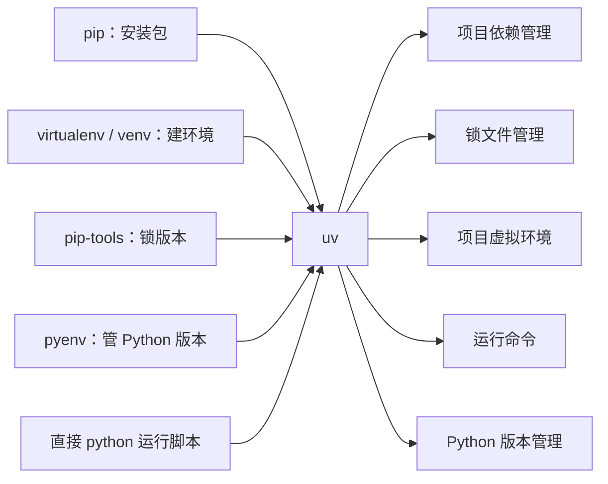
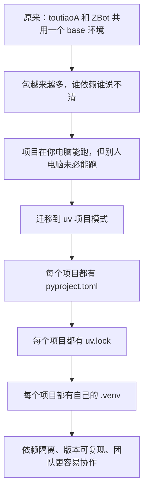
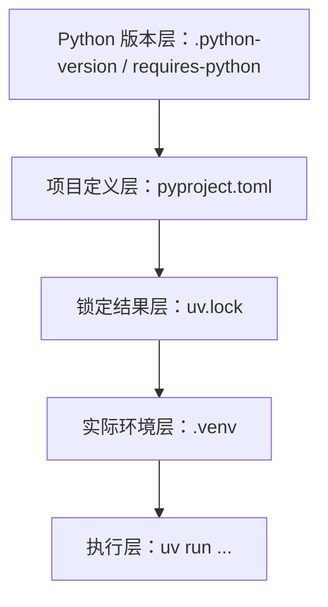
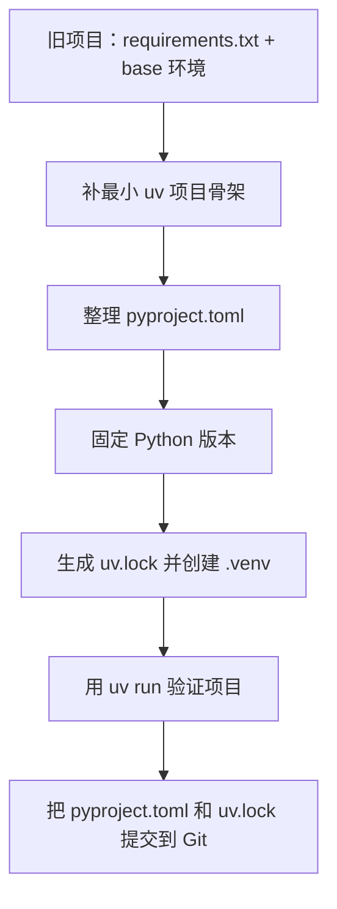
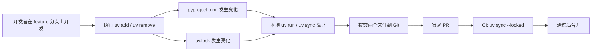

本手册包含 1 份源文件：E:\GithubProject\docs\general\uv.md

# 从 Python Base 环境迁移到 uv：基础认知、项目工作流与面试高频问答（toutiaoA + ZBot 可复述版）

> 这篇文档不再是“照着命令一步一步迁移”的操作手册。
> 假设你已经亲手把 `toutiaoA` 和 `ZBot` 从共用 `base` 环境迁移到了 `uv`，并且已经实际跑通过一遍。
> 现在这篇文档的目标变成：**帮你把“我做过”整理成“我能讲清楚 uv 是什么、为什么要用、团队里怎么用、面试时怎么答”的一整套表达体系。**

---

## 先说这篇文档到底帮你解决什么问题

- 能用非常白话的方式解释 `uv` 是什么。
- 能讲清楚为什么要从 `base` 环境迁移到项目级隔离环境。
- 能解释 `pyproject.toml`、`uv.lock`、`.venv`、`.python-version` 各自负责什么。
- 能按“场景”而不是按“死背命令”的方式理解 `uv` 常用命令。
- 能讲清团队里新增依赖、同步环境、提交锁文件、跑 CI 的标准流程。
- 能回答面试里最常见的 `uv` / Python 包管理问题。

很多人把项目迁到 `uv` 之后，会卡在下面这些地方：

1. 会敲 `uv sync`、`uv run`，但说不清 `uv` 到底是什么。
2. 知道 `pyproject.toml` 和 `uv.lock` 存在，但讲不清它们之间的关系。
3. 知道 `base` 环境不好，但只能说“有点乱”，说不出真正的工程问题。
4. 面试官一追问“为什么 `uv` 快”“`uv add` 和 `pip install` 有什么区别”“团队里怎么协作”，就开始乱。
5. 自己已经迁移过 `toutiaoA` 和 `ZBot`，但不会把这段经历讲成一个完整项目故事。

你读完以后，应该能做到：

---

## 一、先从面试视角理解：面试官到底在考什么

- `uv add`
- `uv sync`
- `uv run`

面试官问你 `uv`，不是在考你会不会背：

他真正想确认的是：

1. 你是不是理解 Python 项目的依赖管理，而不只是“能把代码跑起来”。
2. 你是否知道为什么 `base` 环境会造成依赖污染。
3. 你是否理解“项目定义”“锁定结果”“实际环境”这三层分别是什么。
4. 你是否知道团队里怎样保证“我电脑能跑”和“别人电脑也能跑”。
5. 你是否知道依赖改动该怎么进 Git、怎么进 CI、怎么进部署流程。
6. 你有没有真正做过“老项目迁移到标准化项目管理”的实操。

所以你回答时，必须从“工程问题”和“团队工作流”出发，而不是只从命令本身出发。

---

## 二、`uv` 到底是什么

### 1. 一句话先讲清楚

> `uv` 是一个更现代、更快、项目化程度更强的 Python 包和项目管理工具。

你可以先把 `uv` 理解成：

**一个把 Python 包安装、虚拟环境、项目依赖、锁文件、Python 版本管理、运行命令这些事情，尽量收进同一套命令体系里的工具。**

如果你觉得这句话太长，那就记住这个更短的版本：

---

### 2. 以前你经常分散用的工具，大概在干什么

问题在于：

- 用 `pip install` 装包
- 用 `venv` 或 Conda 环境隔离项目
- 用 `requirements.txt` 记依赖
- 用 `pip freeze` 导出一大坨包
- 用 `python xxx.py` 直接跑项目

- 工具是分散的
- 依赖定义和实际安装状态容易脱节
- 很多项目最后并没有真正做到“可复现”

很多新手以前的做法是这样的：

`uv` 的思路是尽量把这些事情统一起来。

---

### 3. 用一张图理解 `uv` 的位置

> 在绝大多数纯 Python 项目场景里，`uv` 能把过去你分散在多个工具上的常见工作，统一进一套更顺的工作流。

这张图不是说 `uv` 100% 等于所有工具。更准确地说是：

---

### 4. 为什么很多团队开始用 `uv`

你可以从下面 5 点去理解：

1. 它把“项目依赖定义”和“实际环境同步”连接得更紧。
2. 它默认更鼓励每个项目拥有自己的 `.venv`，而不是所有项目共用一个大环境。
3. 它使用 `pyproject.toml` 作为项目定义入口，更符合现在 Python 项目的主流方向。
4. 它有锁文件 `uv.lock`，更适合多人协作和 CI。
5. 它的性能和日常开发体验通常比传统 `pip + requirements.txt + 手工激活环境` 更顺。

---

### 5. 为什么大家都说 `uv` 快

- “因为它快”

- 某些包你装过一次
- 以后别的项目再用同样版本
- 不需要每个项目都重新从网络完整下载一遍

- 如果网络慢，下载还是会慢
- 如果依赖需要本地编译，编译还是要花时间
- 如果第一次装一个很大的项目，第一次也不可能完全无成本

> `uv` 的底层实现不是传统 Python 脚本工具链，而是 Rust 实现，所以在依赖解析、下载调度、文件处理这些环节上，通常会更快。

> `uv` 会利用全局缓存来减少重复下载和重复构建，所以同一台机器上多个项目共享相同依赖时，后续安装成本通常更低。

> `uv` 官方强调它在很多场景下会比 `pip` 快很多，但具体体感还会受到网络、缓存命中、依赖规模和是否需要编译的影响。我更愿意把它理解成“多数项目场景里明显更快，而且工作流更顺”。

这是面试里很容易被问的一题。

你不要只回答：

你要讲出原因。

#### 第一层：它本身实现得更快

官方文档把 `uv` 定位为一个“用 Rust 编写的、非常快的 Python 包和项目管理器”。你在面试里可以这样说：

#### 第二层：它有全局缓存思路

你可以把它理解成：

面试说法：

#### 第三层：它减少了“工具切换成本”

传统做法经常是：

1. 先建环境
2. 再激活环境
3. 再装包
4. 再 freeze
5. 再运行命令

`uv` 把这些环节串得更顺，所以你感受到的不只是“安装速度快”，还有“整个日常动作更短”。

#### 第四层：它不是魔法

这个点很重要，能拉开你和只会背宣传语的人。

你要知道：

所以你最稳妥的说法是：

---

## 三、为什么你要从 `base` 环境迁移到 `uv`

这是你必须讲得非常清楚的一部分。

### 1. `base` 环境的问题，本质不是“看起来有点乱”

它真正的问题是：

1. 项目依赖和环境状态没有被项目本身完整描述。
2. 多个项目会互相借包、互相污染。
3. 你本机能跑，不代表别人机器能跑。
4. 你今天能跑，不代表三个月后你自己还能稳定复现。
5. 一个项目升级包，可能顺手把另一个项目搞坏。

---

### 2. 你可以用这张图来解释迁移价值

---

### 3. 把你自己的两个项目讲进去，回答就会很真实

- 你不是只会讲概念
- 你是把概念落到了自己的项目里

> 我当时有两个项目，`toutiaoA` 和 `ZBot`，早期都是靠共用 `base` 环境跑起来的。这样做短期方便，但长期的问题很明显：项目真实依赖不清楚、环境污染严重、换机器不稳定。后来我把两个项目都迁到 `uv` 项目模式，让每个项目都有自己的 `pyproject.toml`、`uv.lock` 和 `.venv`。这样每个项目都只依赖自己声明过的包，不再偷偷借 `base` 里的包，环境可复现性就明显提升了。

你可以这样讲：

这段话的价值在于：

---

## 四、先把最核心的 5 个文件和概念讲明白

如果这里讲不清，后面面试几乎都会乱。

---

## 1. 一张图先看清它们之间的关系

- `pyproject.toml` 说的是“我想要什么”
- `uv.lock` 说的是“最终解析成了什么”
- `.venv` 说的是“当前机器实际装了什么”
- `uv run` 说的是“用这个项目自己的环境来执行命令”

这张图你要记住：

---

## 2. `pyproject.toml` 是什么

- 这个项目的身份证
- 这个项目的依赖总清单
- 这个项目对 Python 版本的要求

- 项目名称
- 项目版本
- `requires-python`
- 运行时依赖 `dependencies`
- 开发依赖组，例如 `[dependency-groups].dev`

> `pyproject.toml` 是项目级的依赖定义文件，描述这个项目需要什么，而不是某台机器现在刚好装了什么。

你可以把它理解成：

它通常会描述：

面试里最稳妥的说法：

---

## 3. `uv.lock` 是什么

- 依赖解析后的最终结果单
- 团队协作和 CI 最关键的稳定器之一

> `uv.lock` 不是写意图，而是写解析结果。`pyproject.toml` 负责声明需求，`uv.lock` 负责把需求锁成更稳定、可复现的具体依赖集合。

你可以把它理解成：

它的意义不在于“又多了一个文件”，而在于：

1. 同一项目在不同机器上更容易拿到一致结果。
2. PR 里依赖变化更容易被看见。
3. CI 可以更稳定地装出同一套依赖。

面试里推荐说法：

---

## 4. `.venv` 是什么

- 当前项目自己的小房间
- 只给这个项目使用的独立 Python 环境

- 隔离

- `toutiaoA` 用自己的包
- `ZBot` 用自己的包
- 谁都不要偷偷借 `base` 的包

你可以把它理解成：

它的价值就是两个字：

也就是：

---

## 5. `.python-version` 是什么

- 这个项目希望使用哪个 Python 版本的提示文件

> 我会同时关注 `requires-python` 和 `.python-version`。前者是项目层面的兼容范围，后者更像当前项目工作目录想优先使用哪个 Python 版本。

它的作用很容易被忽略，但其实很实用。

你可以把它理解成：

配合 `requires-python`，你就能同时从两个层面表达版本要求：

1. 项目配置里声明兼容范围
2. 工作目录里固定你常用的解释器版本

面试里可以这样说：

---

## 6. `dependencies` 和 `dependency-groups.dev` 有什么区别

这是高频追问题。

你可以这样理解：

### `project.dependencies`

- 项目运行时真的要用到的包

- Web 框架
- ORM
- HTTP 客户端
- 日志库
- 实际业务依赖的 AI SDK

放的是：

比如：

### `[dependency-groups].dev`

- 开发、测试、排查时需要的包

- `pytest`
- `pytest-asyncio`
- `ruff`
- `mypy`

> 我的原则是：项目运行离不开的包放到 `project.dependencies`，只在开发测试阶段用的包放到开发依赖组。这样本地开发、CI、生产环境的依赖边界会更清晰。

放的是：

比如：

面试里推荐说法：

---

## 五、先把命令名字读懂，你会轻松很多

| 命令       | 英文直觉 | 你应该怎么理解               |
| ---------- | -------- | ---------------------------- |
| `init`   | 初始化   | 给项目建基础骨架             |
| `add`    | 添加     | 给项目添加依赖               |
| `remove` | 删除     | 从项目里删掉依赖             |
| `sync`   | 同步     | 按项目定义和锁文件把环境对齐 |
| `run`    | 运行     | 用项目自己的环境执行命令     |
| `lock`   | 锁定     | 只更新锁文件结果             |
| `tree`   | 树       | 用树状结构看依赖关系         |
| `pin`    | 固定     | 固定 Python 版本             |
| `export` | 导出     | 导出成旧工具能看懂的格式     |
| `pip`    | 兼容层   | 兼容过去 `pip` 风格的操作  |

很多新手不是不会用，
而是看到英文就紧张。

你可以先这样记：

---

## 六、最常用命令，不要死背，要按场景理解

---

## 1. 命令与场景总表

| 命令                       | 它在做什么                | 最常见场景                       | 面试里怎么讲                   |
| -------------------------- | ------------------------- | -------------------------------- | ------------------------------ |
| `uv init`                | 初始化项目骨架            | 新项目开始，或旧项目补最小结构   | 用标准项目结构代替散装脚本目录 |
| `uv init --bare`         | 给旧项目建最小骨架        | 老项目迁移，不想生成一堆样板文件 | 旧项目渐进迁移很常用           |
| `uv python install 3.13` | 安装某个 Python 版本      | 本机还没有目标版本               | 用 `uv` 顺带管 Python 版本   |
| `uv python pin 3.13`     | 固定当前项目想用的 Python | 项目想统一解释器版本             | 让项目更稳定、更可复述         |
| `uv add httpx`           | 添加运行时依赖            | 新增业务包                       | 不只是装包，还更新项目定义     |
| `uv add --dev pytest`    | 添加开发依赖              | 新增测试或代码质量工具           | 开发依赖和运行依赖分开管理     |
| `uv remove httpx`        | 删除依赖                  | 项目不再需要某个包               | 不留脏依赖                     |
| `uv lock`                | 只更新锁文件              | 你只想刷新解析结果               | 锁定结果，不直接强调运行       |
| `uv sync`                | 把环境和锁文件同步        | 新机器拉项目、依赖变更后统一环境 | 环境对齐动作                   |
| `uv run python main.py`  | 用项目环境运行命令        | 启动脚本、跑测试、跑工具         | 避免手动切环境                 |
| `uv tree`                | 看依赖树                  | 排查谁依赖了谁                   | 依赖分析工具                   |
| `uv export`              | 导出旧格式依赖文件        | 兼容旧部署链路或旧团队流程       | 过渡期桥接很有用               |
| `uv pip install ...`     | 用 `pip` 风格装包       | 迁移过渡、旧习惯兼容             | 是兼容层，不是最推荐项目工作流 |

---

## 2. 你最应该理解的 7 个核心命令

### `uv init`

- 给项目建立标准起点

- 用 `uv init --bare`

- 不会强行给你塞一堆新项目模板
- 更适合像 `toutiaoA`、`ZBot` 这种已有代码的仓库

> 老项目迁移到 `uv` 时，我更倾向用 `uv init --bare` 建最小骨架，再按项目实际情况补 `pyproject.toml`，这样改动更可控。

它的本质是：

如果是老项目，常见做法是：

这样做的好处是：

面试说法：

### `uv python pin`

为什么重要：

- 告诉当前项目“你优先想用哪个 Python 版本”

- 你本机可能有很多 Python
- 不固定，团队成员很容易各跑各的版本

它的本质是：

### `uv add`

它不只是“装包”。

更准确地说，它是在做三件事：

1. 把依赖写进项目定义
2. 更新锁文件结果
3. 让环境朝着最新依赖状态靠拢

这就是它和随手 `pip install` 的核心区别。

### `uv sync`

- 把项目环境对齐到项目当前定义

> `uv sync` 更强调“环境和锁结果一致”，而不是“我先临时装一个包再说”。

你可以把它理解成：

一个非常重要的加分点是：

### `uv lock`

- 只更新锁定结果

它更像：

如果你已经改了项目定义，
但当前重点是刷新锁文件，而不是立刻启动程序，
就会更接近这个动作。

### `uv run`

> 用当前项目自己的环境来运行命令，并尽量避免你自己手工切来切去。

它是你以后最值得养成的习惯之一。

你不要把它理解成普通的“运行命令”，你要把它理解成：

这也是为什么很多人迁到 `uv` 之后，会明显减少“我到底现在在哪个环境里”的混乱。

### `uv tree`

- 为什么项目里突然多了一个包
- 某个传递依赖是谁带进来的

这个命令很适合你在面试里展示“我不只是会安装包，我还会分析依赖关系”。

比如：

都可以用依赖树思路去解释。

---

## 3. 面试里最常被追问的几组命令区别

### `uv add` 和 `pip install` 有什么区别

> `pip install` 更像是对当前环境做一次安装动作，但它不天然等于“项目依赖定义已经被规范记录下来了”。`uv add` 则是站在项目管理角度做依赖变更，它会把依赖写进 `pyproject.toml`，并更新锁文件和环境，所以更适合标准化团队工作流。

推荐答法：

### `uv run` 和“先激活虚拟环境再运行”有什么区别

> 手动激活环境的思路是“我先切进环境，再做事”；`uv run` 的思路是“我直接声明要做什么，由工具帮我保证在正确环境里执行”。后者更不容易因为忘记切环境而出错，也更适合写进团队脚本和 CI。

推荐答法：

### `uv lock` 和 `uv sync` 有什么区别

> `uv lock` 更偏“刷新锁定结果”，`uv sync` 更偏“把当前环境同步到锁定结果”。一个重点在结果文件，一个重点在实际环境。

推荐答法：

### `uv` 和 `uv pip` 有什么区别

> `uv` 的项目模式更推荐围绕 `pyproject.toml`、`uv.lock`、`.venv` 来管理项目；`uv pip` 更像给老工作流提供的兼容入口，适合迁移过渡，但不是我最推荐的新项目长期主路径。

推荐答法：

---

## 七、团队里真正怎么用 `uv` 做项目管理

- “我会 `uv add`”

- “那团队里怎么配合？”

这部分是面试加分区。

因为很多人会说：

但一被问：

就不会了。

---

## 1. 旧项目迁移到 `uv` 的标准思路图

你自己的 `toutiaoA` 和 `ZBot`，就是这条路线的两个真实例子。

---

## 2. 团队日常开发的标准流程图

这张图你要能讲顺，因为它就是“项目管理”的核心。

---

## 3. 新增一个依赖时，团队里标准动作是什么

> 团队里新增依赖时，我不会直接在环境里偷偷装包，而是通过 `uv add` 正式修改项目依赖。这样 `pyproject.toml` 和 `uv.lock` 都会体现出变化，PR 里别人能看见，CI 也能按同一套依赖结果去验证。

这是一个非常典型的面试题。

标准思路应该是：

1. 先判断这是运行时依赖，还是开发依赖。
2. 用 `uv add` 或 `uv add --dev` 做变更，而不是手工偷偷 `pip install`。
3. 本地用 `uv run` 验证项目还能正常跑。
4. 把 `pyproject.toml` 和 `uv.lock` 一起提交进 Git。
5. PR 里让别人清楚看到依赖变化。
6. CI 用统一方式同步和验证环境。

面试里推荐说法：

---

## 4. 为什么依赖变更一定要把 `uv.lock` 一起提交

- 你的机器解出来一套版本
- 同事的机器解出来另一套版本
- CI 又可能解出来第三套版本

> 改依赖时，`pyproject.toml` 和 `uv.lock` 通常是成对出现的。

因为如果你只提交 `pyproject.toml`，不提交 `uv.lock`，就会出现：

这就失去了“锁文件”的意义。

所以你要记住一句话：

---

## 5. 一张图看懂团队依赖变更与 PR 的关系

这就是你把 `uv` 和前一篇 GitHub 工作流文档串起来的地方。

---

## 6. 团队里什么是错误做法

下面这些做法，面试里你最好直接说“不推荐”：

1. 在 `base` 里直接 `pip install`，但项目文件完全不变。
2. 新增依赖后只改环境，不改 `pyproject.toml`。
3. 改了依赖定义，却不提交 `uv.lock`。
4. 把 `.venv` 提交进 Git。
5. 本地一个运行方式，CI 又是另一套完全不同的安装方式。

---

## 八、把 `toutiaoA` 和 `ZBot` 讲成一个完整项目故事

- “我迁移过两个项目”

如果你只会说：

这个说法太空。

你应该讲成下面这种结构。

---

## 1. 你可以怎么讲 `toutiaoA`

> `toutiaoA` 是一个运行时依赖比较多的后端项目，里面既有 Web 相关依赖，也有任务调度、数据库、AI 相关依赖。像这种项目，如果继续放在共用 `base` 环境里，很容易出现某些包其实是从别的项目借来的、但项目自己并没有正式声明。迁到 `uv` 之后，我把运行时依赖和开发测试依赖分开写到 `pyproject.toml` 里，再用 `uv.lock` 锁定解析结果，用项目自己的 `.venv` 跑起来。这样以后这个项目的依赖边界就非常清楚。

---

## 2. 你可以怎么讲 `ZBot`

> `ZBot` 更偏命令行工具型项目。它的问题不是依赖特别多，而是如果继续靠 `base` 环境运行，长期会越来越难判断“哪些包真的是这个项目需要的”。我把它迁到 `uv` 后，项目的运行依赖被明确写进 `pyproject.toml`，环境由项目自己的 `.venv` 管理，后续运行和测试也都改成走 `uv run`。这样它从一个“依赖散落在环境里”的项目，变成了“依赖定义清楚、可复制”的项目。

---

## 3. 一段通用的项目总结答法

> 我把两个原本依赖 `base` 环境的 Python 项目迁移到了 `uv` 项目模式。迁移后，每个项目都以 `pyproject.toml` 作为依赖定义入口，用 `uv.lock` 锁定解析结果，用项目自己的 `.venv` 运行代码。这样既解决了 `base` 环境污染问题，也让团队协作、换机器复现和 CI 验证更稳定。

---

## 九、面试时最推荐的作答结构

如果你一紧张就容易乱，
你就按下面这 5 步说。

### 第一步：先给定义

> `uv` 是现代 Python 项目的包和项目管理工具。

先用一句话说：

### 第二步：再说它解决什么问题

- `base` 环境污染
- 依赖定义不清
- 团队环境不一致
- 锁版本困难

比如：

### 第三步：再说关键文件和命令

- `pyproject.toml`
- `uv.lock`
- `.venv`
- `uv add`
- `uv sync`
- `uv run`

比如：

### 第四步：再说团队工作流

- 新增依赖怎么提
- 锁文件怎么提交
- CI 怎么同步

比如：

### 第五步：最后说你自己的项目实践

- `toutiaoA`
- `ZBot`

比如：

这样回答就会从“背概念”变成“做过项目的人在总结经验”。

---

## 十、`uv` 面试高频问题与详细答法

这一部分是重点中的重点。

我会按这种结构写：

1. 面试官为什么问
2. 回答时应该抓什么重点
3. 一份详细示范答案
4. 一句短答版本
5. 可能的追问

---

## 问题 1：你怎么一句话介绍 `uv`

### 面试官为什么问

他想看你是不是连工具定位都没搞清楚。

### 回答重点

1. 它是 Python 包和项目管理工具
2. 它不只装包
3. 它强调项目化、锁定和环境管理

### 详细示范答案

> `uv` 是一个更现代的 Python 包和项目管理工具。它不只是像 `pip` 一样做安装，还把项目依赖定义、锁文件、虚拟环境、Python 版本管理和命令运行串成了一套更完整的工作流。对团队来说，它的价值不只是“更快”，更重要的是让依赖管理更标准、更容易复现。

### 一句短答

> `uv` 是一个把装包、锁版本、建环境和运行项目尽量统一起来的现代 Python 项目管理工具。

### 可能的追问

- 那它和 `pip` 有什么区别？
- 为什么不继续用 `requirements.txt`？

---

## 问题 2：你为什么要从 `base` 环境迁移到 `uv`

### 面试官为什么问

他在看你有没有工程问题意识。

### 回答重点

1. `base` 环境污染
2. 项目依赖不透明
3. 团队和 CI 难复现
4. `uv` 带来项目级隔离

### 详细示范答案

> 我迁移的核心原因不是“想换个新工具玩”，而是 `base` 环境本身会带来工程问题。多个项目共用一个环境时，很容易出现依赖互相污染，一个项目其实缺依赖，但因为 `base` 里恰好装过，所以在我电脑上假装没问题。这样一旦换机器、换同事、上 CI，就容易暴露问题。迁到 `uv` 后，每个项目都用自己的 `pyproject.toml`、`uv.lock` 和 `.venv`，项目依赖不再依赖某台机器的偶然状态，而是由项目自己正式定义。

### 一句短答

> 从 `base` 迁到 `uv`，本质上是把“依赖机器环境”改成“依赖项目定义”，让隔离和复现更稳定。

### 可能的追问

- 那迁移完以后 `base` 环境要不要删？

---

## 问题 3：为什么 `uv` 快

### 面试官为什么问

他想看你是不是只会背宣传语。

### 回答重点

1. Rust 实现
2. 全局缓存
3. 工作流更短
4. 不是任何场景都无限快

### 详细示范答案

> 我理解 `uv` 快主要有几层原因。第一，它底层是 Rust 实现，很多依赖解析和安装相关操作的执行效率通常会更高。第二，它有全局缓存思路，同一台机器多个项目复用相同依赖时，后续安装往往会快很多。第三，它把项目定义、锁定、同步和运行串进了一套工作流里，所以开发者的日常动作也更短。当然它不是魔法，如果网络慢或者依赖需要本地编译，速度还是会受影响，所以我通常会说它是在多数项目场景里明显更快，而且整体体验更顺。

### 一句短答

> `uv` 快，一方面是实现层和缓存机制更高效，另一方面是它把原本分散的动作串成了一条更短的工作流。

### 可能的追问

- 具体能快多少？
- 那是不是任何项目都应该无脑换？

---

## 问题 4：`pyproject.toml`、`uv.lock`、`.venv` 三者是什么关系

### 面试官为什么问

这题直接检验你到底懂不懂项目管理的三层结构。

### 回答重点

1. `pyproject.toml` 是项目意图
2. `uv.lock` 是锁定结果
3. `.venv` 是本机实际环境

### 详细示范答案

> 我会把这三者分成三层来看。`pyproject.toml` 负责描述项目想要什么，比如 Python 版本范围、运行依赖、开发依赖；`uv.lock` 负责把这些需求解析成更稳定、可复现的具体依赖结果；`.venv` 则是当前机器上这个项目真正安装出来的环境。所以它们不是重复，而是“定义层、锁定层、执行层”的关系。

### 一句短答

> `pyproject.toml` 写需求，`uv.lock` 写解析结果，`.venv` 是当前机器真正跑项目的环境。

### 可能的追问

- 为什么不能只有 `pyproject.toml`？

---

## 问题 5：`uv add` 和 `pip install` 有什么本质区别

### 面试官为什么问

他想知道你是不是把 `uv` 只当成“更快的 pip”。

### 回答重点

1. `pip install` 更偏环境动作
2. `uv add` 更偏项目动作
3. 是否更新项目定义与锁文件是关键区别

### 详细示范答案

> `pip install` 更像是对当前环境做一次安装操作，但它不天然等于“项目依赖已经被标准记录”。如果开发者只是临时装了一个包，却没同步到项目文件，团队协作就会出问题。`uv add` 则是以项目为中心做依赖变更，它会把依赖正式写进 `pyproject.toml`，并更新锁文件和环境。所以在团队工作流里，我会更强调 `uv add`，而不是“先偷偷装上能跑再说”。

### 一句短答

> `pip install` 更像改环境，`uv add` 更像改项目。

### 可能的追问

- 那什么时候还会用 `uv pip`？

---

## 问题 6：`uv run` 和手动激活虚拟环境，有什么区别

### 面试官为什么问

他在看你是否理解“命令和环境绑定”的意义。

### 回答重点

1. 手动激活是“先切环境”
2. `uv run` 是“直接声明动作”
3. 团队脚本和 CI 更适合后者

### 详细示范答案

> 手动激活虚拟环境的做法是先切到一个环境，再执行命令；`uv run` 的做法是我直接说我要执行什么命令，由工具保证这条命令在当前项目自己的环境里运行。这样更不容易因为忘记切环境而出错，也更适合统一成本地脚本、CI 和文档说明。对我来说，迁移到 `uv` 以后，一个很大的体验改进就是“我不用老担心自己现在到底在哪个环境里”。

### 一句短答

> 激活环境是手工切上下文，`uv run` 是直接让工具帮我在正确环境里执行命令。

### 可能的追问

- 那是不是完全不能手动激活？

---

## 问题 7：`uv lock` 和 `uv sync` 有什么区别

### 面试官为什么问

他想看你是不是把“锁文件”和“实际安装”混为一谈。

### 回答重点

1. 一个强调结果文件
2. 一个强调实际环境
3. 两者不是互斥，而是职责不同

### 详细示范答案

> `uv lock` 更偏向更新锁文件结果，也就是把当前项目定义重新解析成稳定结果；`uv sync` 更偏向让当前机器上的环境和锁定结果对齐。一个重点在“写清楚结果”，一个重点在“把环境装对齐”。如果只改锁文件不管实际环境，程序未必能跑；如果只装环境但不维护锁文件，团队又容易出现各装各的版本。

### 一句短答

> `uv lock` 管结果，`uv sync` 管环境。

### 可能的追问

- `uv run` 和 `uv sync` 的关系是什么？

---

## 问题 8：为什么 `uv.lock` 要提交到 Git

### 面试官为什么问

他在看你有没有复现和协作意识。

### 回答重点

1. 锁文件保证一致性
2. PR 可审查
3. CI 可复现

### 详细示范答案

> `uv.lock` 的价值就在于让依赖解析结果更稳定，所以如果不把它提交到 Git，团队协作时就会回到“每个人自己解一遍”的老问题。提交锁文件后，PR 里依赖变化是可见的，CI 也可以按同一套锁结果去安装，这样项目的可复现性就会明显提高。

### 一句短答

> 锁文件不进 Git，就很难真正做到多人环境一致。

### 可能的追问

- 那为什么 `.venv` 不提交？

---

## 问题 9：团队里新增一个依赖，标准流程是什么

### 面试官为什么问

这是在考你的团队工作流，而不只是工具命令。

### 回答重点

1. 判断依赖类型
2. 用 `uv add` 正式变更
3. 本地验证
4. 提交 `pyproject.toml` 和 `uv.lock`
5. CI 统一验证

### 详细示范答案

> 团队里新增依赖时，我一般先判断它是运行时依赖还是开发依赖，然后通过 `uv add` 或 `uv add --dev` 来做正式变更，而不是直接对环境动手。变更后我会本地用 `uv run` 做最小验证，确认项目还能正常运行或测试通过。提交代码时，`pyproject.toml` 和 `uv.lock` 会一起提交进 Git，让 PR 能清楚展示依赖变化。到了 CI，再用统一方式同步和验证环境，比如 `uv sync --locked` 之后再跑测试。

### 一句短答

> 判断依赖类型，用 `uv add` 正式变更，本地验证，然后把 `pyproject.toml` 和 `uv.lock` 一起进 PR。

### 可能的追问

- 为什么不允许开发者直接在环境里装？

---

## 问题 10：老项目只有 `requirements.txt`，你会怎么迁移到 `uv`

### 面试官为什么问

他想看你有没有真实改造旧项目的经验。

### 回答重点

1. 先建骨架
2. 整理项目依赖定义
3. 固定 Python 版本
4. 生成锁文件和项目环境
5. 改运行方式

### 详细示范答案

> 对老项目迁移到 `uv`，我不会把它理解成单纯“换命令”，而是一次项目管理升级。一般我会先给旧项目补最小 `uv` 骨架，比如用 `uv init --bare`，然后根据项目真实依赖整理 `pyproject.toml`，把运行依赖和开发依赖分开。接着固定项目要用的 Python 版本，再让 `uv` 生成锁文件和项目自己的 `.venv`。最后把原来依赖 `base` 环境的运行方式，改成基于 `uv run` 的运行方式。我的 `toutiaoA` 和 `ZBot` 基本就是按这个思路迁过来的。

### 一句短答

> 老项目迁到 `uv` 的核心不是换壳，而是把“散落在环境里的依赖”收回到项目定义里。

### 可能的追问

- 会不会直接把旧 `requirements.txt` 全部照搬过去？

---

## 问题 11：迁移完成以后，`base` 环境到底动不动

### 面试官为什么问

这题在考你是不是有迁移后的收尾意识。

### 回答重点

1. 先不要急着乱删
2. 但不要再用它跑项目
3. 更不要继续往里装项目依赖

### 详细示范答案

> 我通常不建议项目刚迁完就立刻大清洗 `base`，因为迁移后最好先经过一段观察期，确认项目已经完全能靠自己的 `.venv` 独立运行。但从迁移成功那一刻起，我会停止用 `base` 跑项目，也不再往 `base` 里继续装项目依赖。也就是说，短期可以把 `base` 留作历史缓冲，但长期目标一定是“项目依赖只归项目自己管”。

### 一句短答

> 迁移后短期可以先不删 `base`，但要立刻停止依赖它来跑项目。

### 可能的追问

- 那什么时候才适合清理 `base`？

---

## 问题 12：`uv` 和 `uv pip` 分别什么时候用

### 面试官为什么问

他想知道你是不是理解“兼容层”和“主工作流”的区别。

### 回答重点

1. `uv` 项目模式是长期主路径
2. `uv pip` 是兼容旧工作流
3. 迁移期和特殊场景才更常见

### 详细示范答案

> 如果是新项目或者已经进入标准化项目管理，我会优先用 `uv` 的项目模式，也就是围绕 `pyproject.toml`、`uv.lock`、`uv sync`、`uv run` 这条路径来做。`uv pip` 我会把它理解成兼容旧工作流的桥梁，比如老仓库暂时还没完全迁完，或者某些脚本还在用 `pip` 语义时，它很有价值。但长期来看，我不会把 `uv pip` 当作新项目的主工作流。

### 一句短答

> `uv` 项目模式是主路径，`uv pip` 更像迁移过渡和兼容层。

### 可能的追问

- 那你会不会直接用 `uv pip install` 给项目长期装包？

---

## 问题 13：`uv` 在 CI / Docker / 部署里怎么用

### 面试官为什么问

他想看你有没有把本地开发经验延伸到交付链路。

### 回答重点

1. CI 关键是按锁文件安装
2. 本地和 CI 尽量同一套命令体系
3. 生产环境通常不带开发依赖

### 详细示范答案

> 在 CI 里，我更强调“按锁文件稳定复现”，所以常见做法是先安装 `uv`，再用像 `uv sync --locked` 这样的方式同步环境，然后再执行测试命令，比如 `uv run pytest`。这样 CI 不会偷偷改锁结果，而是严格按项目提交的依赖状态来跑。到 Docker 或部署阶段，如果只需要运行时依赖，常见思路是用 `uv sync --locked --no-dev`，把开发依赖排除掉。我的原则是本地、CI、部署尽量共享同一套依赖管理逻辑，而不是每个阶段各玩各的。

### 一句短答

> CI 强调按锁文件稳定同步，部署则通常只装运行时依赖。

### 可能的追问

- 为什么 CI 里要强调 `--locked`？

---

## 问题 14：`project.dependencies` 和 `[dependency-groups].dev` 应该怎么分

### 面试官为什么问

他在看你是否理解运行依赖边界。

### 回答重点

1. 运行时依赖
2. 开发测试依赖
3. 影响本地、CI、部署边界

### 详细示范答案

> 我区分这两类依赖的标准很简单：如果项目上线运行时必须有它，那就放进 `project.dependencies`；如果它只在本地开发、测试、格式检查、静态分析时才用到，就放进开发依赖组。这样做的好处是依赖边界清楚，本地开发体验也好，部署时还可以只装运行依赖，避免把不必要的工具带到运行环境里。

### 一句短答

> 运行离不开的进正式依赖，只在开发测试阶段才用的进开发依赖组。

### 可能的追问

- 你自己的 `toutiaoA` 是怎么分的？

---

## 问题 15：`uv`、`pip`、Poetry、Conda，你怎么比较

### 面试官为什么问

这是典型的“你理解边界吗”问题。

### 回答重点

1. 不要神化单一工具
2. 说清各自擅长场景
3. 给出你自己的选择逻辑

### 详细示范答案

> 我的理解是：`pip` 更偏基础安装工具，本身不是完整项目管理方案；`uv` 更像现代项目管理工作流，把依赖定义、锁文件、环境、运行命令串得更完整，而且通常更快；Poetry 也是项目管理方案，和 `uv` 有重叠，但 `uv` 在性能和兼容 `pip` 生态这点上给我的体验更直接；Conda 的优势则更偏跨语言和系统级依赖管理，尤其是科学计算或需要很多非 Python 二进制依赖时更常见。所以我不会说谁绝对更好，而是说纯 Python 项目、团队想标准化依赖管理时，`uv` 是一个很强的选择。

### 一句短答

> `pip` 偏安装，`uv` 和 Poetry 偏项目管理，Conda 更擅长更重的跨语言和系统依赖场景。

### 可能的追问

- 那为什么你这两个项目最终选的是 `uv`？

---

## 问题 16：你怎么证明自己真的用过 `uv`，不是只看过教程

### 面试官为什么问

他在怀疑你的经验是不是停留在概念层。

### 回答重点

1. 讲真实项目
2. 讲真实迁移动作
3. 讲真实踩坑和规则变化

### 详细示范答案

> 我不是只看过 `uv` 的概念，而是把两个实际项目从共用 `base` 环境迁到了 `uv` 项目模式。迁移过程中我实际处理过几个关键点：第一，给旧项目补 `pyproject.toml`，把运行依赖和开发依赖重新梳理清楚；第二，让每个项目拥有自己的 `.venv` 和 `uv.lock`，不再依赖 `base` 里的偶然包；第三，把运行和测试方式改成 `uv run`；第四，明确以后新增依赖必须通过 `uv add`，而不是再偷偷 `pip install`。这些都不是只看文档就能自然讲出来的，而是我实际跑通后形成的工作规则。

### 一句短答

> 我真正做过的是把两个项目从 `base` 环境迁成了标准 `uv` 项目，并且把依赖、运行和协作规则都改了。

### 可能的追问

- 你迁移过程中最大的收获是什么？

---

## 十一、给新手准备的“面试背诵版”答案模板

> 我理解 `uv` 的核心价值，是把 Python 项目的依赖管理从“依赖某台机器环境”改成“依赖项目自身定义”。以前很多项目，包括我自己的 `toutiaoA` 和 `ZBot`，早期都跑在共用的 `base` 环境里，这种方式短期看起来方便，但长期会带来依赖污染、项目互相借包、换机器难复现、CI 不稳定等问题。迁到 `uv` 之后，我让每个项目都以 `pyproject.toml` 作为依赖定义入口，用 `uv.lock` 锁定解析结果，再用项目自己的 `.venv` 运行代码。这样项目真正需要什么、不需要什么，都写在项目里，而不是藏在某台机器的环境里。日常开发时，如果要加依赖，我会通过 `uv add` 或 `uv add --dev` 正式修改依赖定义；如果要运行项目或测试，我会优先使用 `uv run`，减少手动切换环境的错误。到了团队协作和 CI 阶段，`pyproject.toml` 和 `uv.lock` 都会进 Git，CI 按锁文件同步环境再执行测试，这样本地、团队和流水线的依赖状态就更容易统一。对我来说，`uv` 的意义不只是更快，而是把项目管理、团队协作和可复现性都一起提升了。

---

## 十二、面试官视角的扣分点清单

如果你回答时出现下面这些情况，面试官通常会减分：

1. 把 `uv` 说成只是“更快的 `pip`”。
2. 讲不清 `pyproject.toml`、`uv.lock`、`.venv` 的关系。
3. 只会背命令，讲不出团队工作流。
4. 说不出为什么 `base` 环境会污染项目。
5. 不知道依赖变更为什么要把 `uv.lock` 一起提交。
6. 分不清运行依赖和开发依赖。
7. 还把“直接 `pip install` 到环境里”当成推荐做法。
8. 讲不出 `uv add` 和 `pip install` 的区别。
9. 讲不出 `uv run` 的工程价值。
10. 明明做过迁移，却讲不出 `toutiaoA` 和 `ZBot` 的真实案例。

---

## 十三、你最后最应该记住的 10 句话

1. `uv` 不只是装包工具，更是项目管理工具。
2. 从 `base` 迁到 `uv`，本质是从“依赖机器环境”转向“依赖项目定义”。
3. `pyproject.toml` 写的是项目想要什么。
4. `uv.lock` 写的是项目最终锁成了什么。
5. `.venv` 是当前项目真正运行代码的独立环境。
6. `uv add` 是正式改项目依赖，不是偷偷改环境。
7. `uv run` 的价值是让命令和项目环境绑定在一起。
8. 改依赖时，`pyproject.toml` 和 `uv.lock` 通常要一起进 Git。
9. 团队协作的核心不是“我本机能跑”，而是“别人和 CI 也能稳定跑”。
10. 你回答 `uv` 面试题时，要按“定义 -> 问题 -> 文件 -> 命令 -> 工作流 -> 自己项目”这个顺序讲。

---

## 十四、官方资料建议你收藏

如果你后面还想继续往深一点学，最值得看的还是官方文档：

1. [uv 官方文档首页](https://docs.astral.sh/uv/)
2. [Projects](https://docs.astral.sh/uv/concepts/projects/)
3. [Managing dependencies](https://docs.astral.sh/uv/concepts/projects/dependencies/)
4. [Running commands](https://docs.astral.sh/uv/concepts/projects/run/)
5. [Locking and syncing](https://docs.astral.sh/uv/concepts/projects/sync/)
6. [Python versions](https://docs.astral.sh/uv/concepts/python-versions/)
7. [The pip interface](https://docs.astral.sh/uv/pip/)

---

## 最后一段：你真正准备好的标志是什么

不是你能背出多少条 `uv` 命令。而是下面这些问题，你都能自然讲清楚：

1. `uv` 到底是什么？
2. 为什么从 `base` 环境迁到 `uv`？
3. `pyproject.toml`、`uv.lock`、`.venv` 分别干什么？
4. 团队里新增一个依赖时，标准流程是什么？
5. 为什么依赖变更要进锁文件、进 Git、进 CI？
6. 你自己的 `toutiaoA` 和 `ZBot` 到底是怎么迁的？

当这些问题你都能讲顺时，你的 `uv` 迁移经验才算真正从“做过”变成了“会讲、会用、会在面试里答”。
