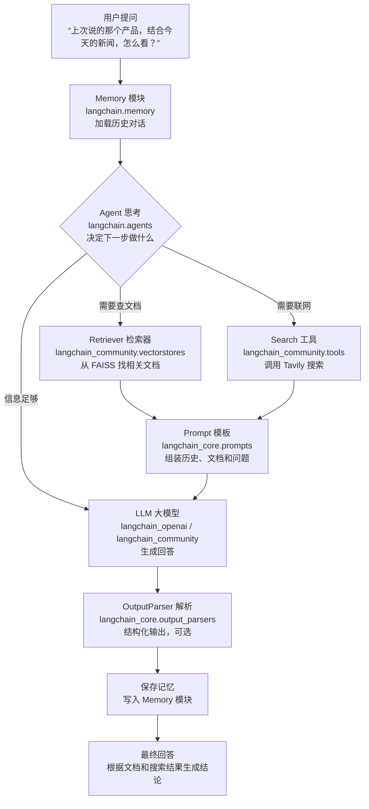

# LangChain 框架学习笔记

## 0. 核心本质、生态设计与核心价值

### 0.1 核心本质与基础分工

LangChain 本质上是把消息、工具、大模型调用、数据库、文档解析、输出解析等能力纳入同一个生态，并在上层提供统一封装。

LangChain 与原生模型 SDK 的核心分工：

- LangChain 负责：输入标准化、参数组装、SDK 调用、异常处理、流式 chunk 转换、返回值转成 `AIMessage`。
- 原生 SDK 负责：真正的 HTTP 请求、认证、重试、响应解析。以 OpenAI SDK 为例，这些底层网络和协议细节主要由 SDK 处理。

LangChain 采用拆包生态设计，核心优势是降低依赖复杂度、隔离版本风险，并支持按需安装。基础使用时，通常安装 `langchain` 和 `langchain-community` 即可；其中 `langchain` 会自动安装核心依赖 `langchain-core`。

`langchain-community` 由社区贡献并在 LangChain 生态中维护，提供大量开箱即用的第三方集成。它的本质是：LangChain 提供标准抽象接口，底层再对接各服务厂商 SDK，或直接发起 HTTP 请求。

为什么不直接使用厂商 SDK 或手写 HTTP 请求？核心原因是 LangChain 把异构服务纳入统一体系，带来统一调用写法、统一接口规范和统一组件编排范式，例如 `invoke`、`stream`、`ainvoke`、`bind_tools`、`with_structured_output`。

### 0.2 统一的组件组合范式：LCEL

LCEL（LangChain Expression Language）是 LangChain 的核心组合方式，它通过管道符 `|` 把各类组件像积木一样拼接起来，减少多环节串联时的胶水代码。

```python
chain = prompt_template | llm | output_parser
```

核心价值：

- 同一条链可兼容同步调用、异步调用、流式输出和批量处理。
- 支持重试、fallback 降级、超时控制等生产级容错逻辑。
- 支持复杂数据流转、上下文传递和多步骤业务流程。

如果直接使用原生 SDK，这些链式编排、边界处理和多组件数据传递通常都需要自行实现。

### 0.3 统一的对话上下文管理：Memory

大模型本身通常是无状态的。LangChain 将对话历史与上下文管理封装为标准化 Memory 抽象，避免开发者手动管理每个会话的历史消息。

常见能力：

- `ConversationBufferMemory`：保存完整对话历史，适合基础多轮对话。
- `ConversationSummaryMemory`：通过大模型总结历史对话，减少 Token 占用。
- `VectorStoreRetrieverMemory`：基于向量数据库实现长期记忆检索。

Memory 的价值在于：它可以接入 Chain 或 Agent，让业务逻辑保持稳定，同时把“怎么保存、怎么压缩、怎么检索历史”交给专门组件处理。

### 0.4 统一的知识接入体系：RAG

针对 RAG（检索增强生成），LangChain 将完整链路拆成可插拔、可替换的标准组件。

- Document Loaders：读取 PDF、Word、Excel、网页、音视频转写文本、数据库等数据源。
- Text Splitters：按字符数、Token 数、语义或文档结构切分文本。
- Vector Stores：对接 Chroma、Milvus、Pinecone、FAISS 等向量数据库。
- Retrievers：封装相似度检索、MMR 重排、混合检索、元数据过滤等能力。

核心价值：更换数据源、切分策略或向量数据库时，通常只改初始化和配置，核心 RAG 调用链路可以保持不变。

### 0.5 统一的工具调用与 Agent 编排

LangChain 的 Agent 能力让大模型从“对话生成器”升级为“能决定是否调用工具的任务执行器”。

核心能力：

- Tools 统一封装：自定义函数、搜索引擎、SQL 数据库、第三方 API、代码执行器等都能封装成标准工具。
- Tool Calling 标准化：统一适配不同模型的工具调用能力，例如 OpenAI、Anthropic、通义千问等。
- Agent 循环框架：实现“思考 -> 工具调用 -> 观察结果 -> 继续决策”的完整流程。

价值在于：开发者不必手写复杂状态机，也不必为每个模型单独适配工具调用格式。

### 0.6 统一的输出格式管控：Output Parsers

LangChain 的 `OutputParser` 体系解决“大模型输出不可控、程序难解析”的问题。

常见能力：

- 生成 JSON、Pydantic 对象、列表、日期、枚举等结构化结果。
- 自动把格式要求注入 Prompt，减少手写格式提示词。
- 对格式错误进行解析、重试或修正，减少正则和容错代码。

最终效果是：程序拿到的是可直接使用的 Python 对象，而不是需要二次处理的原始文本。

### 0.7 生产级可观测性：LangSmith

LangSmith 是 LangChain 生态中的可观测性平台，用于调试、追踪、评估和迭代大模型应用。

常见能力：

- 全链路追踪：记录 Prompt 输入、模型参数、Token 消耗、工具调用结果和延迟。
- 故障定位：快速发现 Chain 或 Agent 中效果不佳、报错或耗时高的环节。
- 效果评估与 A/B 测试：比较不同 Prompt、模型和链路版本的表现。
- 数据集管理：基于线上对话数据沉淀评估集或微调数据。

这部分能力让 LangChain 不只是开发框架，也能覆盖生产落地中的调试和迭代环节。

### 0.8 为什么选择 LangChain

LangChain 不是为了替代厂商 SDK，而是在各类 SDK 与 API 之上构建一层标准化、可扩展、可编排的大模型应用开发生态。

选择 LangChain 的核心原因：

- 更换大模型：通常只需修改模型初始化，核心 Chain、Agent 和调用逻辑不用大改。
- 新增对话记忆：挂载 Memory 组件即可，不必从零开发会话存储。
- 搭建智能体应用：定义工具和目标后，可复用内置 Agent 框架。
- 落地 RAG 应用：文档解析、文本切分、向量检索和问答链路都有标准组件。

总结：LangChain 的核心价值，是让开发者从重复的胶水代码、异构接口适配和边界处理里解放出来，把精力放回业务逻辑本身。

## 1. 概览

LangChain 的核心价值不是替代模型厂商 SDK，而是把不同模型、向量库、工具、文档加载器和工作流统一进同一套抽象接口里。

- LangChain 负责：输入标准化、参数组装、对象转换、工具编排、流式 chunk 转换、结构化输出、异常处理、回调观测。
- 厂商 SDK 负责：真正的 HTTP 请求、认证、重试、响应解析、底层 API 兼容。
- 统一调用方式：`invoke`、`stream`、`batch`、`ainvoke`、`bind_tools`、`with_structured_output` 等。
- 统一数据对象：`HumanMessage`、`AIMessage`、`SystemMessage`、`ToolMessage`、`Document`、`Retriever`、`Tool` 等。

一句话理解：LangChain 做的是“标准化抽象 + 生态适配 + 工作流编排”；模型厂商 SDK 做的是“具体服务调用”。

## 2. LangChain 拆包生态

LangChain 采用拆包生态，目的是降低依赖复杂度、隔离版本风险，并支持按需安装。

### 2.1 核心包关系

| 包名                          | 作用                                                                     |
| ----------------------------- | ------------------------------------------------------------------------ |
| `langchain-core`            | 底层标准接口和基础对象，安装 `langchain` 时通常会自动安装。            |
| `langchain`                 | 官方高阶开发套件，提供 Agent、Chains、Memory、Text Splitter 等常用封装。 |
| `langchain-community`       | 社区生态集成，提供大量第三方模型、向量库、文档加载器、工具封装。         |
| `langchain-openai` 等集成包 | 针对具体厂商或服务的官方适配包。                                         |

常见安装：

```bash
pip install -U langchain langchain-core langchain-community langchain-openai
```

使用向量库、PDF、搜索工具时再按需安装：

```bash
pip install -U faiss-cpu pypdf tavily-python
```

### 2.2 常见集成包

| 包名                          | 主要对接对象                                |
| ----------------------------- | ------------------------------------------- |
| `langchain-openai`          | OpenAI、Azure OpenAI、OpenAI-compatible API |
| `langchain-anthropic`       | Claude                                      |
| `langchain-google-genai`    | Gemini API                                  |
| `langchain-google-vertexai` | Google Vertex AI                            |
| `langchain-ollama`          | 本地 Ollama                                 |
| `langchain-groq`            | Groq                                        |
| `langchain-mistralai`       | Mistral                                     |
| `langchain-deepseek`        | DeepSeek                                    |
| `langchain-cohere`          | Cohere                                      |
| `langchain-huggingface`     | Hugging Face                                |
| `langchain-chroma`          | Chroma 向量库                               |
| `langchain-pinecone`        | Pinecone                                    |
| `langchain-qdrant`          | Qdrant                                      |
| `langchain-milvus`          | Milvus                                      |
| `langchain-mongodb`         | MongoDB Atlas Vector Search                 |

## 3. 核心工作机制

### 3.1 调用大模型时发生了什么

示例：

```python
from langchain_openai import ChatOpenAI

llm = ChatOpenAI(model="gpt-4o-mini")
res = llm.invoke("你好")
print(res.content)
```

内部链路大致如下：

```text
ChatOpenAI.invoke("你好")
   ↓
LangChain 把字符串包装成 HumanMessage
   ↓
langchain-openai 把 HumanMessage 转成 OpenAI API 需要的请求格式
   ↓
调用 openai Python SDK
   ↓
OpenAI 返回 JSON
   ↓
langchain-openai 把 JSON 转成 AIMessage
   ↓
用户拿到 res.content、res.tool_calls、res.usage_metadata
```

LangChain 的消息对象：

```text
HumanMessage
AIMessage
SystemMessage
ToolMessage
```

OpenAI API 通常需要类似这样的 JSON：

```json
[
  {"role": "system", "content": "You are a helpful assistant."},
  {"role": "user", "content": "你好"}
]
```

对象转换示例：

```text
HumanMessage(content="你好")
   ↓
{"role": "user", "content": "你好"}
```

OpenAI 返回：

```json
{
  "choices": [
    {
      "message": {
        "role": "assistant",
        "content": "你好！有什么可以帮你？"
      }
    }
  ],
  "usage": {
    "prompt_tokens": 10,
    "completion_tokens": 8,
    "total_tokens": 18
  }
}
```

再转换成：

```python
AIMessage(
    content="你好！有什么可以帮你？",
    response_metadata={...},
    usage_metadata={...}
)
```

核心点：LangChain 集成包主要做“LangChain 标准对象”和“厂商 API 请求/响应格式”之间的适配。

### 3.2 向量库集成时发生了什么

示例：

```python
from langchain_chroma import Chroma
from langchain_openai import OpenAIEmbeddings

vectorstore = Chroma(
    collection_name="demo",
    embedding_function=OpenAIEmbeddings()
)

vectorstore.add_texts(["LangChain 是一个 LLM 应用开发框架"])
docs = vectorstore.similarity_search("LangChain 是什么？")
```

内部链路大致如下：

```text
add_texts(["文本"])
   ↓
调用 embedding_function.embed_documents()
   ↓
OpenAIEmbeddings 调用 OpenAI embedding API
   ↓
得到向量：[0.012, -0.332, ...]
   ↓
langchain-chroma 把文本、metadata、向量写入 Chroma
   ↓
similarity_search("问题")
   ↓
把问题转换成 embedding
   ↓
Chroma 做向量相似度检索
   ↓
返回 LangChain Document 对象
```

向量库集成包做的是：

```text
LangChain Document / Retriever 接口
   ↓
Chroma / FAISS / Qdrant / Pinecone 等向量库 SDK
```

## 4. 核心能力分层

### 4.1 底层核心能力：`langchain-core`

`langchain-core` 是整个生态的基石，所有上层组件都基于这套标准体系构建。

- 提供统一核心抽象接口：`LLM`、`ChatModel`、`Embeddings`、`Retriever`、`Tool`、`Memory`、`Store`、`Document`、消息体系等。
- LCEL：LangChain Expression Language，支持链式调用、并行执行、条件分支、重试、fallback、超时控制、管道嵌套、同步/异步调用和流式输出。
- Runnable 通用协议：所有组件统一提供 `invoke`、`stream`、`batch`、`ainvoke` 等调用方法。
- 结构化输出与解析：通过 `OutputParser` 把模型自由文本转换成 JSON、Pydantic 对象、列表、日期、枚举等结构。
- 可观测性与调试：内置回调事件体系，可对接 LangSmith 进行链路追踪、可视化、性能分析和错误排查。
- 基础提示词与记忆框架：提供 `PromptTemplate`、`ChatPromptTemplate`、FewShot、消息历史管理和基础上下文记忆能力。

### 4.2 官方高阶能力：`langchain`

`langchain` 主包提供官方维护的高阶封装，聚焦开箱即用的通用场景。

- Agent 智能体框架：支持 ReAct、工具调用 Agent、OpenAI Tools Agent、XML Agent 等执行器。
- RAG 全链路组件：文本分块、检索器、检索增强问答、上下文压缩、重排和结果过滤等。
- 预构建业务链：对话链、检索问答链、带历史记忆的检索链、文档摘要链、SQL 查询链、API 调用链等。
- 对话记忆与状态管理：缓冲区记忆、滑动窗口记忆、摘要记忆、实体记忆等。
- 通用工具集：Python 执行、Shell 命令、文件管理、搜索、数学计算等工具封装。
- 提示词与输出增强：FewShot、动态条件提示词、重试输出解析器、格式守卫等。

### 4.3 生态扩展能力：`langchain-community`

`langchain-community` 是大量第三方集成和社区贡献组件的集合。

- 大模型与嵌入模型集成：通义千问、文心一言、讯飞星火、智谱 AI、DeepSeek、月之暗面、Claude、Mistral、Gemini、Cohere，以及 Ollama、Llama.cpp、vLLM 等本地模型。
- 文档加载器与数据源：PDF、Word、Excel、PPT、Markdown、HTML、CSV、JSON、EPUB、邮件、代码文件、音视频转录文本，以及 Notion、GitHub、Google Drive、飞书、钉钉、Confluence、Slack、数据库等。
- 向量数据库与存储：Milvus、Pinecone、Chroma、FAISS、Weaviate、Qdrant、PGVector、Elasticsearch、Redis、Neo4j、NebulaGraph、KV 存储等。
- 第三方工具与服务：搜索引擎、学术工具、金融财经、网页爬虫、办公协作、DevOps、合规安全等。
- 社区创新组件：重排器、多模态处理、长上下文优化、提示词优化、安全守卫，以及法律、医疗、金融、教育等垂直领域方案。

## 5. 包与模块对照

### 5.1 底层核心：`langchain-core`

| 导入路径                                                           | 模块          | 作用                                                  |
| ------------------------------------------------------------------ | ------------- | ----------------------------------------------------- |
| `from langchain_core.prompts import ChatPromptTemplate`          | 提示词模板    | 动态组装提示词，支持变量、角色和少样本。              |
| `from langchain_core.output_parsers import PydanticOutputParser` | 输出解析器    | 把模型文本输出解析为 JSON 或 Pydantic 对象。          |
| `from langchain_core.output_parsers import StrOutputParser`      | 字符串解析器  | 直接提取模型输出文本。                                |
| `from langchain_core.runnables import RunnablePassthrough`       | Runnable 管道 | LCEL 传递原始输入、构造字典和串联组件，详见第 10 章。 |
| `from langchain_core.messages import HumanMessage, AIMessage`    | 消息体系      | 标准化人类、AI、系统、工具消息。                      |
| `from langchain_core.documents import Document`                  | 文档对象      | 标准化非结构化数据，包含内容和元数据。                |

### 5.2 官方高阶套件：`langchain`

| 导入路径                                                                  | 模块         | 作用                                 |
| ------------------------------------------------------------------------- | ------------ | ------------------------------------ |
| `from langchain.agents import AgentExecutor, create_tool_calling_agent` | Agent 执行器 | 负责思考、规划、工具调用和结果整合。 |
| `from langchain.agents import Tool`                                     | 工具封装     | 把普通函数封装成 Agent 可调用工具。  |
| `from langchain.chains import RetrievalQA`                              | 检索问答链   | 封装好的 RAG 问答链路。              |
| `from langchain.memory import ConversationBufferMemory`                 | 对话记忆     | 存储和管理多轮对话历史。             |
| `from langchain.text_splitter import RecursiveCharacterTextSplitter`    | 文本分块器   | 把长文档切成适合模型处理的小块。     |

### 5.3 社区生态集成：`langchain-community`

| 导入路径                                                                        | 模块         | 作用                                  |
| ------------------------------------------------------------------------------- | ------------ | ------------------------------------- |
| `from langchain_community.vectorstores import FAISS`                          | FAISS 向量库 | 存储文档向量并进行语义检索。          |
| `from langchain_community.document_loaders import PyPDFLoader, WebBaseLoader` | 文档加载器   | 读取 PDF、网页、Word 等非结构化数据。 |
| `from langchain_community.tools.tavily_search import TavilySearchResults`     | 搜索工具     | 给 Agent 提供联网搜索能力。           |
| `from langchain_community.llms import Ollama`                                 | 本地模型集成 | 对接 Ollama 本地部署模型。            |

### 5.4 模型与嵌入集成：`langchain-openai`

| 导入路径                                          | 模块     | 作用                                        |
| ------------------------------------------------- | -------- | ------------------------------------------- |
| `from langchain_openai import ChatOpenAI`       | 聊天模型 | 对接 OpenAI 或 OpenAI-compatible Chat API。 |
| `from langchain_openai import OpenAIEmbeddings` | 嵌入模型 | 把文本转换为向量，用于语义检索。            |

## 6. 八个核心功能模块举例

这一章用最常见的 8 个模块，把 LangChain 的核心能力串起来理解。每个模块都按“是什么、解决什么痛点、代码怎么写、效果是什么”来讲。

前置安装：

```bash
pip install -U langchain langchain-community langchain-openai faiss-cpu
```

如果要读取文本、PDF 或使用搜索工具，可按需补充：

```bash
pip install -U langchain-text-splitters pypdf tavily-python
```

### 6.1 ChatModel：大模型统一调用接口

`ChatModel` 是 LangChain 对聊天大模型的统一抽象。无论底层是 OpenAI、Claude、通义千问、智谱 AI，还是本地 Ollama，只要被适配成 ChatModel，上层代码都可以用同一套方法调用。

解决的痛点：换模型时不需要重写业务链路，通常只需要替换模型名、API Key 或 `base_url`。

```python
from langchain_openai import ChatOpenAI

llm = ChatOpenAI(
    model="qwen-plus",
    api_key="你的API_KEY",
    base_url="你的BASE_URL",
    temperature=0,
)

response = llm.invoke("你是谁？")
print(response.content)
```

效果：返回一个 `AIMessage`，通过 `response.content` 取得模型回答。

### 6.2 ChatPromptTemplate：动态提示词模板

`ChatPromptTemplate` 用来动态生成提示词，支持系统角色、人类消息、变量替换和少样本示例。也实现了invoke方法。

解决的痛点：不用手动拼接字符串。角色、语气、主题等变量可以在运行时传入，提示词结构更稳定。

```python
from langchain_core.prompts import ChatPromptTemplate

prompt = ChatPromptTemplate.from_messages([
    ("system", "你是一个专业的{role}，请用{style}的风格回答问题。"),
    ("human", "请介绍一下：{topic}"),
])

prompt_value = prompt.invoke({
    "role": "程序员",
    "style": "幽默",
    "topic": "Python",
})

print(prompt_value)
```

效果：生成带角色和变量的标准消息，可直接交给大模型调用。

```text
System: 你是一个专业的程序员，请用幽默的风格回答问题。
Human: 请介绍一下：Python
```

### 6.3 PydanticOutputParser：结构化输出解析器

`PydanticOutputParser` 可以把大模型的自由文本输出解析成结构化对象，例如 JSON 或 Pydantic 模型。（不用自己一个个提取，然后转化了）

解决的痛点：程序不需要再靠正则解析模型回答，可以直接访问 `result.name`、`result.age` 这样的字段。

```python
from pydantic import BaseModel, Field
from langchain_core.prompts import ChatPromptTemplate
from langchain_core.output_parsers import PydanticOutputParser


class UserInfo(BaseModel):
    name: str = Field(description="用户的名字")
    age: int = Field(description="用户的年龄")
    hobby: list[str] = Field(description="用户的爱好")


parser = PydanticOutputParser(pydantic_object=UserInfo)

prompt = ChatPromptTemplate.from_messages([
    ("system", "请按以下格式提取信息：{format_instructions}"),
    ("human", "我叫小红，今年20岁，喜欢画画和听音乐。"),
]).partial(format_instructions=parser.get_format_instructions())

chain = prompt | llm | parser
result = chain.invoke({})

print(result.name)
print(result.age)
print(result.hobby)
```

效果：直接得到一个 `UserInfo` 对象，而不是一段难处理的自然语言文本。

### 6.4 LCEL：LangChain 表达式语言

LCEL 是 LangChain 的链式组合方式，最典型的写法是用 `|` 把组件串起来。

解决的痛点：提示词、模型、解析器、检索器之间不用写大量中间变量和胶水代码，链路结构非常清楚。

```python
chain = prompt | llm | parser

result = chain.invoke({})

for chunk in chain.stream({}):
    print(chunk, end="", flush=True)

# 异步调用：
# result = await chain.ainvoke({})
```

效果：`prompt -> llm -> parser` 的执行顺序一眼可见，并且天然支持同步、异步、流式和批量调用。

### 6.5 DocumentLoader + TextSplitter：文档加载与分块（直接给你切分好，不用自己去切分）

`DocumentLoader` 负责把 TXT、PDF、网页、Word 等非结构化数据加载成 LangChain 的 `Document` 对象；`TextSplitter` 负责把长文档切成适合模型处理的小块。

解决的痛点：长文档不能直接塞进模型上下文，需要先切分，再进入向量化和检索流程。

```python
from langchain_community.document_loaders import TextLoader
from langchain_text_splitters import RecursiveCharacterTextSplitter

loader = TextLoader("你的文档.txt", encoding="utf-8")
documents = loader.load()

text_splitter = RecursiveCharacterTextSplitter(
    chunk_size=1000,
    chunk_overlap=200,
)
split_docs = text_splitter.split_documents(documents)

print(f"切分成了 {len(split_docs)} 块")
print(split_docs[0].page_content)
```

效果：长文档被拆成多个 `Document` 小块，每块都保留正文和元数据，后续可以向量化或检索。

### 6.6 VectorStore + Retriever：向量存储与检索（也进行了统一的invoke封装，调用即执行，这样就只用记一个命令，不用复杂的用各家的sdk，记不同的命令）

`VectorStore` 把文档块转换成向量并保存；`Retriever` 根据用户问题找出最相关的文档块。这是 RAG 的核心。

解决的痛点：大模型不知道你的私有文档。先检索相关片段，再把片段交给模型，可以显著减少瞎编。

```python
from langchain_openai import OpenAIEmbeddings
from langchain_community.vectorstores import FAISS

embeddings = OpenAIEmbeddings(
    model="text-embedding-3-small",
    api_key="你的API_KEY",
    base_url="你的BASE_URL",
)

vector_store = FAISS.from_documents(split_docs, embeddings)
retriever = vector_store.as_retriever(search_kwargs={"k": 3})

query = "文档里讲了什么核心内容？"
relevant_docs = retriever.invoke(query)

for doc in relevant_docs:
    print(doc.page_content[:100] + "...")
```

效果：用户提问后，系统先从你的文档里找出最相关的内容片段，再交给模型生成答案。

### 6.7 Agent：智能体与工具调用（还是invoke，进行大量封装，几行代码就完成了agent，内部封装了工具调用循环和结束语句，反正就能直接得到最终结果了）

`Agent` 让大模型不只是回答问题，还能根据任务决定是否调用工具，例如搜索、计算器、数据库查询、文件操作等。

解决的痛点：不用手写大量 `if-else` 判断“什么时候该搜索、什么时候该计算”，Agent 会根据上下文自主选择工具。

```python
from langchain.agents import AgentExecutor, create_tool_calling_agent
from langchain_core.prompts import ChatPromptTemplate
from langchain_core.tools import tool
from langchain_community.tools.tavily_search import TavilySearchResults

search = TavilySearchResults(api_key="你的TAVILY_API_KEY")


@tool
def multiply(a: int, b: int) -> int:
    """把两个数字相乘，返回结果。"""
    return a * b


tools = [search, multiply]

prompt = ChatPromptTemplate.from_messages([
    ("system", "你是一个有用的助手，可以使用以下工具：{tools}"),
    ("human", "{input}"),
    ("placeholder", "{agent_scratchpad}"),
])

agent = create_tool_calling_agent(llm, tools, prompt)
agent_executor = AgentExecutor(agent=agent, tools=tools, verbose=True)

response = agent_executor.invoke({
    "input": "今天香港的气温是多少？把最高温度乘以2告诉我。"
})

print(response["output"])
```

效果：Agent 可以先搜索天气，再调用计算器，最后把工具结果汇总成自然语言回答。

### 6.8 ConversationBufferMemory：对话记忆

`ConversationBufferMemory` 用来保存多轮对话历史，让模型在后续回答中能看到之前的上下文。

解决的痛点：没有记忆时，模型不知道你前面说过什么；加上记忆后，可以进行连贯的多轮对话。

```python
from langchain.chains import ConversationChain
from langchain.memory import ConversationBufferMemory

memory = ConversationBufferMemory(return_messages=True)

conversation = ConversationChain(
    llm=llm,
    memory=memory,
    verbose=True,
)

print(conversation.predict(input="你好，我叫小明。"))
print(conversation.predict(input="我叫什么名字？"))
```

效果：第二轮提问时，模型可以根据历史记录回答“你叫小明”。

### 6.9 常见组合方式

**这些模块通常不是单独使用，而是像积木一样组合：**

```text
文档问答机器人：
DocumentLoader -> TextSplitter -> VectorStore -> Retriever -> ChatPromptTemplate -> LLM

带记忆的 Agent：
ConversationBufferMemory -> ChatPromptTemplate -> Agent -> Tools

结构化数据提取：
ChatPromptTemplate -> LLM -> PydanticOutputParser

标准 RAG 链：
Retriever -> ChatPromptTemplate -> ChatModel -> StrOutputParser
```

理解这 8 个模块后，LangChain 的主线就很清楚：先把数据加载进来，再检索相关内容，最后用提示词、模型、解析器和工具编排成可复用工作流。

## 7. RAG Agent 数据流

以“基于内部 PDF 文档，能联网搜索、能记住上下文的智能助手”为例，数据流如下：



关键逻辑：

- 统一接口：`Memory`、`Retriever`、`LLM`、`Prompt` 等组件都能通过统一协议（Runnable协议）调用和组合。
- 数据传递：`RunnablePassthrough` 可以把数据从一个模块原样传给下一个模块，也可以做简单字典转换。
- Agent 是调度中心：它根据当前问题决定查文档、联网搜索，还是直接回答。
- Prompt 是汇合点：历史对话、用户问题、检索结果和搜索结果都会进入提示词。
- Memory 负责状态：每轮用户输入和 AI 输出都会保存，供后续对话使用。

## 8. 完整串联代码（几行代码搞定所有事情）

下面示例把提示词、模型、嵌入、文档加载、向量库、搜索工具、Agent 和记忆模块串起来。

前置安装：

```bash
pip install -U langchain langchain-core langchain-community langchain-openai faiss-cpu pypdf tavily-python
```

完整代码：

```python
# ==========================================
# 1. 导入核心模块
# ==========================================

# langchain-core：底层核心
from langchain_core.prompts import ChatPromptTemplate

# langchain：官方高阶套件
from langchain.text_splitter import RecursiveCharacterTextSplitter
from langchain.memory import ConversationBufferMemory
from langchain.agents import AgentExecutor, create_tool_calling_agent, Tool

# langchain-community：社区集成
from langchain_community.document_loaders import PyPDFLoader
from langchain_community.vectorstores import FAISS
from langchain_community.tools.tavily_search import TavilySearchResults

# langchain-openai：模型与嵌入集成，也可对接 OpenAI-compatible API
from langchain_openai import ChatOpenAI, OpenAIEmbeddings


# ==========================================
# 2. 初始化基础组件：大模型、嵌入、记忆
# ==========================================

# 这里以通义千问 OpenAI-compatible API 为例，也可以替换为 OpenAI 官方模型。
llm = ChatOpenAI(
    model="qwen-plus",
    api_key="你的通义API_KEY",
    base_url="https://dashscope.aliyuncs.com/compatible-mode/v1",
    temperature=0,
)

# 嵌入模型：把文本转换成向量。
embeddings = OpenAIEmbeddings(
    model="text-embedding-v3",
    api_key="你的通义API_KEY",
    base_url="https://dashscope.aliyuncs.com/compatible-mode/v1",
)

# 记忆模块：保存多轮对话历史。
memory = ConversationBufferMemory(
    memory_key="chat_history",
    return_messages=True,
)


# ==========================================
# 3. 构建 RAG 检索模块：加载文档 -> 分块 -> 入库 -> 检索
# ==========================================

# 3.1 加载 PDF 文档。
loader = PyPDFLoader("你的测试文档.pdf")
documents = loader.load()

# 3.2 切分长文档。
text_splitter = RecursiveCharacterTextSplitter(
    chunk_size=1000,
    chunk_overlap=200,
)
split_docs = text_splitter.split_documents(documents)

# 3.3 写入 FAISS 向量数据库。
vector_store = FAISS.from_documents(split_docs, embeddings)

# 3.4 转成检索器。
retriever = vector_store.as_retriever(search_kwargs={"k": 2})


# ==========================================
# 4. 定义 Agent 可用工具：RAG 检索 + 联网搜索
# ==========================================

def rag_search(query: str) -> str:
    """根据用户问题，从内部文档中检索相关信息。"""
    docs = retriever.invoke(query)
    return "\n\n".join(doc.page_content for doc in docs)


rag_tool = Tool(
    name="Internal_Document_Search",
    func=rag_search,
    description="当用户询问内部资料、产品文档、公司规定时使用此工具。",
)

# Tavily 搜索工具，需要在 https://tavily.com 申请 API Key。
search_tool = TavilySearchResults(api_key="你的TAVILY_API_KEY")

tools = [rag_tool, search_tool]


# ==========================================
# 5. 构建 Agent
# ==========================================

prompt = ChatPromptTemplate.from_messages([
    (
        "system",
        "你是一个智能助手，可以使用以下工具：{tools}。"
        "请根据工具返回的结果回答用户问题。",
    ),
    ("placeholder", "{chat_history}"),
    ("human", "{input}"),
    ("placeholder", "{agent_scratchpad}"),
])

agent = create_tool_calling_agent(llm, tools, prompt)

agent_executor = AgentExecutor(
    agent=agent,
    tools=tools,
    memory=memory,
    verbose=True,
)


# ==========================================
# 6. 运行测试
# ==========================================

print("=" * 50)
print("智能助手已启动，输入 'quit' 退出")
print("=" * 50)

while True:
    user_input = input("\n你：")
    if user_input.lower() == "quit":
        break

    response = agent_executor.invoke({"input": user_input})
    print(f"\n助手：{response['output']}")
```

## 9. 代码中的模块协作细节

当用户运行上面的代码并提问时，内部流程如下：

```text
用户输入
   ↓
进入 AgentExecutor
   ↓
AgentExecutor 调用 ConversationBufferMemory，取出历史对话
   ↓
AgentExecutor 把“历史 + 问题”传给 create_tool_calling_agent
   ↓
Agent 开始判断是否需要调用工具
```

Agent 决策：

```text
如果问题涉及内部文档
   ↓
调用 rag_tool
   ↓
rag_tool 调用 FAISS 检索器
   ↓
返回相关文档片段

如果问题涉及实时信息
   ↓
调用 TavilySearchResults
   ↓
返回网络搜索结果
```

工具结果返回后：

```text
工具结果返回给 Agent
   ↓
Agent 把“历史 + 问题 + 工具结果”填入 ChatPromptTemplate
   ↓
提示词传给 ChatOpenAI
   ↓
大模型生成回答
   ↓
AgentExecutor 把“用户输入 + AI 回答”写入 ConversationBufferMemory
   ↓
最终回答显示给用户
```

总结：LangChain 通过标准对象、Runnable 协议和集成包，把底层模型调用、文档检索、工具调用、记忆管理、提示词组装和结果输出串成一条统一工作流。

## 10. Runnable 协议与 LCEL 管道 (最重要！)

### 10.1 Runnable 是什么

**`Runnable` 是 LangChain 定义的一套通用协议 / 接口。任何组件只要实现了 Runnable 协议，就可以用统一方法调用，也可以放进 LCEL 链里组合。**

**它规定的不是“组件内部必须怎么实现”，而是“组件对外必须怎么被使用”。提示词模板、大模型、检索器、输出解析器、工具等内部逻辑完全不同，但只要都实现 Runnable，就都能被同一套方式调用和串联。**

常见调用方法：

- `invoke(input)`：同步调用一次，输入一个数据，返回一个结果。
- `ainvoke(input)`：异步调用一次，适合不想阻塞当前程序的场景。
- `stream(input)`：流式输出，常用于大模型边生成边返回。
- `batch(inputs)`：批量处理多个输入，返回多个结果。

核心重点：你不需要知道每个组件内部怎么工作，只需要知道“给它输入，它会给你输出”。这就是协议的价值。

### 10.3 `|` 管道符原理

`|` 不是 LangChain 修改了 Python 语法，而是 Python 本来支持运算符重载。LangChain 的 Runnable 基类实现了 `__or__` 方法，所以当 `|` 两边是 LangChain 对象时，它表示“把两个 Runnable 接起来”。

和类型提示里的 `|` 对比：

```python
# 场景 1：类型提示
a: int | None = None

# 场景 2：LangChain 管道
chain = prompt | llm
```

同一个符号含义不同，关键看两边是什么对象：

- 两边是类型：`int | None` 表示联合类型。
- 两边是 Runnable 实例：`prompt | llm` 会调用 `prompt.__or__(llm)`，返回一条可执行链。

Python 运算符背后对应魔法方法。当你写：

```python
a | b
```

Python 实际会尝试调用：

```python
a.__or__(b)
```

所以任何类都可以定义自己遇到 `|` 时的行为，也就是魔法方法。

一个不依赖 LangChain 的小例子：

```python
class MyPipe:
    def __init__(self, value):
        self.value = value

    def __or__(self, other):
        return MyPipe(f"{self.value} -> {other.value}")

    def __repr__(self):
        return f"MyPipe({self.value})"


a = MyPipe("第一步")
b = MyPipe("第二步")
c = MyPipe("第三步")

print(a | b | c)
# 输出：MyPipe(第一步 -> 第二步 -> 第三步)
```

LangChain 也是同样思路，只是它连接的不是普通字符串，而是一个个 Runnable 组件。

**极简版 LangChain 原理：（这个是真牛逼）**

```python
class RunnableBase:
    def invoke(self, input_data):
        raise NotImplementedError

    def __or__(self, other):
        return RunnableSequence(self, other)


class RunnableSequence(RunnableBase):
    def __init__(self, first, second):
        self.first = first
        self.second = second

    def invoke(self, input_data):
        first_result = self.first.invoke(input_data)
        return self.second.invoke(first_result)
```

**模拟两个组件：**

```python
class PromptTemplate(RunnableBase):
    def invoke(self, input_data):
        return f"这是处理后的提示词：{input_data}"


class LLM(RunnableBase):
    def invoke(self, input_data):
        return f"大模型根据提示词生成的回答：[{input_data}]"


prompt = PromptTemplate()
llm = LLM()

chain = prompt | llm  （调用or方法，返回RunnableSequence对象，此时已经把俩个对象存进去了）
result = chain.invoke("用户的问题") （调用RunnableSequence对象的invoke，依次调用俩个对象的invoke）

print(result)
# 输出：大模型根据提示词生成的回答：[这是处理后的提示词：用户的问题]
```

**所以这段真实 LangChain 代码：**

```python
chain = prompt | llm
result = chain.invoke("用户的问题")
```

**可以理解为：**

```text
用户输入
   ↓
prompt.invoke(...)
   ↓
llm.invoke(...)
   ↓
最终输出
```

**`int | None` 和 `prompt | llm` 不冲突，原因是 Python 会根据两边对象的类型决定执行什么逻辑。类型提示场景里，`|` 表示 Union；对象实例场景里，`|` 调用对象的 `__or__` 方法。**

### 10.4 常见 Runnable 组件

在 LangChain 中，很多核心组件都实现了 Runnable 协议。

| 组件       | 示例类                   | 输入         | 输出                   |
| ---------- | ------------------------ | ------------ | ---------------------- |
| 提示词模板 | `ChatPromptTemplate`   | 字典或变量   | PromptValue / 消息列表 |
| 聊天模型   | `ChatOpenAI`           | 消息或提示词 | `AIMessage`          |
| 输出解析器 | `StrOutputParser`      | 模型消息     | 字符串                 |
| 检索器     | `VectorStoreRetriever` | 查询字符串   | `Document` 列表      |
| 直通组件   | `RunnablePassthrough`  | 任意输入     | 原始输入或扩展后的字典 |

判断方法很简单：**如果一个对象能调用 `.invoke()`、`.stream()` 或 `.batch()`，它通常就是 Runnable，可以和其他 Runnable 通过 `|` 组合。**

下面用 5 个常见类看具体表现。

#### 10.4.1 `ChatPromptTemplate`

```python
from langchain_core.prompts import ChatPromptTemplate

prompt = ChatPromptTemplate.from_template("请用一句话解释：{concept}")
result = prompt.invoke({"concept": "Runnable 协议"})

print(result)
# 输出是 PromptValue，里面包含组装好的消息
```

结论：提示词模板是 Runnable，因为它能 `.invoke()`，也能参与 `prompt | llm`。

#### 10.4.2 `ChatOpenAI`

```python
from langchain_openai import ChatOpenAI
from langchain_core.messages import HumanMessage

llm = ChatOpenAI(
    model="qwen-plus",
    api_key="你的API_KEY",
    base_url="https://dashscope.aliyuncs.com/compatible-mode/v1",
    temperature=0,
)

result = llm.invoke([HumanMessage(content="你好")])
print(result.content)
```

结论：聊天模型是 Runnable，通常支持 `.invoke()` 和 `.stream()`。

#### 10.4.3 `StrOutputParser`

```python
from langchain_core.messages import AIMessage
from langchain_core.output_parsers import StrOutputParser

parser = StrOutputParser()
ai_message = AIMessage(content="这是大模型的回答")

result = parser.invoke(ai_message)
print(result)
# 输出：这是大模型的回答
```

结论：输出解析器是 Runnable，可以接在模型后面，把 `AIMessage` 转成普通字符串。

#### 10.4.4 `VectorStoreRetriever`

```python
from langchain_core.documents import Document
from langchain_openai import OpenAIEmbeddings
from langchain_community.vectorstores import FAISS

docs = [
    Document(page_content="Runnable 是 LangChain 的核心协议"),
    Document(page_content="Python 用 __or__ 方法重载 | 运算符"),
]

embeddings = OpenAIEmbeddings(
    model="text-embedding-v3",
    api_key="你的API_KEY",
    base_url="https://dashscope.aliyuncs.com/compatible-mode/v1",
)

vector_store = FAISS.from_documents(docs, embeddings)
retriever = vector_store.as_retriever()

result = retriever.invoke("什么是 Runnable？")
print(result)
```

结论：检索器是 Runnable，输入问题字符串，输出相关 `Document` 列表。

#### 10.4.5 `RunnablePassthrough`

```python
from langchain_core.runnables import RunnablePassthrough

passthrough = RunnablePassthrough()
result = passthrough.invoke("测试数据")

print(result)
# 输出：测试数据
```

结论：`RunnablePassthrough` 自己也是 Runnable，它是 LCEL 里最常见的“数据传递”组件。

### 10.5 自己实现一个极简 Runnable 协议

**如果还是觉得“协议”抽象，可以用纯 Python 写一个极简版。这个例子不依赖 LangChain，但能说明 Runnable 协议在规定什么。**

**第一步：定义协议，要求所有组件都实现 `invoke()`：**

```python
from abc import ABC, abstractmethod


class MyRunnable(ABC):
    @abstractmethod
    def invoke(self, input_data):
        """处理输入，返回输出。"""
        pass

    def __or__(self, other):
        return Pipeline(self, other)
```

**第二步：定义流水线，让两个组件能串起来：**

```python
class Pipeline(MyRunnable):
    def __init__(self, first, second):
        self.first = first
        self.second = second

    def invoke(self, input_data):
        output1 = self.first.invoke(input_data)
        output2 = self.second.invoke(output1)
        return output2
```

**第三步：创建两个遵守协议的组件：**

```python
class Writer(MyRunnable):
    def invoke(self, input_topic):
        print(f"[Writer] 收到主题：{input_topic}，正在写文案...")
        return f"这是一篇关于「{input_topic}」的精彩文案。"


class Translator(MyRunnable):
    def invoke(self, input_text):
        print(f"[Translator] 收到文案：{input_text}，正在翻译...")
        return f"English Translation: {input_text}"
```

**第四步：统一调用，并用 `|` 组合：**

```python
writer = Writer()
translator = Translator()

print(writer.invoke("AI"))
print(translator.invoke("你好"))

chain = writer | translator
final_result = chain.invoke("Python")

print(final_result)
```

**输出大致是：**

```text
[Writer] 收到主题：Python，正在写文案...
[Translator] 收到文案：这是一篇关于「Python」的精彩文案。，正在翻译...
English Translation: 这是一篇关于「Python」的精彩文案。
```

|  |  |
| - | - |
|  |  |

协议的力量在于：只要组件都遵守同一套输入输出调用规范，就可以自由替换和组合。

### 10.6 RAG 链组合示例

下面是一个典型 LCEL RAG 链，把检索器、提示词、大模型和解析器串起来：

```python
from langchain_core.prompts import ChatPromptTemplate
from langchain_core.output_parsers import StrOutputParser
from langchain_core.runnables import RunnablePassthrough

prompt = ChatPromptTemplate.from_template("""
请根据以下上下文回答问题。

上下文：
{context}

问题：
{question}
""")


def format_docs(docs):
    return "\n".join(doc.page_content for doc in docs)


chain = (
    {
        "context": retriever | format_docs,
        "question": RunnablePassthrough(),
    }
    | prompt
    | llm
    | StrOutputParser()
)

response = chain.invoke("什么是 Runnable？")
print(response)
```

## 一、核心本质：字典是 RunnableParallel 的语法糖

你代码中出现的这段字典结构：

```
{
    "context": retriever | format_docs,
    "question": RunnablePassthrough(),
}
```

 **在 Python 语法层面，它是一个原生普通字典；但在 LCEL 管道体系中，它是 `RunnableParallel`（并行运行对象）的简写形式** ，完全等价于以下完整写法：

```
from langchain_core.runnables import RunnableParallel

RunnableParallel({
    "context": retriever | format_docs,
    "question": RunnablePassthrough(),
})
```

---

## 二、RunnableParallel 核心作用与分支拆解

它的核心定位是 **LCEL 的并行任务分配器** ，解决的核心问题：把用户输入的「单条问题字符串」，转换成下游提示词模板需要的「多变量字典」。

### 2.1 核心执行逻辑

当输入数据流经这个 `RunnableParallel`时，会按以下 4 步固定流程执行：

1. **复制输入** ：将上游传入的输入数据完整复制多份
2. **并行分发** ：将每一份输入，分别传给字典中每个 key 对应的 Runnable 分支
3. **等待完成** ：等待所有分支的 Runnable 执行完毕，拿到全部分支的执行结果
4. **组装输出** ：将所有分支的结果，按原 key 组装成一个新的 Python 字典，传递给下游组件

### 2.2 结合 RAG 链逐分支拆解

 **上游输入数据** ：用户调用 `chain.invoke("什么是 Runnable？")`传入的字符串 `什么是 Runnable？`

#### 分支 1：context 分支

```
"context": retriever | format_docs
```

1. 输入字符串 `什么是 Runnable？` 流入 `retriever`（本身是标准 Runnable 对象）
2. `retriever`接收查询字符串，输出检索到的文档列表 `List[Document]`
3. 文档列表流入 `format_docs`函数（LCEL 会自动将普通函数包装为 RunnableLambda）
4. `format_docs`将文档列表拼接为单条上下文字符串，作为该分支的最终结果
5. 结果赋值给新字典的 `context`key

#### 分支 2：question 分支

```
"question": RunnablePassthrough()
```

1. 输入字符串 `什么是 Runnable？` 流入 `RunnablePassthrough()`
2. `RunnablePassthrough`直接将输入原封不动透传，不做任何修改
3. 原始问题字符串作为该分支的最终结果，赋值给新字典的 `question`key

### 2.3 分支执行完成后的输出

两个分支全部执行完毕后，会向下游输出一个完整的字典，完美匹配提示词模板的变量要求：

```
{
    "context": "检索到的文档拼接后的上下文内容",
    "question": "什么是 Runnable？"
}
```

这个字典会直接流入下游的 `ChatPromptTemplate`，自动将 `context`和 `question`的值填入模板对应的变量占位符中。

---

## 三、核心疑问解答：为什么普通字典能接入 LCEL 管道？

这是 LCEL 最精妙的设计，核心依赖**Python 运算符重载 + 隐式类型转换**两大特性。

### 3.1 前置基础：管道符 | 的本质

Python 中，`|` 运算符的行为，是由对象的特殊方法 `__or__` 定义的。LangChain 对所有 Runnable 基类重写了 `__or__`方法，让 `|`具备了「管道串联」的能力，而非原生的按位或功能。

### 3.2 字典的隐式转换规则

当你用 `|`将字典和 Runnable 组件串联时，LangChain 会在管道执行前，自动完成以下转换：

1. 执行 `A | B` 时，先校验左右两侧的对象类型
2. 若左侧对象是 `dict`，自动将其包裹为 `RunnableParallel(dict)`实例，转为合法的 Runnable 对象
3. 若右侧对象是 Runnable（如 prompt、llm、StrOutputParser），则将转换后的左侧 Runnable 与右侧 Runnable，拼接为 `RunnableSequence`（串行执行的 Runnable 链）
4. 同时，LCEL 会自动把普通函数、字符串、字典等非 Runnable 对象，按需转换为对应的 Runnable 子类，保证整条链的所有节点都是可执行的 Runnable

### 3.3 代码验证实验

你可以通过以下代码，直观验证这个转换过程：

```
from langchain_core.runnables import RunnablePassthrough
from langchain_core.prompts import ChatPromptTemplate

# 1. 定义原生字典
my_dict = {"question": RunnablePassthrough()}
# 此时它就是普通Python字典
print("单独定义时的类型：", type(my_dict))
# 输出：单独定义时的类型： <class 'dict'>

# 2. 用管道符和Runnable组件串联
prompt = ChatPromptTemplate.from_template("请回答这个问题：{question}")
chain = my_dict | prompt

# 3. 查看串联后的类型
print("管道串联后的类型：", type(chain))
# 输出：管道串联后的类型： <class 'langchain_core.runnables.base.RunnableSequence'>

# 4. 验证可执行性
print(chain.invoke("什么是LCEL？"))
```

---

## 四、完整 RAG 链全链路数据流复盘

结合以上原理，整条链的完整执行流程如下：

```
用户调用 chain.invoke("什么是 Runnable？") 传入问题字符串
   ↓
字符串进入管道首节点（RunnableParallel 字典）
   ↓
字符串被复制为2份，并行进入两个分支执行
   ├─ 分支1：retriever 检索文档 → format_docs 拼接为上下文 → 赋值给 context
   └─ 分支2：RunnablePassthrough 透传原始问题 → 赋值给 question
   ↓
两个分支执行完成，组装为 {"context": "...", "question": "..."} 字典
   ↓
字典流入 ChatPromptTemplate，自动填充模板变量，生成完整的Prompt对话消息
   ↓
完整Prompt流入LLM大模型，生成回答文本
   ↓
回答文本流入StrOutputParser，解析为普通Python字符串
   ↓
最终结果返回给用户，通过print输出
```

---

## 五、补充整合：从源码角度再看 LangChain 的核心机制

这一部分是把 `tx.txt` 中和原文重复但更底层的内容，整理成补充说明。前面的内容已经把 LangChain 的用法、LCEL、RAG 链路讲清楚了；这里重点补“为什么它能这样设计、底层对象之间怎么配合”。涉及源码机制时，以本地源码为依据，例如：

- `E:\Framework\langchain\libs\core\langchain_core\runnables\base.py`
- `E:\Framework\langchain\libs\core\langchain_core\language_models\chat_models.py`
- `E:\Framework\langchain\libs\core\langchain_core\messages\`
- `E:\Framework\langchain\libs\core\langchain_core\tools\base.py`
- `E:\Framework\langchain\libs\core\langchain_core\callbacks\manager.py`

### 5.1 三层架构：抽象层、实现层、集成层

LangChain 的整体设计可以理解成三层：

```text
应用层：你写的业务代码
  ↓
实现层：chain、agent、retrieval、memory 等高阶流程
  ↓
抽象层：Runnable、Message、Tool、ChatModel、Parser、Callback
  ↓
集成层：OpenAI、Anthropic、Ollama、FAISS、Milvus、Tavily 等外部服务
```

`langchain-core` 的定位是抽象层。它不应该承担太多具体业务，而是定义稳定接口：什么叫可执行组件，什么叫消息，什么叫工具，什么叫输出解析器，什么叫回调事件。

`langchain` 或旧版里的 `langchain-classic` 更偏实现层，负责把这些抽象组装成常见应用形态，比如 RAG、Agent、Memory、Chain。

各类 partner 包和 `langchain-community` 更偏集成层，负责把第三方服务转换成 LangChain 认识的对象。例如某个向量库原本有自己的查询 SDK，但接进 LangChain 后，上层只需要面对 `Retriever.invoke()`。

这套分层的关键不是“目录分得漂亮”，而是让变化被隔离：底层服务变化时，改适配层；业务流程变化时，改 Chain 或 Agent；统一协议尽量稳定，这样上层代码才不会被每个厂商 SDK 牵着走。

### 5.2 Message：把对话从字符串升级成结构化协议

普通聊天看起来只是几段文字，但在 LangChain 里，消息必须承载更多语义：

- 谁说的：用户、系统、AI、工具。
- 说了什么：文本、多模态内容、结构化内容块。
- 是否请求工具：`AIMessage.tool_calls`。
- 工具结果属于谁：`ToolMessage.tool_call_id`。
- 消耗了多少 token：`AIMessage.usage_metadata`。

所以 LangChain 没有只用普通字典，而是定义了 `BaseMessage` 及其子类。源码里可以看到 `AIMessage` 明确带有 `tool_calls`、`invalid_tool_calls`、`usage_metadata` 等字段，`ToolMessage` 明确带有 `tool_call_id`。

一个典型工具调用流程是：

```text
HumanMessage：用户提出问题
  ↓
AIMessage：模型没有直接回答，而是给出 tool_calls
  ↓
Tool 根据 tool_calls 执行
  ↓
ToolMessage：工具结果带着 tool_call_id 回来
  ↓
AIMessage：模型看到工具结果后生成最终回答
```

为什么要这么麻烦？因为 Agent 里可能一次调用多个工具。如果没有 `tool_call_id`，框架就很难判断“哪个工具结果对应哪个工具请求”。这不是表面封装，而是为了让多工具、并发工具、工具错误恢复这些复杂场景仍然能对齐数据。

### 5.3 BaseChatModel：统一模型入口，差异留给 Provider

`BaseChatModel` 的目标是把不同厂商的聊天模型统一成一个调用入口。你可以换 OpenAI、Anthropic、通义千问或其他 OpenAI-compatible 模型，但上层仍然使用：

```python
result = model.invoke(messages)
```

从本地 `chat_models.py` 可以看到，`BaseChatModel.invoke()` 会先通过 `_convert_input()` 把输入标准化，然后进入 `generate_prompt()`，并把 `callbacks`、`tags`、`metadata`、`run_name` 等配置传下去，最后返回 `AIMessage`。

底层大致流程是：

```text
字符串 / 消息列表 / PromptValue
  ↓
_convert_input 统一成模型输入
  ↓
读取 RunnableConfig 中的回调、标签、元数据
  ↓
进入 generate / generate_prompt
  ↓
检查缓存、限流、判断是否流式
  ↓
调用子类 _generate 或 _stream
  ↓
包装成 AIMessage 返回
```

这里的设计重点是：稳定流程放在基类，厂商差异放到子类。不同 Provider 的鉴权方式、请求参数、响应格式都不一样，但这些差异被限制在适配层里，上层业务不需要重写整条调用链。

### 5.4 Provider 适配：统一接口不是消灭差异

Provider 适配容易被误解成“所有模型都完全一样”。实际上不是。LangChain 做的是把通用能力统一成相似接口，同时保留能力差异。

比如：

- 有的模型支持工具调用，有的不支持。
- 有的模型支持原生流式，有的只能模拟。
- 有的模型支持结构化输出，有的需要通过 Prompt + Parser 约束。
- 不同模型的 token 统计字段可能不同。

所以适配层的职责不是假装差异不存在，而是把差异关在边界内。上层尽量面对 `invoke()`、`stream()`、`bind_tools()`、`with_structured_output()` 这些统一方法；如果底层模型不支持某项能力，再通过错误、降级或替代实现暴露出来。

这也是为什么 LangChain 比直接写 HTTP 多了一层价值：它把“厂商协议差异”变成“框架能力差异”，开发者只需要理解 LangChain 的统一抽象。

### 5.5 Tool：函数为什么要包装成工具对象

一个普通 Python 函数不能直接成为模型工具，因为模型需要的不只是“能运行”，还需要知道：

- 工具叫什么。
- 工具什么时候该用。
- 参数 schema 是什么。
- 哪些参数由模型填写，哪些参数运行时注入。
- 工具报错时如何返回。
- 工具执行过程如何被追踪。

`BaseTool` 正是为了解决这些问题。源码里 `BaseTool` 继承自 `RunnableSerializable`，说明工具也是一种可执行组件。`invoke()` 会预处理输入，然后调用 `run()`；`run()` 内部会配置 `CallbackManager`，触发工具开始、结束、报错等事件。

特别值得注意的是 `tool_call_schema`。它会过滤掉 injected 参数，只把模型应该填写的参数暴露给模型。例如 `tool_call_id`、运行时上下文、store、state 这类参数不应该让模型生成，而应该由框架在执行时注入。

这背后的原则是：模型只负责决策和填写业务参数，框架负责执行环境和协议字段。

### 5.6 Callback：看见框架内部发生了什么

LangChain 的可观测性不是后面硬加的日志，而是通过 Callback 系统贯穿执行过程。

模型调用、链执行、工具执行、Retriever 检索、Parser 解析，都可以触发事件。`CallbackManager` 负责把事件分发给多个 handler。handler 可以是控制台日志、LangSmith、计时器、调试器，也可以是你自己写的监控逻辑。

典型事件流：

```text
on_chain_start
  ↓
on_llm_start
  ↓
on_llm_end / on_llm_error
  ↓
on_tool_start
  ↓
on_tool_end / on_tool_error
  ↓
on_chain_end
```

Callback 的价值在生产环境尤其明显。大模型应用出问题时，你不能只看最终回答，还要看：

- Prompt 最终长什么样。
- Retriever 找到了哪些文档。
- 模型是否请求了工具。
- 工具参数是否正确。
- 哪一步耗时最长。
- Parser 为什么失败。

所以 Callback 和 LangSmith 解决的是“看见内部世界”的问题。没有这层机制，复杂 Agent 出错时只能靠猜。

### 5.7 Runnable 再总结：统一协议带来能力继承

原文已经详细讲了 `Runnable`、`RunnableSequence`、`RunnableParallel` 和字典为什么能进入 LCEL。这里再从设计角度总结一次。

`Runnable` 的真正价值是能力继承：只要一个组件实现了 Runnable，它就天然进入同一个生态。

```text
实现 invoke
  ↓
可以接入 LCEL 管道
  ↓
可以同步、异步、批量、流式
  ↓
可以接收 RunnableConfig
  ↓
可以被 Callback / LangSmith 追踪
  ↓
可以和其他 Runnable 组合
```

这就是框架抽象的威力。它不是让每个组件少写一个方法，而是让每个组件自动获得整套运行时能力。

## 六、设计模式：通用知识与 LangChain 里的真实例子

这一章放在最后，作为独立的设计模式学习资料。它不只解释 LangChain，也讲这些模式在普通软件设计中的意义。

### 6.1 模板方法模式

模板方法模式解决的问题是：一个流程的整体顺序固定，但其中某些步骤的具体实现会变化。

通用定义：父类定义完整流程骨架，子类只重写其中某些步骤。父类控制“先做什么、后做什么”，子类控制“某一步具体怎么做”。

经典例子：快递寄件流程。收件、验视、称重、计费、发货这个顺序基本固定，但不同快递公司的计费方式不同。顺丰可能按重量，某些物流可能按体积，国际快递还要看目的地。流程骨架固定，计费细节变化。

适用场景：

- 流程顺序稳定。
- 多个子类共享大部分流程。
- 框架希望控制主流程，只开放少数扩展点。

不适合场景：

- 每种实现的流程顺序都不同。
- 运行时需要频繁切换算法对象。
- 父类越来越臃肿，子类只能通过重写大量钩子绕开限制。

LangChain 例子：`BaseChatModel`。模型调用的大流程是固定的：输入转换、配置读取、回调管理、缓存判断、限流、流式判断、调用底层模型、包装返回值。不同厂商真正不同的是请求 API 的那一步，所以子类主要实现 `_generate()` 或 `_stream()`。

底层思路：稳定的流程放在基类，变化点变成抽象方法或钩子方法。这样接入新模型时，不需要复制整套调用流程，只需要补厂商差异。

常见误区：模板方法不是策略模式。模板方法通常依赖继承，强调父类控制流程；策略模式通常依赖组合，强调运行时替换算法。

一句话记忆：骨架固定，血肉可换。

### 6.2 策略模式

策略模式解决的问题是：同一个目标可以用多种算法或行为完成，希望这些算法能互相替换。

通用定义：把一组可替换行为封装成独立策略，调用方只依赖统一接口，不直接写死具体算法。

经典例子：支付方式。订单系统只关心“完成支付”，但支付可以走支付宝、微信、银行卡、余额。每种支付方式都是一个策略，业务主流程不应该堆满支付方式的细节。

适用场景：

- 有多种算法可以选择。
- 算法之间输入输出相对统一。
- 希望减少主流程中的大量 `if/else`。

不适合场景：

- 只有一种算法。
- 每个算法输入输出完全不同。
- 抽象后比直接判断更难理解。

LangChain 例子：是否使用流式输出可以看作一种策略选择。`BaseChatModel._should_stream()` 会综合判断子类是否实现流式、用户是否传入 `stream=True`、实例是否设置 streaming、是否挂了流式回调处理器。Retriever 中的相似度检索、MMR、多路召回、重排也都体现了策略思想。

底层思路：把变化的算法从主流程中拆出去。主流程只问“用哪个策略”，不关心策略内部怎么做。

常见误区：策略模式不是简单函数参数。只有当这些函数代表一组稳定的可替换行为，并且主流程长期需要依赖它们时，才值得抽象成策略。

一句话记忆：目标一样，路线可选。

### 6.3 组合模式

组合模式解决的问题是：单个对象和组合对象希望使用同一个接口。

通用定义：把对象组织成树形或层级结构，让调用方可以用一致方式处理叶子节点和组合节点。

经典例子：文件系统。文件是单个对象，文件夹是组合对象；文件夹里还能有文件夹。但删除、移动、重命名这些操作，对文件和文件夹都可以用类似方式调用。

适用场景：

- 对象天然有层级结构。
- 组合对象内部包含同类对象。
- 调用方不想区分“一个对象”和“一组对象”。

不适合场景：

- 数据结构很扁平。
- 单个对象和组合对象行为差异很大。
- 组合对象不应该暴露和单个对象相同的操作。

LangChain 例子：`RunnableSequence`。它由多个 Runnable 组成，但它自己也是 Runnable。你可以对单个 `ChatModel` 调用 `invoke()`，也可以对 `prompt | model | parser` 这整条链调用 `invoke()`。

底层思路：统一接口让复杂结构可以继续组合。框架只需要认识 Runnable，不用关心背后是一颗叶子还是一棵树。

常见误区：组合模式不是“把对象放进列表”。普通列表只是容器，组合模式强调容器本身也实现和元素一样的接口。

一句话记忆：单兵和队伍，都听同一个命令。

### 6.4 观察者模式

观察者模式解决的问题是：一个对象发生事件后，需要通知多个对象，但不希望事件源依赖具体处理者。

通用定义：事件源维护一组观察者，事件发生时逐个通知。观察者可以增加、删除，事件源不关心它们具体做什么。

经典例子：公众号订阅。作者发布文章，所有订阅者都能收到通知。作者不需要知道每个订阅者是阅读、收藏还是转发。

适用场景：

- 一个事件可能有多个处理者。
- 处理者数量会变化。
- 事件源不应该和处理逻辑强耦合。

不适合场景：

- 永远只有一个处理者。
- 事件顺序和事务一致性要求极高。
- 性能极端敏感，事件广播开销不可接受。

LangChain 例子：Callback 系统。模型开始、模型结束、工具开始、工具结束、链报错等事件发生时，`CallbackManager` 会通知所有 handler。handler 可以写日志、上报 LangSmith、统计耗时、打印 token。

底层思路：业务组件只负责执行，观察者负责记录和响应事件。这样加监控时不用侵入模型、工具、Retriever 的核心逻辑。

常见误区：观察者模式不是“传一个回调函数”这么简单。它通常支持多个观察者，并强调事件源和观察者解耦。

一句话记忆：事件广播，谁订阅谁处理。

### 6.5 责任链模式

责任链模式解决的问题是：一个请求需要经过多个处理者，每个处理者有机会处理、修改、放行或终止。

通用定义：把多个处理器串成链，请求沿着链传递。每一层只关心自己的职责，不需要知道整条链的全部细节。

经典例子：审批流。员工请假先到组长，再到经理，再到 HR。每一层按自己的规则处理，必要时继续往后传。

适用场景：

- 请求处理天然分阶段。
- 每个阶段职责相对独立。
- 希望处理阶段可以插拔或调整顺序。

不适合场景：

- 请求只需要一步处理。
- 每层之间共享大量内部状态。
- 链太长导致调试困难。

LangChain 例子：Agent 执行过程有责任链的影子。用户问题先经过 Prompt，再经过模型，再根据 `tool_calls` 交给工具，再把工具结果交回模型，最后交给 Parser。Callback handler 链也类似，每个 handler 对同一事件有机会做自己的处理。

底层思路：把复杂请求拆成多个小处理器，避免一个函数同时负责所有事情。

常见误区：责任链不等于普通流水线。流水线强调数据一步步转换；责任链更强调“每一层都有机会决定如何处理请求，甚至终止请求”。

一句话记忆：这一层处理完，再交给下一层。

### 6.6 装饰器模式

装饰器模式解决的问题是：不修改原对象，也能动态增加能力。

通用定义：用包装对象包住原对象，包装对象和原对象实现同一接口，对外看起来仍然是同类对象，但调用时多了一层增强逻辑。

经典例子：咖啡加料。基础咖啡可以加奶、加糖、加奶油。每加一层，价格和描述都变化，但它仍然是一杯咖啡。

适用场景：

- 想动态叠加功能。
- 不想修改原类。
- 多个增强能力可以组合。

不适合场景：

- 功能固定，直接写进类更清楚。
- 包装层过多，导致调用栈难读。
- 增强逻辑需要深入修改原对象内部状态。

LangChain 例子：`bind()`、`with_config()`、`with_retry()`、`with_fallbacks()` 这类方法常见思路是返回一个包装后的 Runnable，而不是直接改掉原 Runnable。原对象继续可用，新对象带上绑定参数、配置、重试或 fallback 能力。

底层思路：核心能力和增强能力分离。模型只负责模型调用，包装层负责附加参数、重试、降级、配置等横切能力。

常见误区：Python 的 `@decorator` 语法和设计模式里的装饰器有关，但不是完全等价。设计模式强调的是“包装对象以增加行为”。

一句话记忆：不改原件，外面包一层。

### 6.7 工厂方法模式

工厂方法模式解决的问题是：对象创建逻辑复杂，或者要根据输入类型创建不同对象，不希望调用方到处写判断。

通用定义：把创建对象的逻辑集中到工厂方法里，调用方只提交原始信息，工厂负责选择并创建合适对象。

经典例子：日志器工厂。传入 `"file"` 创建文件日志器，传入 `"console"` 创建控制台日志器，传入 `"remote"` 创建远程日志器。业务代码只说“我要一个 logger”。

适用场景：

- 创建哪个类取决于输入。
- 创建前需要校验、转换、补默认值。
- 调用方不应该知道所有具体类名。

不适合场景：

- 只创建一个简单对象。
- 构造逻辑没有变化。
- 工厂隐藏太多细节，反而让代码难以理解。

LangChain 例子：`coerce_to_runnable()`。它会根据输入类型创建合适的 Runnable：已有 Runnable 原样返回，普通函数包装成 `RunnableLambda`，生成器包装成 `RunnableGenerator`，字典包装成 `RunnableParallel`。

底层思路：把“类型判断 + 对象创建 + 协议转换”集中到一个入口。这样用户能自然地把函数或字典写进 LCEL，而不必手动创建每个包装类。

常见误区：工厂方法不是为了少写几次构造函数，而是为了统一创建规则。

一句话记忆：你给原料，工厂决定造哪个对象。

### 6.8 适配器模式

适配器模式解决的问题是：已有对象的接口和系统需要的接口不一致，需要中间层做转换。

通用定义：适配器把不兼容接口转换成目标接口，让原本不能协作的对象可以协作。

经典例子：电源转接头。插头和插座规格不一样，电器不能直接使用，中间加一个转接头完成接口转换。

适用场景：

- 第三方接口不能修改。
- 系统内部需要统一接口。
- 多个外部服务能力类似但协议不同。

不适合场景：

- 你能直接修改被适配对象。
- 接口差异很小，直接调用更简单。
- 适配器掩盖了重要能力差异。

LangChain 例子：不同模型 Provider 的 SDK 接口不同，但 LangChain 把它们适配成统一的 `ChatModel`。不同向量库的查询 API 不同，但可以适配成统一的 Retriever。`_convert_input()` 也体现了适配思想：把字符串、消息列表、PromptValue 转成模型调用需要的输入。

底层思路：外部差异停在边界层，内部系统面向稳定接口编程。

常见误区：适配器不能消灭所有差异。它能统一调用形状，但不能让不支持工具调用的模型突然拥有完整工具调用能力。

一句话记忆：接口不合，中间转一下。

### 6.9 最后总结：这些模式在 LangChain 里共同解决什么问题

LangChain 面对的是一堆高度异构的东西：模型、工具、向量库、Prompt、Parser、回调、外部 API。设计模式的作用，就是把这些异构能力组织成可理解、可替换、可组合的结构。

```text
模板方法：固定模型调用骨架
策略模式：替换不同算法或行为
组合模式：链和组件使用同一接口
观察者模式：用 Callback 观察运行事件
责任链模式：把请求交给多层处理器
装饰器模式：不改原对象也能增强能力
工厂方法：把普通对象转换成框架对象
适配器模式：把第三方差异转换成统一接口
```

真正要学到的是：框架不是靠“多写类”变高级，而是靠稳定抽象管理变化。哪里稳定，就抽成协议；哪里变化，就留扩展点；哪里异构，就做适配；哪里需要组合，就统一接口。
